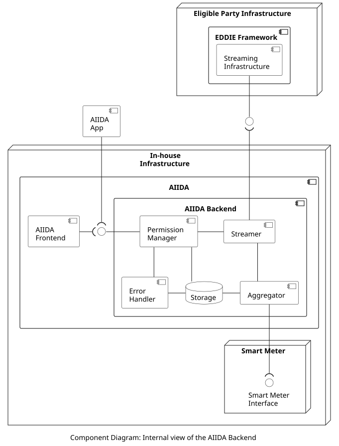

# AIIDA Backend
## Overview

The AIIDA Backend component is responsible for accessing the real-time data from the Smart Meter and sending it to the EDDIE Framework. In addition to this, AIIDA Backend has an interface for the customer via the AIIDA Frontend (which is a web application) and the AIIDA App (which is a smartphone app). This interface can be used by the customer to manage the customer consent for access to real-time data, and to view error messages regarding the consent, the connection to the Smart Meter and the connection to the EDDIE Framework. The internal view of the AIIDA Backend is shown in the figure below.

## Components

The included components are the following:

| Component | Responsibility |
| - | - |
| Aggregator | Connect to the Smart Meter and collect the energy consumption measurements in real time. These values send to the Streamer, and are also stored in the Storage. |
| Streamer | Receives the real-time energy consumption values from the Aggregator and sends them to the Streaming Infrastructure of the EDDIE Framework. Since the Streaming Infrastructure implements a publish/subscribe mechanism based on Kafka, the Streamer implement a client that publishes the data on Kafka. |
| Permission Manager | Handles the customer consent for access to real-time data, and stores the related information in the Storage. It also configures the Streamer to publish the data, when the customer consent has been given. |
| Error Handler | Follows the operation of the AIIDA Backend and logs error messages for the customer regarding the flow of the energy consumption data, the customer consent, and unexpected situations that might occur. |
| Storage | Stores the state of the system including information about the customer consents, and the connections to the EDDIE Framework and the Smart Meter. Also it stores recent energy consumption values which may need to be sent to the EDDIE Framework.  |

## Interfaces

The included interfaces are the following:

| Provided by | Consumed by | Type |
| - | - | - |
| Permission Manager | AIIDA Frontend/App | HTTP |
| Smart Meter | Aggregator | P1 (or other) |
| Streaming Infrastructure | Streamer | Kafka |

---
# AIIDA Frontend
---

## Overview

The AIIDA Frontend is a web application for the customer to access and configure the AIIDA Backend. Since the AIIDA Backend runs on the in-house device connected to the house's local area network, the AIIDA Frontend needs to be on the same network as well. This is done for security purposes so that only the customer can configure the AIIDA BAckend. To configure the connection to the EDDIE Framework, the customer needs to access the Permission Facade first, and manually copy-paste the provided information (e.g., host URL and connection ID) to the AIIDA Front end. An alternative to this process is to use the AIIDA App. The AIIDA Frontend is shown in the figure below.

>[!WARNING]
> The following image got lost and there are currently no further chapters describing the **AIIDA Frontend**.
>
> ``

The AIIDA Frontend enables the following functionalities:

1. Configure the connection to the Smart Meter.
1. Configure the connection to the EDDIE Framework.
1. View active and inactive connections/permissions.
1. Manage existing connections/permissions (e.g., activate, terminate, etc.)

