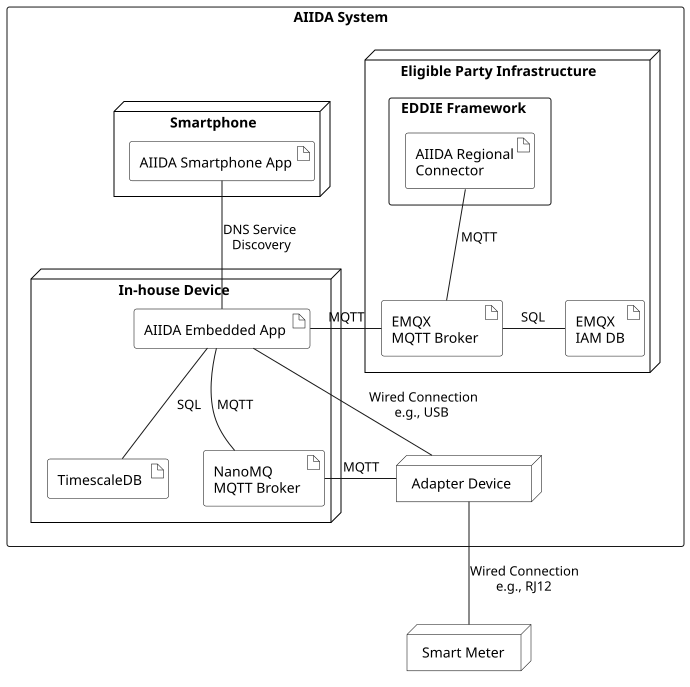

## Overview
The AIIDA system runs mainly on an in-house device (e.g., a Raspberry Pi computer) and the eligible party infrastructure. To access the real-time data, the Adapter Device connects to the smart meter via a physical port, e.g., RJ12 using DSMR. The Adapter Device may vary to be compatible with different smart meters (e.g., in different countries). Different Adapter Devices can connect to the AIIDA Embedded App in different ways, e.g., wireless or USB. The AIIDA Embedded App stores the real-time data in the Timescale DB, and also sends this data to the AIIDA Regional Connector via MQTT. The AIIDA Regional Connector can then make the data available to the EDDIE Framework.

## Diagram

|Node | Description |
| - | - |
| In-house Device | The in-house device is a Raspberry Pi computer, which is operated by the customer. It is connected to the customer's local area network. |
| Smartphone | This is the customer's smartphone which needs to be connected to the local area network as the in-house device to establish a connection between the AIIDA Smartphone App and the AIIDA Embedded App. |
| Metering Device | The metering device, e.g., the smart meter of the customer, collects energy data at the customer's site. |
|Adapter Device| An Adapter Device is needed to facilitate the connection between the smart meter and the AIIDA Embedded App. The Adapter Device may vary per customer in order to be compatible with each customer's specific smart meter. |
|Eligible Party Infrastructure| This is the computing infrastructure that hosts the EDDIE Framework. The AIIDA Regional Connector is a plugin of the EDDIE Framework and communicates with the EDDIE Core. |

