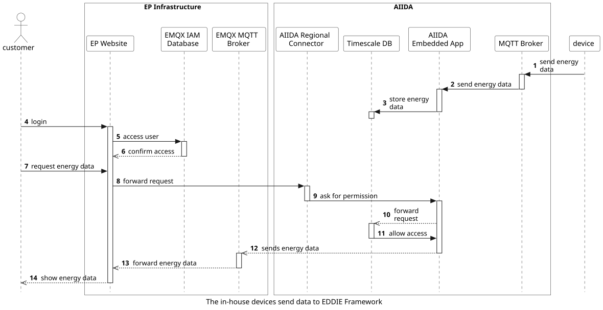

## Overview

The main two functionalities of AIIDA are:
- Managing the connections to EDDIE Framework
- Share real-time data with EDDIE Framework

The access management is both device and time specific, meaning that each token/ QR Code for each device is created for a certain time, that can be defined by the customer. 

## Create a new connection
### Via AIIDA Frontend

Via the EP Website the Customer creates a new token and inserts that into the provided form at the AIIDA Frontend. Afterwards the AIIDA Backend establishes a connection with the AIIDA Regional Connector, while the information about the connection is stored in the EMQX IAM Database.

This workflow includes the following steps:

1. The user clicks the AIIDA connect button on the EP website.
2. A Token and a QR code is generated for the user to establish a connection.
3. The user copies the token from the ep website.
4. The user inserts the token at the AIIDA frontend.
5. Through copying the token, the AIIDA backend recieves the information, that a new permission was granted.
6. The backend establishes a connection with the regional connector for AIIDA, to share data with EDDIE Framework.
7. The AIIDA regional connector connects with EDDIE Framework, where a new user is created at the IAM Database, to store the energy data.

Revoking a connection works exactly the same way. The customer accesses the Frontend where he sees all open permissions. 

### Via Smartphone App

With the AIIDA Smartphone App the Customer can as well scan the QR Code that was created by the EP Website. The connection is then established automatically.

1. The user clicks the AIIDA connect button on the EP website.
2. A Token and a QR code is generated for the user to establish a connection.
3. The user scans the QR-Code with a smartphone.
4. The AIIDA Smartphone app establishes a connection  with the AIIDA backend, to enforce a new permission.
5. The backend establishes a connection with the regional connector for AIIDA, to share data with EDDIE Framework.
6. The AIIDA regional connector connects with EDDIE Framework, where a new user is created at the IAM Database, to store the energy data.

## Send real-time data from devices

A device, that is somehow connected to the AIIDA Embedded App, stores its data in the Timescale DB.

1. A device, that is somehow connected to energy collecting systems in a household, sends energy data to the AIIDA MQTT Broker. 
2. The Broker translates the protocol and sends the data to the AIIDA embedded app, that forwards it to the Timescale DB.
3. The data is stored at the Timescale DB.

On the other hand, the Customer can look at his/her own data by requesting it through the EP Website. After the login the user can connect with AIIDA through the AIIDA regional connector.

4. The customer logs into an account through the EP Website.
5. / 6.  The user account is located at the EMQX IAM Database, where the request ist confirmed.
7. To request his/her own energy data, the customer clicks a button on the EP website. 
8. The EP website forwards the request to the AIIDA regional connector.
9. The AIIDA regional connector sends its request to the backend of the AIIDA embedded app.
10. The AIIDA embedded app forwards the request to the Timescale DB.
11. If the connectors request comes from the verfied and dedicated account, the Timescale DB sends the data directly to the MQTT Broker.
12. The data is forwarded (after beeing translated by a MQTT Broker) to EP Website.
13. The user can see and also download the data from the EP Website. Apart from that the data will be stored only in the cache, not at the EDDIE System itself.
