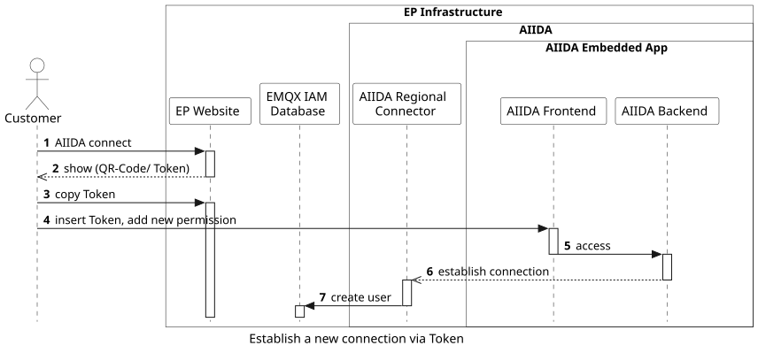
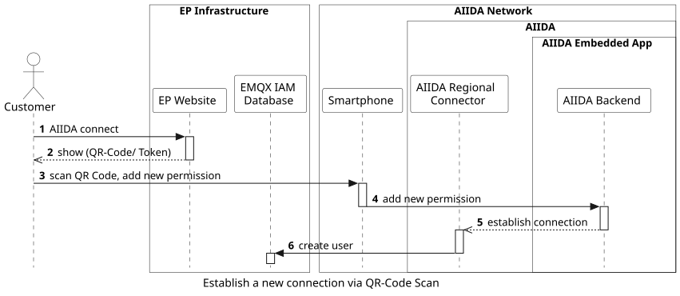
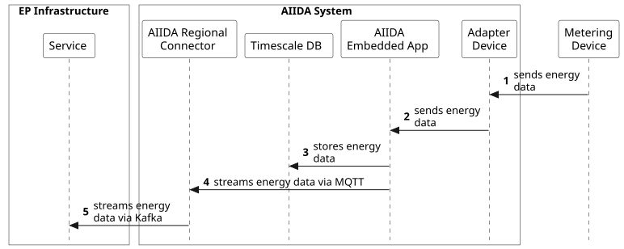

## Overview

The main two functionalities of AIIDA are:
- Managing the connections to EDDIE Framework
- Sharing real-time data with EDDIE Framework

The access management is both device and time specific, meaning that each token/ QR Code for each device is created for a certain time, which can be defined by the customer. 

## Create a new connection
### Via AIIDA Frontend

Via the EP Website the Customer creates a new token and inserts that into the provided form at the AIIDA Frontend. Afterwards the AIIDA Backend establishes a connection with the AIIDA Regional Connector, while the information about the connection is stored in the EMQX IAM Database.

This workflow includes the following steps:

1. The user clicks the AIIDA connect button on the EP website.
1. A request is sent to the AIIDA Regional Connector.
1. A Token and a QR code are generated for the user to establish a connection.
1. The Token is shown to the user.
1. The user inserts the token at the AIIDA frontend.
1. Through copying the token, the AIIDA backend receives the information, that a new permission was granted.
1. The backend establishes a connection with the regional connector for AIIDA, to share data with EDDIE Framework.
1. The AIIDA regional connector connects with EDDIE Framework, where a new user is created in the IAM Database, to store the energy data.

Revoking a connection works exactly the same way. The customer accesses the Frontend where he sees all open permissions. 

### Via Smartphone App

With the AIIDA Smartphone App the Customer can as well scan the QR Code that was created by the EP Website. The connection is then established automatically.

1. The user clicks the AIIDA connect button on the EP website.
1. A request is sent to the AIIDA Regional Connector.
1. A Token and a QR code is generated for the user to establish a connection.
1. The Token is shown to the user.
1. The user scans the QR Code with a smartphone.
1. The AIIDA Smartphone App establishes a connection with the AIIDA backend, to enforce a new permission.
1. The backend establishes a connection with the regional connector for AIIDA, to share data with EDDIE Framework.
1. The AIIDA regional connector connects with EDDIE Framework, where a new user is created in the IAM Database, to store the energy data.

## Continuously stream real-time data from devices

A device, that is somehow connected to the AIIDA Embedded App, stores its data in the Timescale DB. If a certain permission, with a start and end date exists, AIIDA continuously shares the data with EDDIE.

1. A device that is somehow connected to energy collecting systems in a household, sends energy data to the AIIDA MQTT Broker. 
1. The data is stored at the Timescale DB.
1. The Broker sends the data directly to the MQTT Broker on the EDDIE Framework side.
1. The Broker buffers the energy data and shares it with various services on demand.