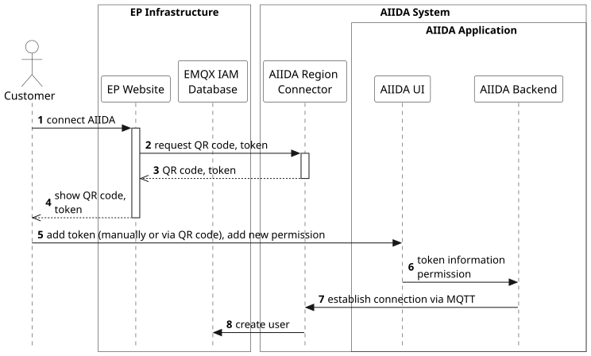

## Overview

The main workflows of AIIDA are:

- [Create a new connection to the EDDIE Framework](./runtime-view.md#create-a-new-connection-to-the-eddie-framework)
- [Stream energy data from the Metering Device to the EDDIE Framework](./runtime-view.md#stream-energy-data-from-the-metering-device-to-the-eddie-framework)

The wire-level messages exchanged in both workflows (QR code payload, handshake
requests, MQTT topics, status updates) are specified in the
[AIIDA Communication Protocol](../../appendix/aiida-communication/aiida-communication.md)
appendix.

## Create a new connection to the EDDIE Framework

Via the EP Website, the customer can create a token that encodes the necessary information to establish a connection
with the AIIDA Region Connector (e.g., the Region Connector IP and connection ID) and adds (by copy-pasting or scanning
the QR code) this token into the UI of the AIIDA application. Afterwards, the AIIDA Backend uses the token
information to establish a connection with the AIIDA Region Connector which creates a new user at the EMQX IAM Database.

This workflow includes the following steps:

1. The customer requests to connect to AIIDA by clicking a button on the EP website.
2. The EP Website requests to create a new connection to the AIIDA Region Connector, and to provide the QR code/token
   for establishing this connection.
3. The AIIDA Region Connector generates a Token and a QR code, and shows them on the EP Website.
4. The token and the QR code are shown to the customer.
5. The customer adds (by copy-pasting or scanning the QR code) the token into the UI of the AIIDA application, and gives
   permission to AIIDA to stream energy data. AIIDA then performs the handshake with EDDIE
   (fetch permission details respond to the permission request).
6. The AIIDA UI forwards the token information and the customer permission to the AIIDA Backend.
7. The AIIDA Backend uses the token information to establish a connection to the AIIDA Region Connector via MQTT. After
   the connection is established, energy data can be streamed from the AIIDA Application to the AIIDA Region Connector
   which makes the data available to the EDDIE Framework.
8. The AIIDA Region Connector creates a new user at the EMQX IAM Database for authentication.

To revoke the customer permission and stop streaming data, the customer accesses the AIIDA Frontend where all the
permissions and connections can be managed.

## Stream energy data from AIIDA to the EDDIE Framework

After a connection has been established in AIIDA, the AIIDA Application can stream energy data from Data Sources to the
AIIDA Region Connector.

1. In case the Data Source is connected to a Measuring Device, first, the Measuring Device sends the energy data to the
   Data Source via a supported protocol, e.g., DSMR over RJ12.
2. The Data Source either receives data from a Measuring Device or generates energy data itself, and sends this data to
   the AIIDA Application, e.g., via MQTT.
3. The AIIDA Application stores the energy data in the Timescale DB.
4. The AIIDA Application publishes the energy data to the AIIDA Region Connector via MQTT on the outbound data topic.
   Lifecycle messages (acknowledgement, termination, status updates) are exchanged on the Control Plane topics.
5. The EP can subscribe the energy data via MQTT with the respective user.
