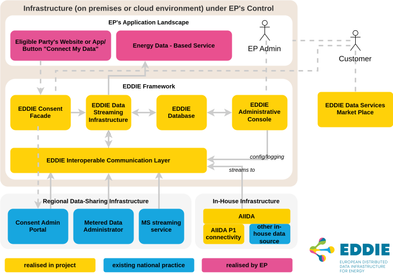
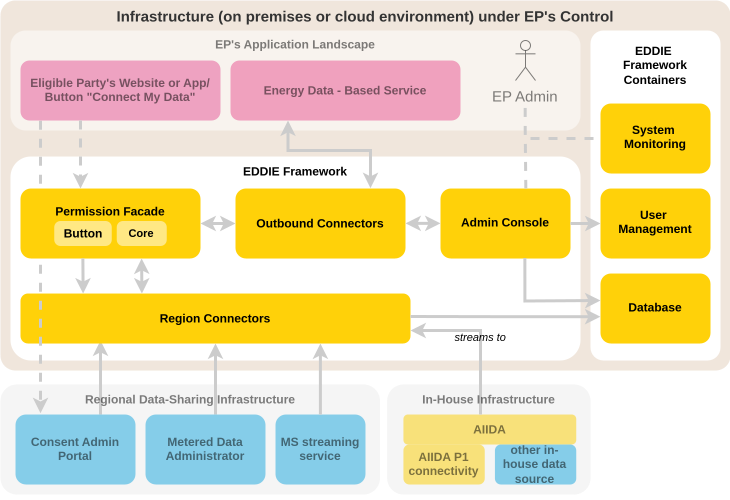
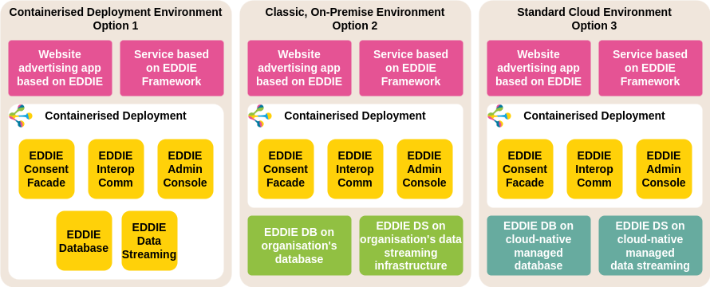
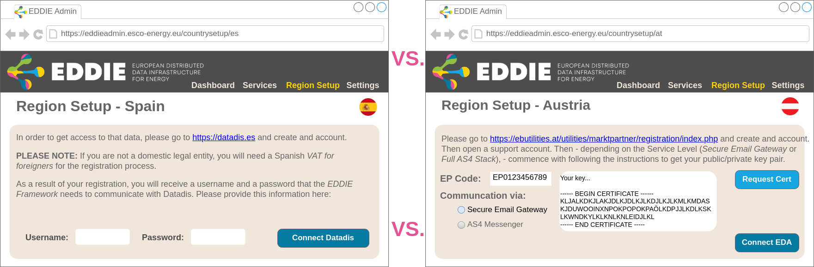
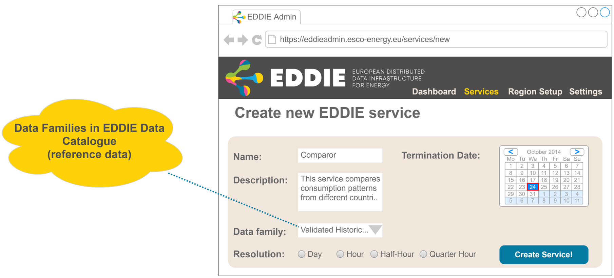

::: info TODO
- Move to an appendix section over solution strategy?
- Keep outside the EDDIE Framework system and also compare Marketplace and AIIDA?
::: 

This page aims to describe the journey from the initial project specification towards the implemented architecture
by relating the methodology outlined in the Grant Agreement (Part B, Section 1.2, Pages 11–25)
to the documented architecture.

For those familiar with the Grant Agreement or early publications, it might serve as an improved point of entry towards the current state of the EDDIE Framework.
Others may find in it a more coherent view on architectural drivers and functional requirements.
Please note that the Grant Agreement is not a public document and therefore not shared with this documentation.
If you have access to the Grant Agreement, this section uses the same diagrams and headlines for an easy comparison.

With its methodological structure, this page can be read as a historical companion to the [solution strategy](../eddie-framework/solution-strategy/solution-strategy.md).

## EDDIE core components

The following diagram shows the most important parts and actors of EDDIE as laid out by the Grant Agreement.

Comparing this diagram to the updated version below, 
one can see that each existing component maps nicely to a specific concept implementing its envisioned functionality.

- EDDIE Consent Facade → [Permission Facade](../eddie-framework/crosscutting-concepts/domain-concepts.md#permission-facade)
- EDDIE Data Streaming Infrastructure → [Outbound Connectors](../eddie-framework/crosscutting-concepts/domain-concepts.md#outbound-connectors)
- EDDIE Interoperable Communication Layer → [Region Connectors](../eddie-framework/crosscutting-concepts/domain-concepts.md#region-connectors)
- EDDIE Administrative Console → [Admin Console](../eddie-framework/building-block-view/building-block-view.md#eddie-application)

The most notable adaptation is the implementation of the _Data Streaming Infrastructure_ and _Interoperable Communication Layer_ through the concepts of _Outbound Connectors_ and _Region Connectors_.
Both _Outbound Connectors_ and _Region Connectors_ are implemented using a plugin architecture, 
where each plugin supports a specific data exchange protocol or energy data provider.
_Outbound Connectors_ and _Region Connectors_ do not communicate directly, but use a separate component as a mediator.

Another notable change is the column on the right where the EDDIE Framework uses specialized software to tackle specific problems.

- System monitoring is done [separate from the admin console](../architectural-decisions/architectural-decisions.md#separate-system-monitoring-and-admin-console) and handled by an existing software solution.
- Authentication, authorization, and user management are delegated to a configured Keycloak instance and no longer stored in the shared database.
- The shared database is configured to track process states and configuration for region connectors, as well as metrics for the admin console. It does not include authentication information.

The Grant Agreement also highlights how the EDDIE Framework can be installed with a single command through the use of scripted deployment configurations and provides the following diagram describing three deployment options.
All these options can be achieved by configuration of the EDDIE Framework as described in the [Operation Manual](https://eddie-web.projekte.fh-hagenberg.at/framework/).
Details on the deployment of the EDDIE Framework are found in its [Deployment View](../deployment-view/deployment-view.md).

## Functionality provided by the EDDIE Framework

To demonstrate the functionality of the EDDIE Framework, the Grant Agreement describes a scenario of four stages.
This section highlights how these descriptions differ from the implemented architecture.
An updated collection of use-cases can be found in the [Runtime View](../eddie-framework/runtime-view/runtime-view.md) of the EDDIE Framework.

### Installation and setup

::: info TODO
We are not yet sure if we can or even want to support the onboarding/configuration of region connectors through the admin console.
:::

_service_ provided by the eligible party
the specification of the data was termed a [data need](../eddie-framework/crosscutting-concepts/domain-concepts.md#data-needs).

From the perspective of the eligible party, the acquisition of data begins with the definition of a [data need](../eddie-framework/crosscutting-concepts/domain-concepts.md#data-needs) in the [admin console](../eddie-framework/building-block-view/building-block-view.md#eddie-application).

### Establishment of a consent

Consent Facade -> [Permission Facade](../eddie-framework/crosscutting-concepts/domain-concepts.md#permission-facade)

[Multistep Form](../eddie-framework/crosscutting-concepts/user-experience.md#eddie-button-as-multistep-form)

### Manage active consents

[Admin Console](../eddie-framework/building-block-view/building-block-view.md#eddie-application)

### Data transfer

### Termination and revocation

## Kafka

From the Grant Agreement:

> For the purpose of our project, it will account for the management of
> [1] in-house data streams (flowing in from AIIDA) as well as
> [2] online data streams (from MDAs and online near real-time data-sharing infrastructures) and the combination of the two, and also
> [3] the communication between different EDDIE Framework applications.

1. AIIDA communicates with EDDIE via [MQTT](../aiida/architectural-decisions/architectural-decisions.md#mechanism-to-send-data-from-aiida-to-the-eddie-framework).
2. Region connectors communicate with MDAs using their preferred (usually only) option.
   TODO: Check with Flo
3. EDDIE Framework applications communicate using a suitable option.
   EDDIE ↔ Admin via HTTP/REST
   Outbound Connectors ↔ Core ↔ RCs via Flux (TODO: Link architectural decision)

Despite not being used in its originally intended contexts, Kafka is still available as an option for data streaming towards the eligible party.
Kafka Outbound Connector -> TODO: Link Framework Docs?

TODO: Link architectural decision