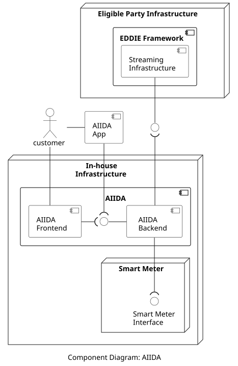

## Overview

AIIDA (Administrative Interface for In-house Data Access) is responsible for establishing the consent of the customer regarding access to real-time data from the customer's Smart Meter. Also, for acquiring the real-time data from the Smart Meter and sending it to the Streaming Infrastructure of the EDDIE Framework. The high-level view of AIIDA is shown in the figure below.

## Components

The included components are the following:

| Component | Responsibility | Section |
| - | - | - |
| AIIDA Frontend | Web application for the customer that can be accessed via the local area network (LAN). It allows the customer to configure the connection with the EDDIE Framework, to view error messages, and adjust configuration options for AIIDA. | [Link](./aiida-frontend/aiida-frontend.md)|
| AIIDA Backend | Backend application that receives configurations from the AIIDA Frontend and/or the AIIDA App. It accesses the real-time data from the Smart Meter and publishes this data on the corresponding topic of the customer at the Streaming Infrastructure of the EDDIE Framework | [Link](./aiida-backend/aiida-backend.md)|
| AIIDA App | Smartphone application for the customer. It can replace the AIIDA Frontend for specific functionalities which are suited better for an app than a web application. For example, via the AIIDA app the customer can scan the QR code from the EP Website (while on the local area network). The AIIDA App then configures the connection between the AIIDA Backend and the Streaming Infrastructure automatically. | [Link](./aiida-app/aiida-app.md)|

## Interfaces

The included interfaces are the following:

| Provided by | Consumed by | Type |
| - | - | - |
| AIIDA Backend | AIIDA Frontend/App | HTTP (LAN only) |

## Country-specific Implementations

Since the Smart Meter device may be different in each country, AIIDA may need to operate differently as well, in order to adapt to the specificities of each Smart Meter. For this reason, the deployment of AIIDA is presented in the table below for each supported country. 

| Country | Section | 
|-|-|
| Austria | [Link](./countries/aiida-austria/aiida-austria.md) |
| France | [Link](./countries/aiida-france/aiida-france.md) |

<!-- the app needs to be discussed here. -->

## Data Models

Information about the AIIDA data model is provided [here](../../data-models/aiida/aiida.md).