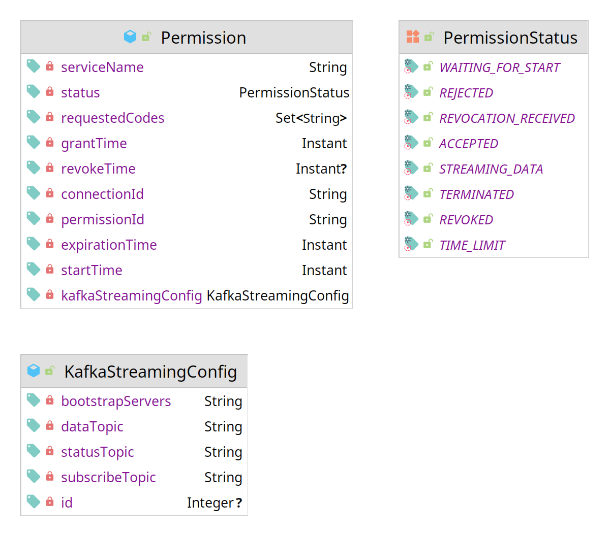

## Overview

AIIDA handles the consent of the customer for access to real-time data, and the transmission of the data to the EDDIE Framework. For this reason, it needs to implement a data model that includes all the necessary information to represent the customer consent, the status of the consent, and the connection to the Kafka implemented by the Streaming Infrastructure of the EDDIE Framework. This data model is shown in the figure below. 

The data model of the real-time energy consumption data used within AIIDA is the same CIM-compliant model that is used within the EDDIE Framework and is discussed [here](../meter-data-portal/meter-data-portal.md).