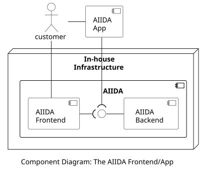

## Overview

The AIIDA Frontend is a web application for the customer to access and configure the AIIDA Backend. Since the AIIDA Backend runs on the in-house device connected to the house's local area network, the AIIDA Frontend needs to be on the same network as well. This is done for security purposes so that only the customer can configure the AIIDA BAckend. To configure the connection to the EDDIE Framework, the customer needs to access the Permission Facade first, and manually copy-paste the provided information (e.g., host URL and connection ID) to the AIIDA Front end. An alternative to this process is to use the AIIDA App. The AIIDA Frontend is shown in the figure below.

The AIIDA Frontend enables the following functionalities:

1. Configure the connection to the Smart Meter.
1. Configure the connection to the EDDIE Framework.
1. View active and inactive connections/permissions.
1. Manage existing connections/permissions (e.g., activate, terminate, etc.)

