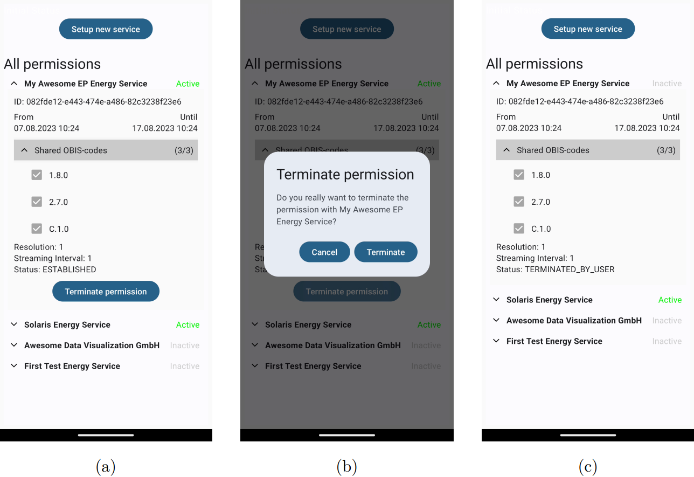

## Overview

The AIIDA App is a smartphone application for the customer to access and configure the AIIDA Backend, similar to the AIIDA Frontend. Since the AIIDA Backend runs on the in-house device connected to the house's local area network, the AIIDA App needs to be on the same network as well. This is done for security purposes so that only the customer can configure the AIIDA BAckend. The AIIDA App is shown in the figure below.

The AIIDA App enables the following functionalities:

1. Scan a QR code from the EP website to configure the connection to the Smart Meter and the EDDIE Framework automatically.
1. View active and inactive connections/permissions.
1. Manage existing connections/permissions (e.g., activate, terminate, etc.)

When scanning a QR code from the EP Website, the AIIDA App shows the configurations to the customer who is expected to either accept the configurations (i.e., give permission for data access), or reject the configurations (i.e., deny the permission for data access). This is shown in the figure below.

The termination of an active permission for data access can also be executed via the AIIDA App. This is shown in the figure below which shows that the customer first has to select the "Terminate Permission" option (a), then confirm the termination (b), and then observe that the termination was executed by the status change to "TERMINATED". 

