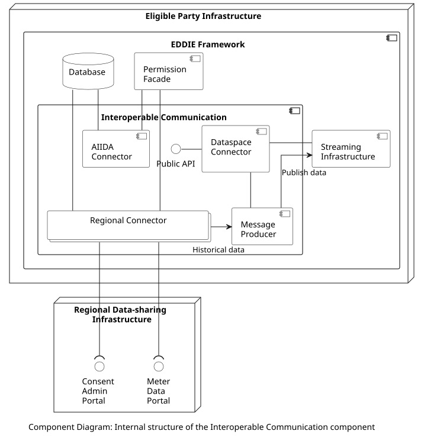

## Overview

The Interoperable Communication component is responsible for communication with external components (e.g., with the Regional Data-sharing Infrastructures). Primarily, it manages the customer consent in coordination with the Regional Data-sharing Infrastructures, and publishes the historical validated data to the Streaming Infrastructure (to be sent to the Services). The Interoperable Communication includes a collection of connectors, each one being responsible for data access of a particular type: The Regional Connectors handle the data access to historical validated data, the AIIDA Connector aids in establishing the customer consent for access to real-time data, and the Dataspace Connector is responsible for connecting to dataspaces. The internal structure of the Interoperable Communication component is shown in the figure below.

## Components

The included components are the following:

| Component | Responsibility | Section |
| - | - | - |
| Regional Connectors | Includes various country-specific regional connectors. Each one of these connectors implements the functionality to access the APIs of the Regional Data-sharing Infrastructure of the corresponding country. | [Link](./regional-connectors/regional-connectors.md)|
| AIIDA Connector | The AIIDA Connector aids in establishing the communication between the EDDIE Framework and AIIDA instances. However, it does not connect to AIIDA instances directly, as AIIDA connects to the Streaming Infrastructure | [Link](./aiida-connector/aiida-connector.md)|
| Dataspace Connector | Implements the functionality to connect to a dataspace, e.g., to collect other data than energy consumption, which is useful for the Services. | [Link](./dataspace-connector/dataspace-connector.md)|
| Message Producer  | Receives data from a Regional Connector and publishes it to the Streaming Infrastructure. | [Link](./message-producer/message-producer.md) |

## Interfaces

The included interfaces that are exposed outside the EDDIE Framework are the following:

| Provided by | Consumed by | Type |
| - | - | - |
| Dataspace Connector | External dataspace connector | HTTP (or other)|

## Data Models

> Information about the Interoperable Communication data model is provided [here](../../data-models/interoperable-comm/interoperable-comm.md).
