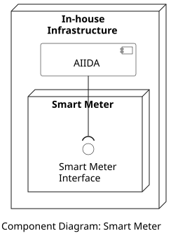

## Overview

The Smart Meter is a device that is installed in the residence of each customer to collect energy consumption data in real time. The Smart Meter is out of the control of the eligible party and the customer. The EDDIE Framework, and specifically AIIDA, interacts with the Smart Meter only through the Smart Meter interface to access the real-time data, as shown in the figure below.   

## Data Models

> Information about the Smart Meter data model is provided [here](../../data-models/smart-meter/smart-meter.md).