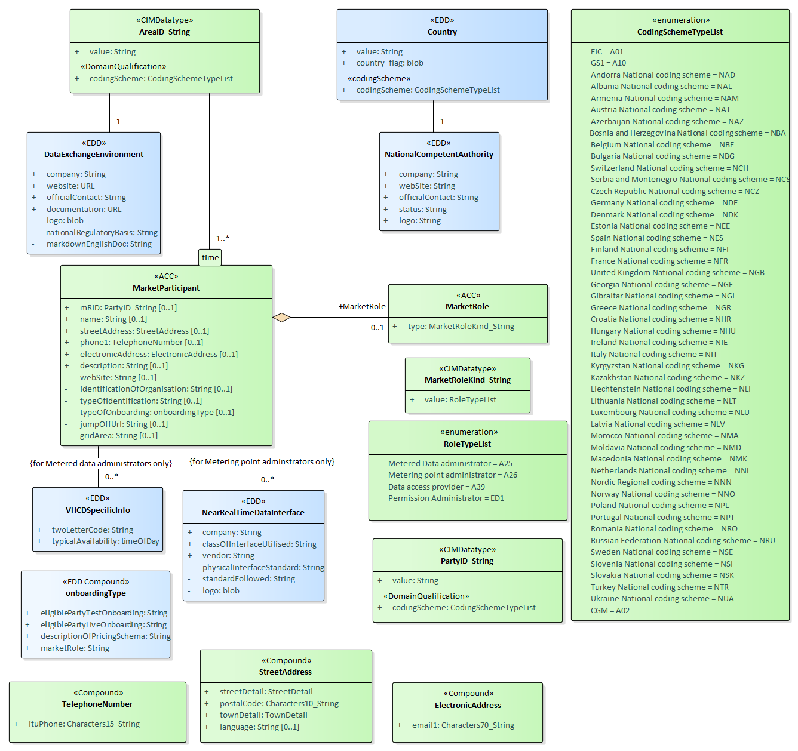

## Overview

The data model of the Master data is shown in the class diagram below.

This data model is CIM-compliant. Specifically, the green entities correspond directly to CIM entities, while the blue entities are additions that are necessary to enrich the CIM model so that it covers all aspects of the EDDIE Framework. Furthermore, some existing entities are enhanced with additional attributes. These can be distinguished by the minus sign ( - ) in front of the attribute name. Notably, the permission administrator entity is added. Also, some of the RoleTypesList enumerations are renamed to fit better the context of the EDDIE Framework. These are:

CIM vs EDDIE/SGTF roles:

* Metered data **responsible** -> Metered data **administrator**
* Data provider -> Data **access** provider

Attribute descriptions for this data model are provided in the links below:

- [Brief description of important attributes](./class-and-attributes-brief.md)
- [Class and attributes CIM Master Data Model](./Class%20and%20attributes%20CIM%20Master%20Data%20Model.md)
- [Class and attributes CIM Transfer Data Base](./Class%20and%20attributes%20CIM%20Transfer%20Data%20Base.md)

Additional helpful attribute descriptions are provided in the links below:

- [IEC62325-351 Ed.3 - ESMPClasses](./IEC62325-351%20Ed.3%20-%20ESMPClasses.md)
- From the Dcbel residential energy use cases:
    - [IEC61968](./IEC61968.md)
    - [IEC61970](./IEC61970.md)
    - [IEC62746Profile](./IEC62746Profile.md)
- From the OneNet Project:
    - [OneNet Project](./RD_Projects_OneNet.md)

