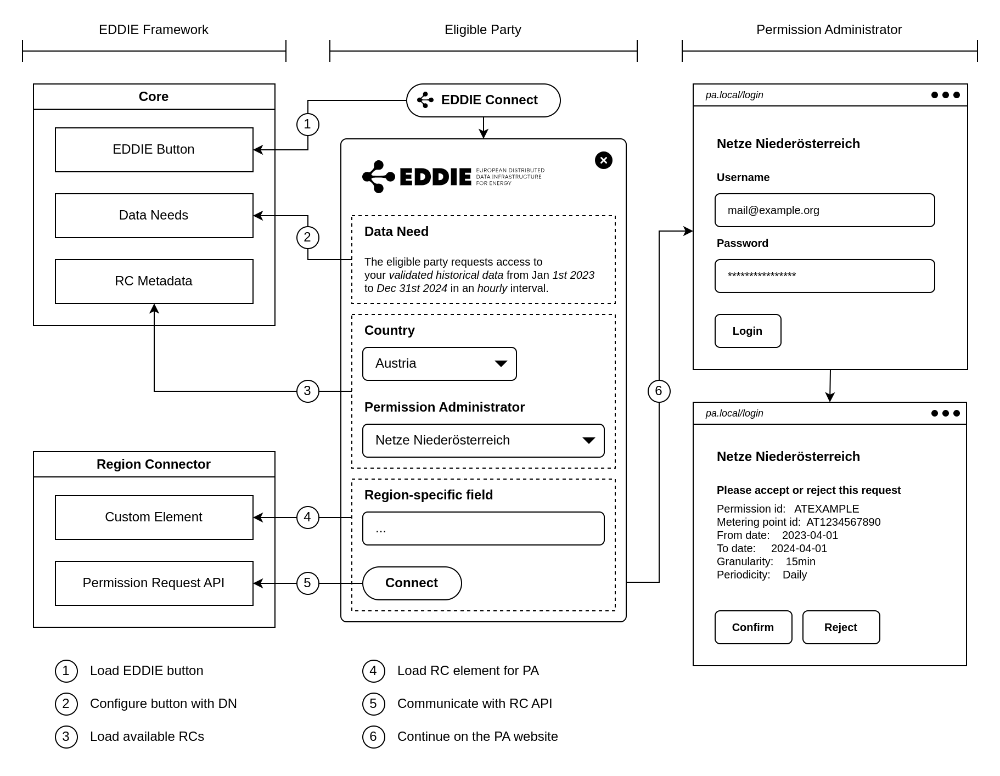
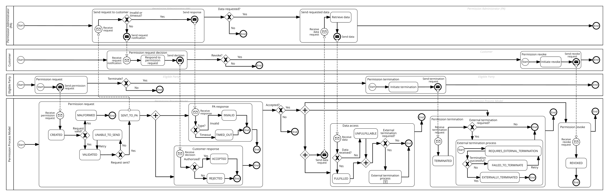

Various concepts are relevant across the EDDIE system such as:

- [Data Space](./crosscutting-concepts.md#data-space)
- [Data Models](./crosscutting-concepts.md#data-models)
    - [Common Information Model (CIM)](./crosscutting-concepts.md#common-information-model-cim)
    - [Smart Grid Architecture Model (SGAM)](./crosscutting-concepts.md#smart-grid-architecture-model-sgam)
    - [Smart Appliances REFerence ontology (SAREF)](./crosscutting-concepts.md#smart-appliances-reference-ontology-saref)
- [Kafka Topic Topology](./crosscutting-concepts.md#kafka-topic-topology)
- [Domain Concepts](./crosscutting-concepts.md#domain-concepts)
    - [Permission Facade](./crosscutting-concepts.md#permission-facade)
    - [Permission Process Model](./crosscutting-concepts.md#permission-process-model)
    - [Data Needs](./crosscutting-concepts.md#data-needs)
- [User Experience](./crosscutting-concepts.md#user-experience)
    - [Shoelace for EDDIE Button and RC Elements](./crosscutting-concepts.md#shoelace-for-eddie-button-and-rc-elements)
    - [EDDIE Button as Multistep Form](./crosscutting-concepts.md#eddie-button-as-multistep-form)

## Data Space

#### Definition

<!-- What it is -->

The concept of a data space describes a federated system whereby organizations can share data in alignment with the principles of data sovereignty. Data spaces facilitate secure, trusted, and interoperable data exchange across sectors. There are two prime initiatives that drive the adoption of data spaces: IDSA (International Data Spaces Association) which focuses on defining processes and specifications for sharing sovereign data, and Gaia-X that focuses on compliance within and across data spaces. Based on these initiatives, a data space is a system that includes multiple software applications for sharing sovereign data, such as dataspace connectors, registries for data and metadata, and identity management.

#### Relevance

<!-- Where it is used, i.e., in what parts of EDDIE -->

While general-purpose data spaces are broad and flexible, they may not be directly applicable to the specific needs of the energy sector, e.g., to access data from Regional Data-sharing Infrastructures or Metering Devices at home. For this reason, the EDDIE system creates a data space that is similar to what is defined by data space initiatives, but focuses more on meeting the needs of the energy sector. The goal of the EDDIE system is to create a domain-specific data space tailored to the energy sector. This approach includes domain-specific components and processes. For example, instead of a generic dataspace connector, the EDDIE system uses Region Connectors tailored to accessing data from Regional Data-sharing infrastructures, and instead of a generic metadata registry, the EDDIE system integrates a Marketplace tailored to eligible parties and customers.

#### Motivation

Data spaces are proposed for managing data according to [European Strategy for Data](https://digital-strategy.ec.europa.eu/en/policies/strategy-data).

## Data Models

### Common Information Model (CIM)

#### Definition

CIM (Common Information Model) is a standard for electric power transmission and distribution developed by the electric power industry. It aims to enable software applications exchange information about electrical networks in a consistent and interoperable manner. CIM has been officially adopted by the International Electrotechnical Commission (IEC) but is maintained by the [DMTF](https://www.dmtf.org/about), formerly known as the Distributed Management Task Force) CIM defines a set of Unified Modeling Language (UML) classes, class associations, data types, and attributes for describing entities commonly found in energy production, distribution, consumption, and management systems. Thus, CIM also provides a standardized vocabulary for modeling energy systems.

CIM is an object-oriented information model based on UML, which defines both syntax and semantics. It is composed of three main parts:

- IEC 61970-301: Defines the energy management system application programming interface (EMS-API).
- IEC 61968-11: Defines system interfaces for the integration of distribution management systems (DMS) with enterprise applications within electric utilities.
- IEC 62325-301: Defines the energy market communications, supporting the exchange of information between market participants. THe European version is known as ESMP (European Style Market Profile) and is maintained by [ENTSO-E](https://www.entsoe.eu/digital/common-information-model/cim-for-energy-markets/).

The CIM standard provides well-defined semantics. Each CIM class or object has a clear definition registered within the common model. This model encompasses a wide range of entities and functions across the energy sector, including grid operations, asset management, and energy markets, with a focus on infrastructure and connectivity.

Although CIM covers a large portion of the energy sector data, there are areas where CIM is less well-developed. e.g. electric vehicle charging. Below some complementary standards are discussed.

#### Relevance

The EDDIE system uses CIM to address interoperability concerns arising from diverse entities communicating via the EDDIE Framework. These entities may include:

- Smart meters generating data in various formats.
- Regional Data-sharing Infrastructures providing historical data in different formats.
- Permission administrators using various formats for permission messages.

#### Motivation

CIM is a model that has been developed and refined for a long time reaching a satisfactory level of maturity. Throughout the years, it has received a lot of support from [ENTSO-E](https://www.entsoe.eu/digital/common-information-model/) which ensures that CIM is developed in line with TSO requirements. In addition, ENTSO-E runs yearly tests to demonstrate the interoperability of CIM, and to support the CIM development for grid models and market exchanges. Due to its focus on the infrastructure lifecycle, CIM can model historical changes in devices and device replacements, as well as expected future additions to existing networks. This aspect is crucial in a fast-evolving energy environment where one generation of devices may be replaced by the next in order to provide extended services to the parties involved.

Apart from CIM, a number of subdomain solutions have emerged over the years creating what is sometimes called a "cylinder of excellence". These solutions focus on meeting particular purposes, which may foster large market penetration, although their applicability for EDDIE might be limited. Some examples are discussed below:

- [OpenADR](https://www.openadr.org/): Open Automated Demand Response (OpenADR) is an open and interoperable information exchange model and emerging smart grid standard. OpenADR standardizes the message format used for Auto-DR so that dynamic price and reliability signals can be delivered in a uniform and interoperable fashion among utilities, ISOs, and energy management and control systems. OpenADR focuses on a set of defined exchange messages, but may lack data model definitions, which can lead to weak semantics.
- [OCPP](https://www.openchargealliance.org/): The Open Charge Point Protocol (OCPP) is a communication protocol for residential charging that enables seamless interaction between electric vehicle (EV) charging stations and central management systems (CMS). Similar to OpenADR, it may lack data model definitions (due to focusing on defining exchange messages).
- [SAREF](https://www.saref.etsi.org/core/v4.1.1/): The Smart Applications REFerence Ontology (SAREF) is a suite of ontologies which form a shared model that aims to enable semantic interoperability between solutions from different providers and among various activity sectors in the Internet of Things (IoT). SAREF4ENER is of particular interest as it has proven valuable in the modelling of smart white appliances with a focus on devices. SAREF is ontology-based and defines explicit semantics. More information on SAREF is provided later on.
- [Green Button](https://www.greenbuttonalliance.org/): Green Button is based on the Energy Services Provider Interface (ESPI) data standard released by the North American Energy Standards Board (NAESB). The ESPI standard consists of two components: 1) a common XML format for energy usage information and 2) a data exchange protocol which allows for the automatic transfer of data from a utility to a third party based on customer authorization. Similar to OpenADR, it may lack a data model, due to focusing on well-defined exchange messages, which can lead to weak semantics.

#### Employed strategy

The infrastructural lifecycle management of the CIM standard makes it the preferred standard used for exchange of smart meter and historical data. However, when Vehicle to Grid communication or interaction with smart white appliances come in, some market standards cannot be ignored either because of their wide distribution or because they have much better support in areas where CIM is still in development. To enrich subdomain standards, creating a mapping to the CIM model, provides a lifecycle infrastructural dimension to those standards lacking these. On the other side, CIM can profit from years of development in other standards where CIM has not put its focus on (yet). One point of attention: when working with weak semantic standards, careful scrutiny should be employed to make sure that terminology is consistent over standards.

### Smart Grid Architecture Model (SGAM)

#### Definition

SGAM is a reference architecture developed by the International Electrotechnical Commission (IEC) that aims to provide a framework for organizing and describing the various components of a smart grid system. It defines a set of functional and information exchange views that can be used to model the different layers and functions of a smart grid system, including the physical layer, communication layer, application layer, and business layer.

SGAM is organized into six main views:

1. Business View: Defines the overall business context of the smart grid system.
2. Function View: Defines the functions and services that need to be provided by the smart grid system.
3. Information View: Defines the information that needs to be exchanged between different components (including the data models and communication protocols).
4. Communication View: Defines the communication networks and protocols that need to be used for exchanging information between the different components.
5. Component View: Defines the physical and logical components that make up the smart grid system.
6. Deployment View: Defines the deployment scenarios and configurations of the smart grid system.

#### Relevance

SGAM provides reference points, e.g., scenarios, workflows, and data models, that aid the technical and conceptual development of the EDDIE system. SGAM provides a standardized way of organizing and describing the different components of the smart grid system, which are of relevance as well.

#### Motivation

SGAM provides a comprehensive and standardized way of organizing and describing the different components of a smart grid system, allowing for better communication and collaboration between different stakeholders and organizations involved in the development and implementation of smart grids. It provides a common language and framework for describing the different layers and functions of the smart grid system, as well as the communication networks and protocols that need to be used for exchanging information between different components of the smart grid system.

Alternative models to SGAM include:

- NIST Smart Grid Framework: Developed by the National Institute of Standards and Technology (NIST), the NIST Smart Grid Framework provides a comprehensive and standardized way of organizing and describing the different components of a smart grid system, similar to SGAM.
- IEC 61850: This is a communication standard for power utility automation that defines a set of protocols.

### Smart Appliances REFerence ontology (SAREF)

#### Definition

SAREF is a semantic data model developed by the European Telecommunications Standards Institute (ETSI) with the goal of facilitating the interoperability and standardization of smart appliances in the Internet of Things (IoT) ecosystem.
It provides a standardized ontology with classes and properties to describe smart appliances, such as household appliances, lighting systems, and HVAC (Heating, Ventilation, Air Conditioning) systems. The ontology provides a standardized vocabulary that can be used to describe smart appliances in a way that is widely accepted.

SAREF comprises a main ontology, SAREF, and several sub-ontologies such as SAREF4AUTO, SAREF4ENER, and SAREF4BLD, which offer more specific vocabularies for automotive, energy, and building domains, respectively.

#### Relevance

In the context of the IoT, SAREF is used to ensure the interoperability and semantic consistency of smart appliances, enabling their integration into a larger smart system. SAREF provides a standardized vocabulary for describing smart appliances, which allows different applications and systems to communicate with each other using a common language.

In the EDDIE system, SAREF is relevant for databases and services which store and process energy data. The use of SAREF in such components can ensure interoperability and consistency of energy consumption data from smart appliances.

#### Motivation

SAREF is developed by ETSI to align with industry requirements and standards. It is supported by several organizations and initiatives, such as the FIWARE project, which aims to promote the development of IoT applications and services.

Alternative models to SAREF include:

- OneM2M: OneM2M is a global standard for Machine-to-Machine (M2M) and Internet of Things (IoT) interoperability, providing a common architecture and framework for IoT applications across different domains.
- Brick Schema: Brick Schema is an open-source, community-driven effort to develop a comprehensive schema for building automation, based on Semantic Web technologies.

## Kafka Topic Topology

#### Definition

The EDDIE Framework uses Apache Kafka as one of its outbound communication mechanisms to exchange messages between the framework and Eligible Parties.  
Kafka provides a scalable, event-driven publish/subscribe architecture that enables the EDDIE Framework to distribute energy-related data, permission request status updates, and termination commands asynchronously.

Each EDDIE instance defines a set of Kafka topics that follow a standardized naming scheme and can carry data in either JSON or XML format.  
These topics allow EDDIE to act both as a producer (publishing validated and raw data) and as a consumer (receiving terminations and retransmission requests).

#### Relevance

The definition of topics for message brokers like Kafka is fundamental for the integration of the EDDIE Framework’s Outbound Connectors.  
They enable the decoupling of internal data flows from external consumers and ensure that permission-related and energy data can be delivered in near real time to Eligible Parties, regardless of their internal technology stack.

Using a message broker allows the EDDIE Framework to:

- Publish validated and raw data messages originating from Region Connectors.
- Notify Eligible Parties about permission request status changes.
- Receive termination or retransmission commands directly from Eligible Parties.
- Scale efficiently when handling high volumes of customer data.

This mechanism supports interoperability between the EDDIE core, Region Connectors, and Eligible Party infrastructures by adhering to open, message-based integration patterns.

#### Motivation

A message broker like Kafka was selected to meet the scalability, flexibility, and interoperability requirements of the EDDIE Framework.  
Since Eligible Parties can differ in their backend technologies and data processing rates, asynchronous communication via Kafka provides an optimal balance between throughput and reliability.

Additionally, Kafka supports:

- High-performance data streaming for real-time energy data.
- Fault tolerance and persistence for sensitive permission and metering information.
- Extensible topic-based communication for adding new message types or regional formats in the future.

---

#### Topic Naming Scheme

Each EDDIE System instance is identified by an
`eddie-id`, which is used in topic names to separate data streams across deployments.  
The topics created by the Outbound Connector follow this pattern:

| Topic | Direction | Description |
|-------|------------|-------------|
| `ep.${eddie-id}.agnostic.connection-status-message` | Outbound | Provides updates on permission request status changes. |
| `ep.${eddie-id}.agnostic.raw-data-message` | Outbound | Publishes raw data messages from Region Connectors with additional metadata. |
| `ep.${eddie-id}.cim_0_82.permission-md` | Outbound | Publishes permission market documents. |
| `ep.${eddie-id}.cim_0_82.validated-historical-data-md` | Outbound | Publishes historical data market documents. |
| `ep.${eddie-id}.cim_0_82.accounting-point-md` | Outbound | Publishes accounting point market documents. |
| `fw.${eddie-id}.cim_0_82.termination-md` | Inbound | Receives permission termination documents from Eligible Parties. |
| `fw.${eddie-id}.cim_0_91_08.retransmissions` | Inbound | Receives redistribution transaction requests for re-sending historical data. |

---

#### Message Headers

Each outbound Kafka message carries additional metadata headers that help correlate messages with specific permission requests and Data Needs:

- `permission-id`: Identifier of the permission request.
- `connection-id`: Identifier provided by the Eligible Party to group related requests.
- `data-need-id`: Identifier of the Data Need linked to this message.

---

#### Configuration Parameters

EDDIE System supports all [Kafka producer and consumer configurations](https://kafka.apache.org/documentation/).  
All configuration keys must be prefixed with `kafka.` or `outbound-connector.kafka.` depending on their scope.

Common configuration examples include:

- `outbound-connector.kafka.enabled=true`
- `outbound-connector.kafka.eddie-id=eddie`
- `outbound-connector.kafka.format=json`
- `kafka.bootstrap.servers=localhost:9094`

#### Handling Large Messages

EDDIE can sometimes produce large data records.
Kafka’s default message size limit (1 MB) can be increased to support these larger records:

- `kafka.buffer.memory=104857600`
- `kafka.message.max.bytes=104857600`
- `kafka.max.request.size=104857600`

#### Data Exchange Behavior

The Kafka Outbound Connector enables bidirectional communication between the EDDIE Framework and Eligible Parties:

##### Outbound Flow

EDDIE Framework publishes permission updates, validated data, and raw data messages to Outbound Topics.
Eligible Parties consume these topics via their Kafka clients or data pipelines.

##### Inbound Flow

Eligible Parties can send termination and retransmission documents to the EDDIE Framework.
These are published to the inbound topics (termination-md and retransmissions), which EDDIE Framework consumes and processes accordingly.

## Domain Concepts

### Permission Facade

The Permission Facade describes the process that enables the Eligible Party to request and the customer to grant permission to access customer data.  
It acts as a simplified interface to diverse regional implementations by following the [Facade design pattern](https://refactoring.guru/design-patterns/facade).

The facade includes:

- the EDDIE button, [embedded](../eddie-framework/architectural-decisions/architectural-decisions.md#embed-the-eddie-button-as-a-custom-element) into the Eligible Party’s website,
- the permission dialog guiding the customer through creating permissions,
- backend endpoints to register and manage permissions,
- and integration with regional Permission Administrators.

Most of these aspects are located on the frontend, which is why the Permission Facade is often referred to as the frontend of the EDDIE Framework. It is not a standalone component but spans across the EDDIE Core and Region Connectors.

#### Relevance

The Permission Facade is the entry point for customers to grant access to their energy data. It ensures a consistent and user-friendly flow across regions, despite differences in underlying Permission Administrator processes.

#### Motivation

By abstracting the permission process into a common facade, EDDIE Framework lowers complexity for Eligible Parties and increases trust and usability for customers, which is crucial for adoption.

---

### Permission Process Model

#### Definition

The Permission Process Model defines the lifecycle of a permission request within the EDDIE Framework.  
A permission request represents the agreement between a Customer, their Permission Administrator, and the Eligible Party to access energy-related data.  
Each permission request transitions through well-defined states — from its creation and validation to acceptance, revocation, or termination — ensuring that no state is skipped and that the complete permission history is traceable.  
This state model standardizes how permissions are created, validated, transmitted, and retired across all Region Connectors and PAs.

The [Operation Manual](https://eddie-web.projekte.fh-hagenberg.at/framework/2-integrating/integrating.html#permission-process-model) provides details on how to interpret and handle specific states.

#### Relevance

The permission process model is fundamental to maintaining interoperability and consistency across regional implementations.  
It enables EDDIE System to integrate with diverse Permission Administrators and Metered Data Administrators while preserving a unified internal workflow.  
By formalizing the transition between states such as `CREATED`, `VALIDATED`, `ACCEPTED`, `REVOKED`, and
`TERMINATED`, the framework can track the exact lifecycle of a permission request and handle external notifications or errors consistently.  
Furthermore, this model ensures that both frontend components (like the EDDIE Popup) and backend systems (EDDIE Core, Region Connectors) can synchronize permission states accurately, enabling transparent communication between customers and Eligible Parties.

#### Motivation

Energy data access involves strict data protection and consent requirements.  
A standardized permission process model ensures compliance with legal and regulatory frameworks while simplifying integration with regional infrastructures.  
It provides a clear and auditable flow from request creation to termination, reducing ambiguity and risk of unauthorized access.  
By adopting a unified state machine, EDDIE System ensures that every data exchange is backed by a verifiable permission status, improving trust, maintainability, and scalability of the overall system.

### Data Needs

#### Definition

Eligible Parties require different data to provide their services.  
These requirements are standardized across region connectors as Data Needs. A Data Need specifies:

- the type of data family (e.g., validated historical data, accounting point data, AIIDA real-time data),
- the time frame of the request,
- and additional parameters relevant for the data type.

On the frontend, Data Needs are used to inform customers about what data is requested and to determine which Region Connectors can fulfill the request.

#### Relevance

Data Needs ensure that service requirements are expressed consistently across all connectors. This standardization enables interoperability between Eligible Parties, customers, and Regional Data-sharing infrastructures.

#### Motivation

Without a common model for expressing data requirements, each region would enforce its own conventions. Data Needs provide a uniform contract that allows services to scale across multiple regions while remaining transparent to customers.
More details are available in the [operation manual](https://eddie-web.projekte.fh-hagenberg.at/framework/2-integrating/data-needs.html).

## User Experience

### Shoelace for EDDIE Button and RC Elements

#### Definition

[Shoelace](https://shoelace.style/) is a lightweight library of web components that EDDIE adopts to provide a consistent look and feel across its user-facing elements, such as the EDDIE Button and Region Connector forms. It supplies reusable components, theming via CSS variables, and localization support.

#### Relevance

Shoelace ensures that user interactions across EDDIE components follow a uniform design, which improves usability and consistency, especially when components are embedded into external websites of Eligible Parties.  
Because the library is loaded at runtime from a Content Delivery Network, EDDIE system avoids the need for a separate build process.

#### Motivation

Using an existing component library reduces development time and improves user experience through standardized patterns.  
Over time, EDDIE system may replace Shoelace components with custom ones as the framework matures.

Advantages

- Faster development by reusing tested components.
- A uniform, consistent user experience.

Disadvantages

- Extra styles and components need to be loaded.
- Some styling may not fit perfectly with EDDIE system’s visual identity.

---

## EDDIE Button as Multistep Form

#### Definition

The EDDIE Button is the primary entry point for customers to grant permissions.  
While the initial version displayed all information in a single vertical form, this design consumed too much space and could overwhelm the user.  
The multistep form approach addresses this by splitting the process into several smaller steps.

#### Relevance

The multistep form improves usability by guiding customers through distinct steps, such as:

1. Display of the data need.
2. Country and Permission Administrator selection.
3. Region Connector form inputs (e.g., metering point, access token).
4. Post-request instructions and actions.
5. Success page.

This approach adapts to button configuration and the type of Data Need (e.g., AIIDA real-time data).  
Errors and status updates are displayed as separate pages, ensuring clarity for the customer.

#### Motivation

Breaking down the permission flow into smaller steps improves comprehension, reduces cognitive load, and works better on mobile devices.  
It also allows for clearer communication of errors and request states, which strengthens trust in the process.

Design considerations

- Step indicators should remain simple to avoid clutter on mobile devices.
- Connection IDs are hidden from customers, as they are only relevant to Eligible Parties.
- Back navigation is limited after request creation to avoid confusing users.
- The button resets only when the dialog is closed deliberately by the customer.

The implementation of this approach is tracked in [GH-1233](https://github.com/eddie-energy/eddie/issues/1233).  
