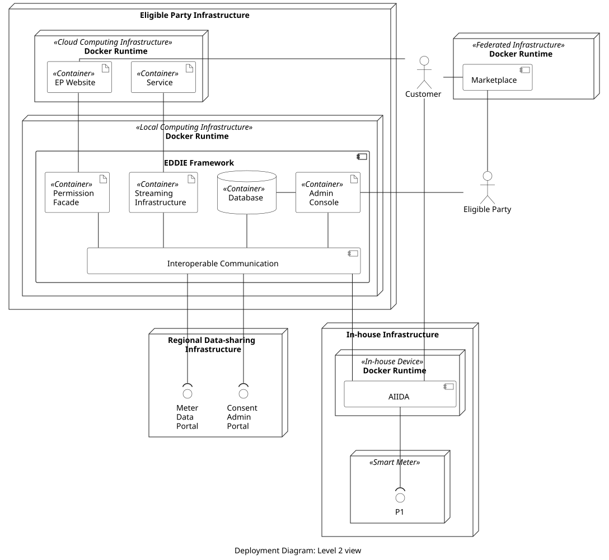
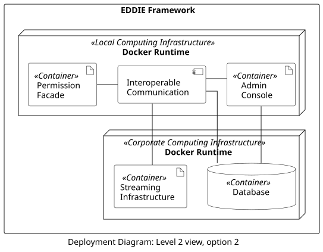
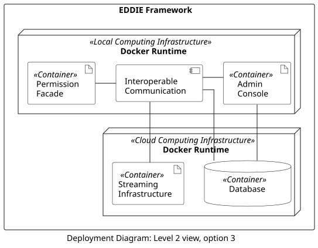

<!-- The deployment view describes:
1.  technical infrastructure used to execute your system, with
    infrastructure elements like geographical locations, environments,
    computers, processors, channels and net topologies as well as other
    infrastructure elements and
2.  mapping of (software) building blocks to that infrastructure
    elements.
Often systems are executed in different environments, e.g. development
environment, test environment, production environment. In such cases you
should document all relevant environments.

From a software perspective it is sufficient to capture only those
elements of an infrastructure that are needed to show a deployment of
your building blocks. -->

<!-- Maybe a highest level deployment diagram is already contained in section
3.2. as technical context with your own infrastructure as ONE black box.
In this section one can zoom into this black box using additional
deployment diagrams:
Describe (usually in a combination of diagrams, tables, and text):
-   distribution of a system to multiple locations, environments,
    computers, processors, .., as well as physical connections between
    them
-   important justifications or motivations for this deployment
    structure
-   quality and/or performance features of this infrastructure
-   mapping of software artifacts to elements of this infrastructure --> 

## Overview

The deployment view of the system focuses on the utilized technical infrastructure, and shows deployment diagrams that depict where the components of the system run. The prime way to deploy these components is shown in the figure below. Notably, the Interoperable Communication component is not depicted as a Container because it may consist of multiple containers. The same applies to AIIDA, and the Marketplace.

The system runs across four nodes which are described in the table below.

| Node | Description |
|-|-|
| Eligible Party Infrastructure | This is operated by the eligible party. The Local Computing Infrastructure is used for running the EDDIE framework which is deployed locally on the premises of the eligible party. The Cloud Computing Infrastructure is used for running the EP Website and the Services. The implementation and design of the EP Website and the Services are out of the scope of the EDDIE project. |
| Regional Data-sharing Infrastructure | This is operated by country-specific entities such as the permission administrator and the metered data administrator. |
| In-house Infrastructure | This node is operated by the customer. It includes an in-house device (e.g., a Raspberry Pi computer) and the Smart Meter. |
| Federated Infrastructure | This node hosts the Marketplace. The Marketplace may include Services of multiple eligible parties. Thus, one or more eligible parties might operate the Marketplace as a federated service running, e.g., on cloud computing resources. |

## EDDIE  Framework Deployment Options

Specifically for the deployment of the EDDIE Framework, i.e., the node Local Computing Infrastructure shown above, two additional deployment options are possible. The original deployment is shown below isolated from the rest of the system.

Two additional options are shown below.

| Option 2 | Option 3 |
|-|-|
|||

The motivation for all 3 options is shown in the table below.
| Option | Motivation |
|-|-|
| 1 |  Deployment on the personal computer or a standard server operated by the eligible party. The deployment of the EDDIE Framework is delivered with a simple console command that runs an orchestrated pre-defined virtual infrastructure configured by the EDDIE deployment scripts. |
| 2 | Deployment for a scenario in a corporate environment that has its own Database and Streaming Infrastructure running on-site. This deployment option allows the reuse of these components which are managed and maintained by existing staff. |
| 3 | Deployment scenario for running the EDDIE Framework via a “purchase” or “download” button of a cloud marketplace. This option works similar to Option 2, but it utilizes two integrated cloud components: a cloud-native Database and a cloud-native Streaming Infrastructure. |
