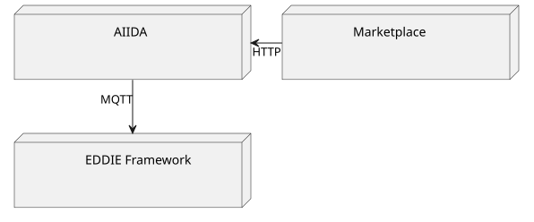

The deployment view provides an overview of the technical infrastructure required to execute the system. It details the key infrastructure elements, as well as other relevant infrastructure components. Additionally, the deployment view maps the system's software building blocks to these infrastructure elements, illustrating how the various components are distributed across the infrastructure to support the system's operation. As EDDIE is a system of systems, there are interactions between the individual systems, as illustrated in the image below.

The table below outlines the deployment decisions for each system: the EDDIE Framework, AIIDA, and the Marketplace.

| EDDIE system | Description | Section                                                                                                   |
|-------------------|----------------------------------------------------------------------------------------------------------------------------------------------------------------------------------------------------------------------------------------------------------------------------------------------------------------------------------------------------------------------------------------------------------------------------------------------------------------|------------------------------------------------------------------------------------------------------------------------|
| EDDIE Framework | EDDIE Framework provides an integration platform for regional connectors and serves the Data Needs API. This platform enables regional connectors to implement custom permission-sharing workflows for different regions, forming the basis for data sharing. | [EDDIE Framework Deployment View](../eddie_framework/deployment-view/deployment-view.md)
| AIIDA | AIIDA is an in-house software system for accessing real-time energy data from the customer's site and sending it to the EDDIE Framework.| [AIIDA Deployment View](../aiida/deployment-view/deployment-view.md)                                                                      |
| Marketplace | The Marketplace provides a discovery mechanism for customers and eligible parties, enabling customers to search for energy services from eligible parties and eligible parties to search for customer data.                             | [Marketplace Deployment View](../marketplace/deployment-view/deployment-view.md)                                                          |

The EDDIE system runs across four nodes which are described in the table below.

| Node                                 | Description                                                                                                                                                                                                                                                                                                                                                                             |
| ------------------------------------ | --------------------------------------------------------------------------------------------------------------------------------------------------------------------------------------------------------------------------------------------------------------------------------------------------------------------------------------------------------------------------------------- |
| Eligible Party Infrastructure        | This is operated by the eligible party. The Local Computing Infrastructure is used for running the EDDIE framework which is deployed locally on the premises of the eligible party. The Cloud Computing Infrastructure is used for running the EP Website and the Services. The implementation and design of the EP Website and the Services are out of the scope of the EDDIE project. |
| Regional Data-sharing Infrastructure | This is operated by country-specific entities such as the permission administrator and the metered data administrator.                                                                                                                                                                                                                                                                  |
| In-house Infrastructure              | This node is operated by the customer. It includes an in-house device (e.g., a Raspberry Pi computer) and the Smart Meter.                                                                                                                                                                                                                                                              |
| Federated Infrastructure             | This node hosts the Marketplace. The Marketplace may include Services of multiple eligible parties. Thus, one or more eligible parties might operate the Marketplace as a federated service running, e.g., on cloud computing resources.                                                                                                                                                |
