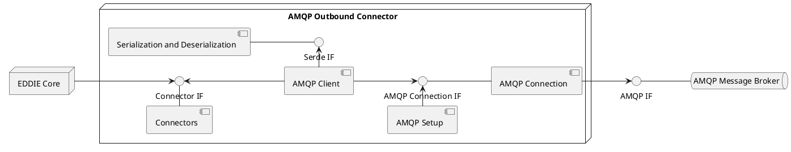

The EDDIE Framework produces a number of messages that need to be delivered to the Eligible Party.
The AMQP Outbound Connector delivers these messages to an AMQP Message Broker, for example RabbitMQ.
This allows the Eligible Party to receive the messages via an AMQP client.
Furthermore, it is possible for the Eligible Party to send messages to the EDDIE Framework via the AMQP Message Broker.
The messages are described in detail in the [Messages and Documents](https://architecture.eddie.energy/framework/2-integrating/messages/messages.html) section of the EDDIE Framework docs.
See the [Outbound Connector Building Blocks](./outbound-connectors.md) for more information.

The following diagram shows the building blocks of the AMQP Outbound Connector.

## Connectors

This component manages outbound messages, sent by the EDDIE Framework to the Eligible Party, and inbound messages, sent to the EDDIE Framework from the Eligible Party.

## Serialization and Deserialization (SerDe)

This component is responsible for serializing messages to JSON or XML and vice versa.

## AMQP Connection

The AMQP Connection component is responsible for managing the low level communication with the AMQP Message Broker.

## AMQP Client

The AMQP Client is responsible for sending and receiving messages from the AMQP Connection.
It uses the SerDe component to serialize and deserialize these messages.
Furthermore, it uses the Connectors to send messages from the AMQP Message Broker to the EDDIE Core and vice versa.

## AMQP Setup

The AMQP Setup component is responsible for setting up the infrastructure on the AMQP Message Broker, such as Queues.
For more information on setting up a AMQP Message Broker see the [AMQP docs](https://www.amqp.org/product/architecture.html).

