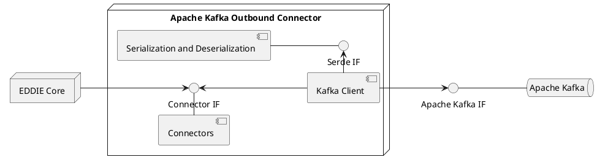

The EDDIE Framework produces a number of messages that need to be delivered to the Eligible Party.
The Apache Kafka Outbound Connector, or Kafka Outbound Connector, delivers these messages to a Apache Kafka Broker.
This allows the Eligible Party to receive the messages via an Apache Kafka client.
Furthermore, it is possible for the Eligible Party to send messages to the EDDIE Framework via Apache Kafka.
The messages are described in detail in the [Messages and Documents](https://architecture.eddie.energy/framework/2-integrating/messages/messages.html) section of the EDDIE Framework docs.
See the [Outbound Connector Building Blocks](./outbound-connectors.md) for more information.

The following diagram shows the building blocks of the Kafka Outbound Connector.

## Connectors

This component manages outbound messages, sent by the EDDIE Framework to the Eligible Party, and inbound messages, sent to the EDDIE Framework from the Eligible Party.

## Serialization and Deserialization (SerDe)

This component is responsible for serializing messages to JSON or XML and vice versa.

## Kafka Client

The Kafka Client is responsible for sending and receiving messages from Apache Kafka.
It uses the SerDe component to serialize and deserialize these messages.
Furthermore, it uses the Connectors to send messages from Apache Kafka to the EDDIE Core and it forwards messages from the EDDIE Core to Apache Kafka.

