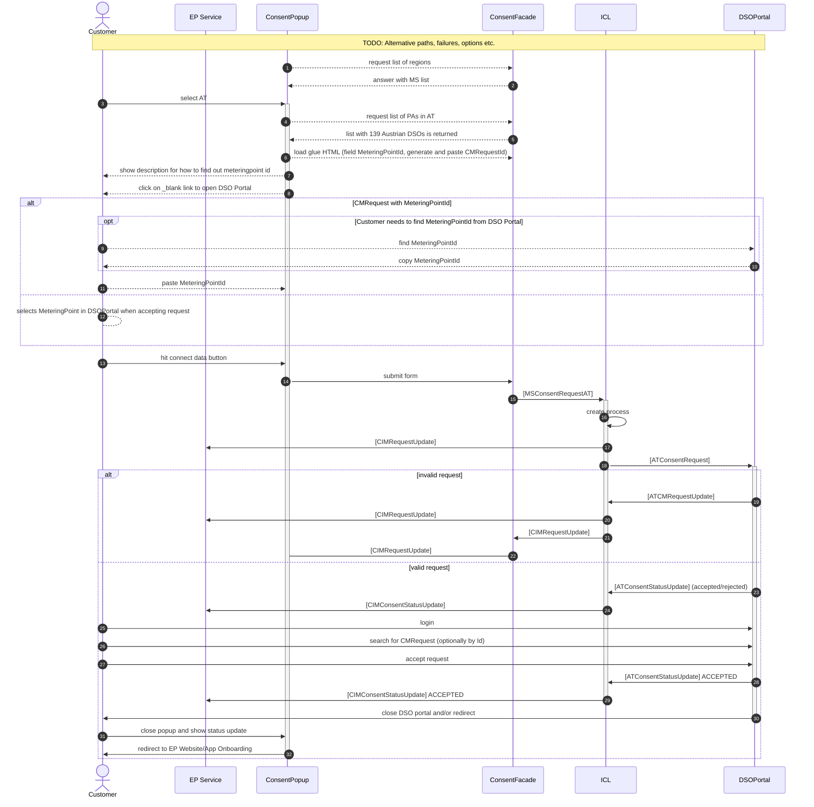

> [!note] TODO
> - What should each RC page contain -> shared structure?
> - How much technical detail?
>
> **Arch docs** -> stakeholders and developers
> - Internal architecture
> - Sequence Diagrams
> - Component diagrams
> - Class diagrams (if complex and stable enough)
> - Link to operation manual
>
> **Operation manual** -> eligible parties
> - Setup / Prerequisites
> - Configuration
> - Sketch + Screencast
> - Supported features
> - Regional coverage (what countries/regions/companies)
> - Onboarding help
> - How to test the RC manually
>
> Not everything will fit neatly into the "building block view"

[Onboarding and configuration](https://eddie-web.projekte.fh-hagenberg.at/framework/1-running/region-connectors/region-connector-at-eda.html)

> [!note] TODO: Copied from our wiki. Please review.

