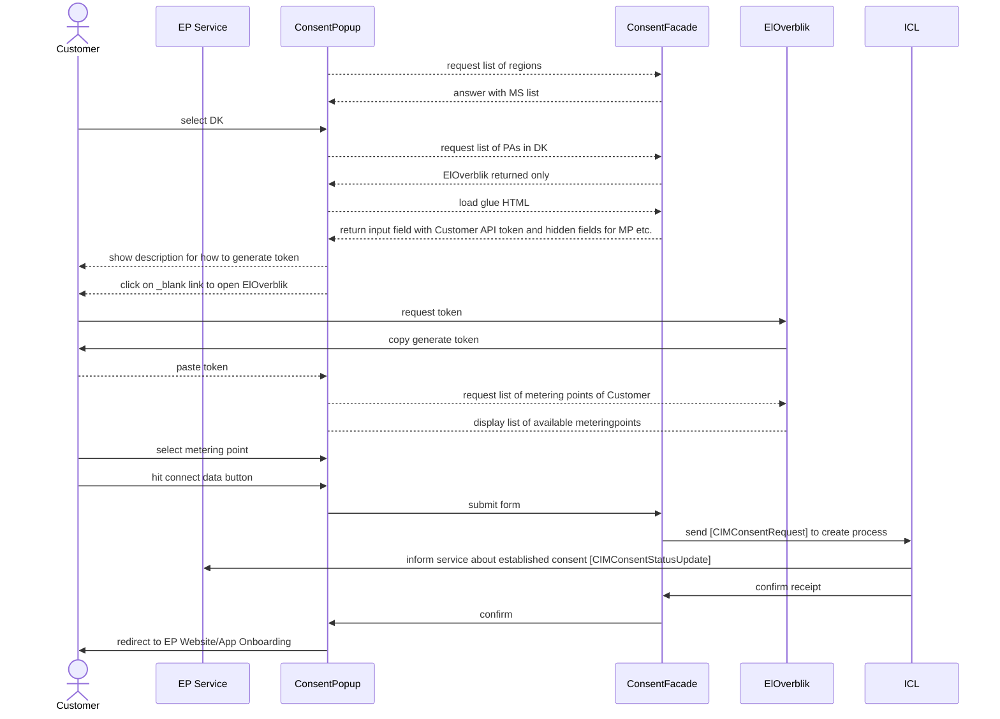

> [!note] TODO: Copied from our wiki. Please review.
  

```mermaid
sequenceDiagram
Actor Customer
participant EP Service
ConsentPopup-->>ConsentFacade:request list of regions
ConsentFacade-->>ConsentPopup:answer with MS list
Customer->>ConsentPopup: select DK
ConsentPopup-->>ConsentFacade:request list of PAs in DK
ConsentFacade-->>ConsentPopup:ElOverblik returned only
ConsentPopup-->>ConsentFacade:load glue HTML
ConsentFacade-->>ConsentPopup:return input field with Customer API token and hidden fields for MP etc.
ConsentPopup-->>Customer:show description for how to generate token
ConsentPopup-->>Customer:click on _blank link to open ElOverblik
Customer->>ElOverblik:request token
ElOverblik->>Customer:copy generate token
Customer-->>ConsentPopup:paste token
ConsentPopup-->>ElOverblik:request list of metering points of Customer
ElOverblik-->ConsentPopup:display list of available meteringpoints
Customer->>ConsentPopup:select metering point
Customer->>ConsentPopup:hit connect data button
ConsentPopup->>ConsentFacade:submit form
ConsentFacade->>ICL:send [CIMConsentRequest] to create process
ICL->>EP Service:inform service about established consent [CIMConsentStatusUpdate]
ICL->>ConsentFacade:confirm receipt
ConsentFacade->>ConsentPopup:confirm
ConsentPopup->>Customer:redirect to EP Website/App Onboarding    
```
