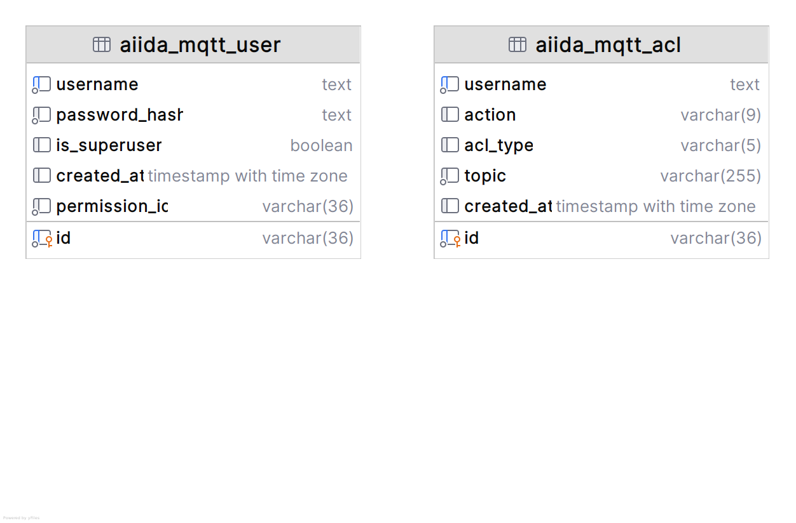

To share near real-time energy data the AIIDA region connector is used.
AIIDA acts as a permission administrator in the final customer's home.
AIIDA connects to various data sources in the final customer's home, provides a dashboard for the final customer to
manage the permissions for EPs to access the final customer's data, and provides the data to authorized EPs.

The AIIDA region connector is a building block of the EDDIE Framework that integrates with AIIDA.
The permissions created with the AIIDA region connector are managed by the final customer.

For EDDIE to receive data from AIIDA, the AIIDA region connector is required to establish the permission and the
connection between the EDDIE framework and AIIDA.

## Functionality

The AIIDA region connector's responsibility is to implement the permission process of AIIDA and to provide access to
near real-time energy data on behalf of the Eligible Party.
The permission facade of the AIIDA region connector generates a quick-response (QR) code that the final customer can
scan with the AIIDA application to establish the permission.

After scanning, the final customer may accept or reject the permission request.
Once the permission is accepted, AIIDA and the EDDIE framework will do a handshake, thus establishing a connection.
The AIIDA region connector creates MQTT credentials for this permission, which AIIDA will use to communicate with the
EDDIE framework.
In addition to the credentials, the AIIDA region connector will create a data topic, status topic and termination topic.
To which topics AIIDA can publish and subscribe to are defined by the data need, which determines how the access control
list (ACL) for this permission is generated.

For outbound data, AIIDA will publish near-real time energy data to the data topic.
For inbound data, AIIDA will subscribe to the data topic to receive messages from the EDDIE framework.
AIIDA will in both cases publish to the status topic to inform the EDDIE framework about changes in the permission
status, and subscribe to a termination topic to receive a termination message from the EDDIE framework if the permission
is terminated by the EP.

## MQTT Connection

AIIDA and the AIIDA region connector communicate solely via MQTT.
The AIIDA region connector requires an EMQX MQTT Broker to which AIIDA can connect and publish/subscribe to the topics
defined in the permission.
To ensure that only authorized AIIDA instances can connect to the MQTT Broker, the AIIDA region connector creates a user
for each permission in the AIIDA region connector database table of the EDDIE database, serving as an identity and
access management (IAM) database.
The username of this user is always the permission ID.
The MQTT streaming configuration is exchanged with AIIDA when they do the handshake after the permission is accepted by
the final customer.

## IAM Database Table

When doing the handshake the AIIDA region connector saves the following information in the AIIDA region connector
database table of the EDDIE database, which will then be used to authenticate and authorize AIIDA when connecting to the
MQTT Broker.

The table `aiida_mqtt_user` contains the MQTT credentials for each permission.

| Column        | Description                                                                                                                                                                                |
|---------------|--------------------------------------------------------------------------------------------------------------------------------------------------------------------------------------------|
| id            | The consecutive ID of the MQTT user.                                                                                                                                                       |
| username      | The username for the MQTT connection, which is always the permission ID.                                                                                                                   | 
| password_hash | The hashed password for the MQTT connection. The original password  was sent to AIIDA during the handshake after the permission was accepted by the final customer and resides only there. |
| is_superuser  | Whether this user is a superuser. Always false.                                                                                                                                            |
| created_at    | The timestamp when the MQTT credentials were created.                                                                                                                                      |
| permission_id | The ID of the permission this user belongs to.                                                                                                                                             |

The table `aiida_mqtt_acl` contains the ACLs for each permission.

| Column     | Description                                                                       |
|------------|-----------------------------------------------------------------------------------|
| id         | The consecutive ID of the ACL entry.                                              |
| username   | The username for the MQTT connection, which is always the permission ID.          |
| action     | The action the MQTT user is allowed to perform, either PUBLISH, SUBSCRIBE or ALL. |
| acl_type   | The ACL type which is either ALLOW or DENY.                                       |
| topic      | The topic the MQTT user is allowed to access.                                     |
| created_at | The timestamp when the ACL entry was created.                                     |