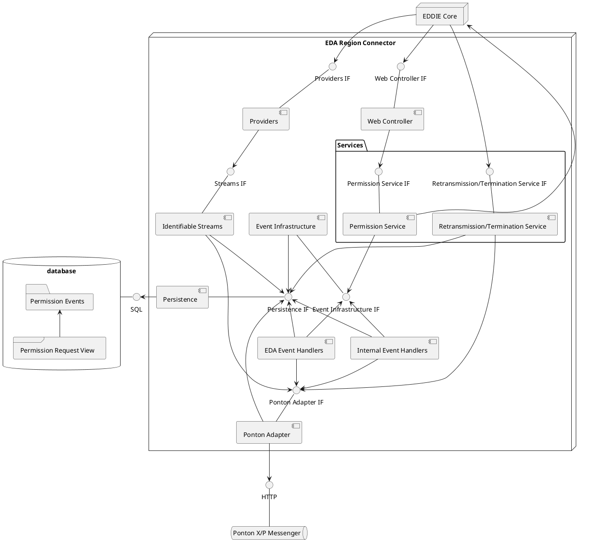

## Overview

The EDA Region Connector integrates the EDDIE Framework with the Austrian data infrastructure operated by EDA.  
It connects to the Austrian Permission Administrators and Metered Data Administrators through the PontonXP Messenger, which implements the AS4 protocol required in Austria.

For information on how to operate the EDA Region Connector, see the [Framework Docs](https://eddie-web.projekte.fh-hagenberg.at/framework/1-running/region-connectors/region-connector-at-eda.html).

> [!NOTE]
> Shared components described in the [region connectors section](./regional-connectors.md#shared-components) will not be included in the figure unless necessary.

### Persistence

The persistence components are responsible for persisting and querying permission events.
Permission events might be preprocessed in the database using the permission request view.
This view aggregates related permission events into a permission request.

The persistence components also track which energy data was already received for which permission request.

### Ponton Adapter

The Ponton Adapter component is responsible for sending and receiving messages from the Ponton X/P Messenger.
It offers an interface to send messages and subscribe to messages in a reactive way.
The adapter also uses the persistence component to add context to the messages that it produces via its interface.

### Event Infrastructure

This is a shared component that is described in the [Shared Components](./regional-connectors.md#shared-components) section.

### EDA Event Handlers

The EDA Event Handlers receive events from the Ponton Adapter and translate them to internal events, which are sent to the Event Infrastructure if necessary.

### Internal Event Handlers

The Internal Event Handlers react to events sent through the Event Infrastructure.
They in turn will send additional events, such as a fulfilled event, or send messages to the Ponton Adapter, such as the initial permission request designated for the final customer to accept.

### Identifiable Streams

This component subscribes to all energy data related messages from the [Ponton Adapter](#ponton-adapter), these are the accounting point and validated historical data.
It correlates them with existing permission requests and filters them on wether the data was already received and if the permission request exists and is still accepting new data.
For example, it will filter data that is related to a permission request, which is already fulfilled.

### Providers

The providers subscribe to the filtered data from the [Identifiable Streams](#identifiable-streams) and map them to CIM or agnostic messages.
The mapped streams are then served via an interface to the EDDIE Core.
For all message types see the [Framework docs](https://architecture.eddie.energy/framework/2-integrating/messages/messages.html).

### Permission Service

The Permission Service is responsible for creating and validating new Permission Requests.
It interacts with the EDDIE Core to get information about Data Needs to validated the permission requests.
It sends events to the Event Infrastructure when creating and validating the permission requests.

### Retransmission/Termination Service

This component is responsible for managing retransmission and termination requests coming from the eligible party.
It produces the corresponding events and Ponton Adapter messages.

### Web Controller

This component is responsible for managing the region connector specific API endpoints, which are used to create permission requests.
The endpoints are served by the EDDIE Core.

