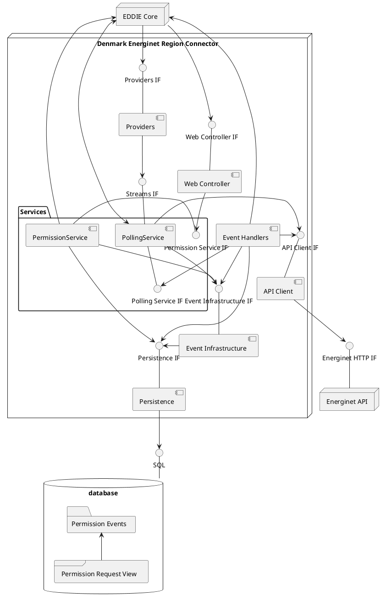

## Overview

The Energinet Region Connector integrates the EDDIE Framework with Energinet.
It uses the Energinet REST API to retrieve data.

For information on how to operate the Energinet Region Connector, see the [Framework Docs](https://architecture.eddie.energy/framework/1-running/region-connectors/region-connector-dk-energinet.html).

> [!NOTE]
> Shared components described in the [region connectors section](./regional-connectors.md#shared-components) will not be included in the figure unless necessary.

## Shared Components

The following components are shared by all region connectors and are described in the [shared component](./regional-connectors.md#shared-components) section.

- [Event Infrastructure](./regional-connectors.md#event-infrastructure)
- [Persistence](./regional-connectors.md#persistence-components)
- [Permission Events](./regional-connectors.md#permission-events)
- [Permission Request View](./regional-connectors.md#permission-request-views)
- [Web Controller](./regional-connectors.md#web-controller)
- [Providers](./regional-connectors.md#providers)

## API Client

The API client communicates with the Energinet API to get energy data and retrieve credentials to access the energy data of the final customer.

## Permission Service

The permission service is responsible for creating and validating permission requests.
For validation the service gets information about the data need from the EDDIE Core.
It creates the corresponding events for those actions.
Furthermore, it is responsible for retrying to send permission requests to the Energinet API if that has failed before.

It manages the termination of permission requests too.
It retrieves the permission request that is to be terminated from the Persistence Component and verifies that it can be terminated.

## Polling Service

The polling service is responsible for retrieving energy data once it is made available.
This includes checking at a specified interval if new data is available.
It polls the data based on data needs which are made available by the EDDIE Core.
It filters the data and will fulfill the permission request if all required data was polled.
Furthermore, it will poll data for retransmission requests if the associated permission request is still active.

## Event Handlers

The event handlers are responsible for sending the permission request to Energinet using the API Client.They will then emit events depending on if the permission request was accepted, reject, invalid, or if it could not be sent.

Furthermore, they will trigger the polling of energy data once the permission request was accepted.
