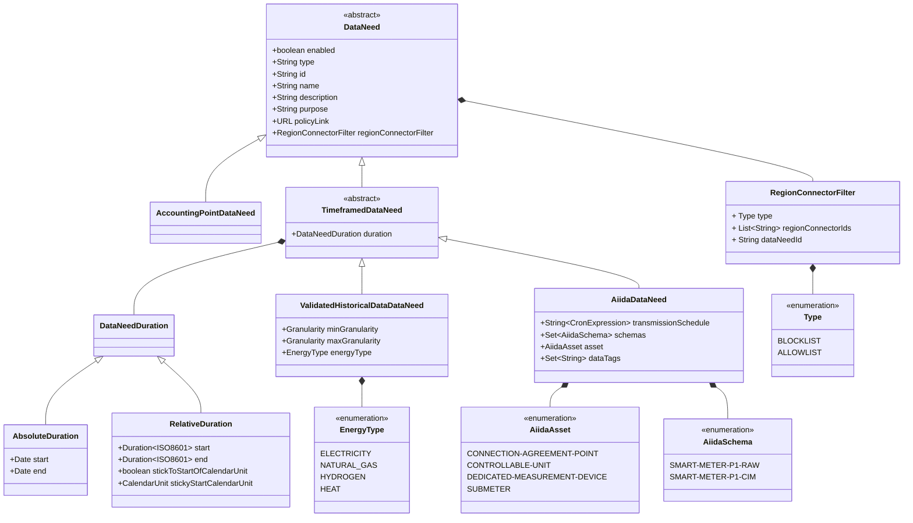

## Permission Facade

The permission facade describes the process that enables the eligible party to request and the customer to grant permission to access customer data.

This includes
- the EDDIE button to be [embedded](../architectural-decisions/architectural-decisions.md#embed-the-eddie-button-as-a-custom-element) into the website of the eligible party,
- the permission dialog guiding the customer to create permissions,
- the endpoints to register said permissions on the backend,
- and sending the permission requests to the permission administrators.

The term "facade" refers to the [structural design pattern](https://refactoring.guru/design-patterns/facade) to provide a simplified interface to the regional implementations.

With most of these aspects located on the frontend, the permission facade is often referred to as the frontend of the EDDIE framework.

The permission facade does not exist as an individual component but spreads across the EDDIE core and region connectors.

## Data Needs

Eligible parties require different data to provide their services. 
The specification of such data requirements is standardized across region connectors as _data needs_. 
A data need specifies the data family to be requested and a time frame, 
as well as additional parameters relevant for the data type.

On the frontend, data needs are used to inform the user about what data is provided to the eligible party and to determine which region connectors are available.

The following diagram shows the different types of data needs. 
More details are available in the [operation manual](https://eddie-web.projekte.fh-hagenberg.at/framework/2-integrating/data-needs.html).

