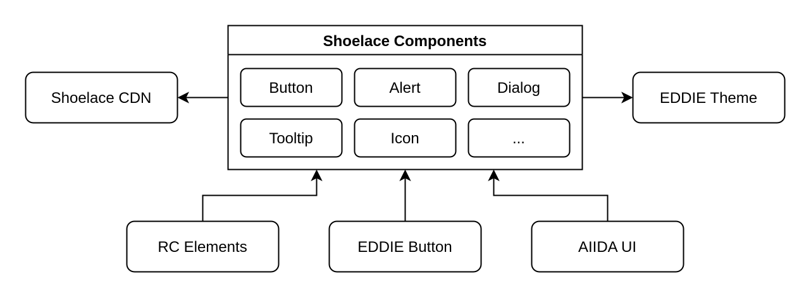
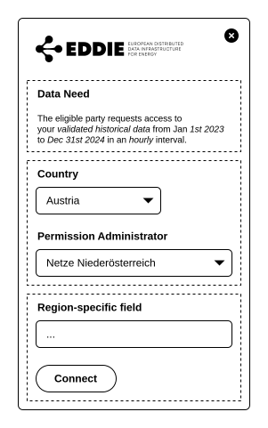
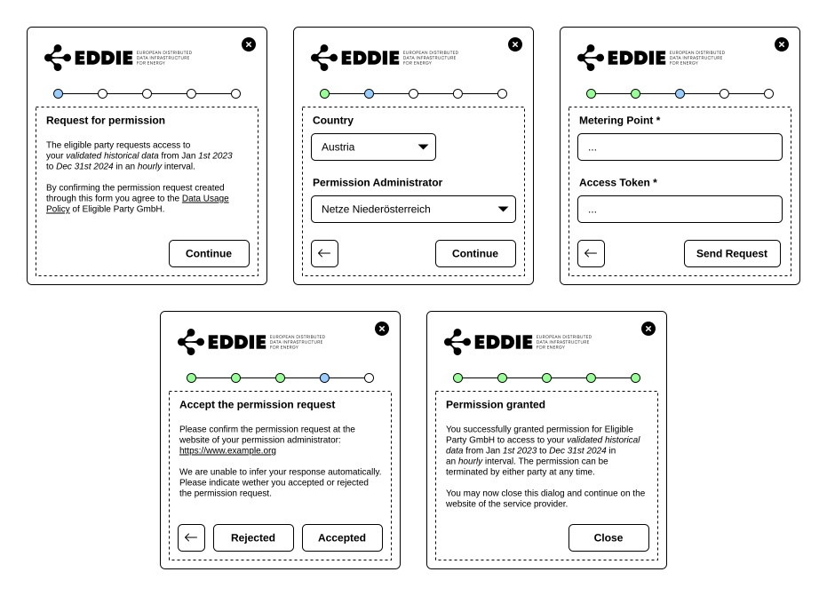
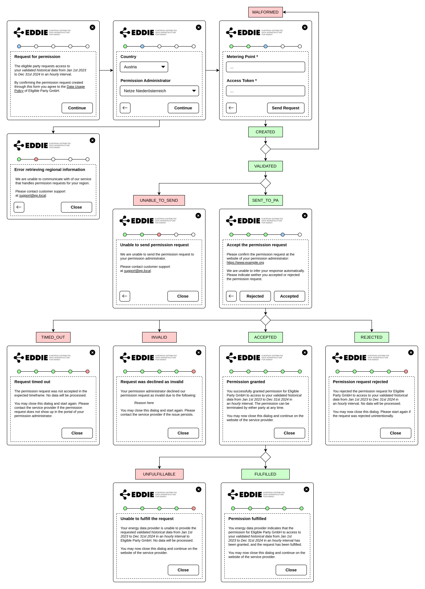

## Shoelace for EDDIE Button and RC Elements

The [Shoelace](https://shoelace.style/) library provides a set of common components and styles and is used to ensure a consistent user experience across EDDIE components.

Shoelace also supports [theming](https://shoelace.style/getting-started/themes) through CSS variables and [localization](https://shoelace.style/getting-started/localization).

As the EDDIE project matures, custom components can be developed to gradually replace the Shoelace library.

Relevant Shoelace components are loaded from a Content Delivery Network (CDN) at run-time, effectively eliminating the need for a separate build step.

**Advantages**

- The use of an existing component library reduces development time.
- Component libraries ensure a uniform look and feel across elements, thereby enhancing the overall user experience.

**Disadvantages**

- The button has to load styles and components of the library.
- Specific styling that might not fit EDDIE.

## EDDIE Button as Multistep Form

The initial implementation of the EDDIE button uses a lot of vertical space to fit all information inside a single form dialog.
This may overwhelm and discourage the user and also leads to layout shifts during interaction.

Instead of showing all information at once, the dialog can display similar fields in separate steps.
Such steps may be

1. display of the data need
2. country and PA selection
3. RC form (metering point, access token)
4. RC post-request instructions and actions (accept, reject, continue)
5. success page

The actual steps and even the number of total steps may depend on the button configuration (presets) and data need (AIIDA).

Following the multistep approach, the form dialog communicates the state of the permission request, as well as error cases, as separate pages.

The complete collection of diagrams is available on [Sharepoint](https://hartnerconsultingcom.sharepoint.com/:f:/r/sites/EuropeanDataAccess/Freigegebene%20Dokumente/WPs/WP2_FrameworkAPI/Permission%20Facade%20Design?csf=1&web=1&e=5dxhVW).

The implementation of this approach is tracked in [GH-1233](https://github.com/eddie-energy/eddie/issues/1233).

### Q&A

#### Title the step indicators?

The content of the step should show all necessary information to the end user, including instructions on how to proceed.
There is little benefit in adding additional text above the step indicator.

Placing text content above the step indicator also does not work well with the limited space on mobile devices.

#### Show the connection ID?

The connection ID is intended for the eligible party to identify created permission requests.
This identifier is likely not human-readable and of no use to the end user.

One could argue that it might be relevant for debugging a session.
However, the connection ID used should have no impact on the behavior of the EDDIE button.

#### Allow back navigation on the result page?

As with after request creation, there is no technical problem.
However, there is no action on the previous page that could modify the created request.
The only reason is for the end user to deliberately create a separate request with the same button configuration (data need and connection id).
There is no reason for a normal user to do so, and the intended flow is for the end user to start a separate process instead.

#### Why always show five steps instead of the actual number?

We only know the number of required steps once the end user selects their permission administrator, which is already two steps in.

#### Show the status of the permission request?

The internal status of the permission request does not concern the end user.
They will instead be presented with the right content and instructions for the current status.

#### Reset the button on successful interaction?

Apart from demonstrative purposes, there are limited cases where the end user might reset the state of their dialog to start a separate permission process.
Therefore, it does not make sense to add a "reset" button in the dialog.
There are two opposing assumptions to make for what the user expects when they click the button after closing it post-completion.
1. They want to review the final state that they reached.
2. They want to start over in case an error state was reached.

For now, the dialog is to reset when the user closes the dialog using the "Close" button after reaching a final state.
This eases demonstration and allows the eligible party to instruct the user to retry a permission process.
To be consistent with typical dialog behavior, 
the button should not reset when the user closes the dialog by other means,
like clicking outside the dialog or clicking the close button on the top right.
The implementation might change based on feedback from demonstrators or eligible parties.
In reality, the eligible party will likely redirect the user on completion or reset the button themselves.

#### Allow back navigation after request creation?

The end user might want to abandon the created request if they made a mistake.
However, this is very uncommon, and a created request will be idle and can still be accepted, potentially confusing the end user.
To account for this scenario, the content of the previous steps must already provide all required information.

The user might also abandon the request intentionally or by accident.
If the user ignores the request in the PA portal, it will not be processed.
Since the user will typically not be able to reproduce the same result after navigating back after request creation, the navigation will be removed.