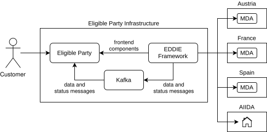

The EDDIE Framework provides eligible third parties with the tools to access to energy data from various Data Access Providers (DAPs) throughout the European Union.
This is done by implementing a unified interface to create permission requests and access energy data that abstracts away the diverse processes required by different data providers.

The documentation of the EDDIE Framework follows the [arc42](https://arc42.org/) template.
The [Solution Strategy](./solution-strategy/solution-strategy.md) explains fundamental concepts and decisions shaping the framework architecture. 
Afterward, the [Building Block View](./building-block-view/building-block-view.md) lays out the main building blocks of the system using the [C4 Model](https://c4model.com/). 
The [Runtime View](./runtime-view/runtime-view.md) then shows the system behavior through important use-cases,
while the [Deployment View](./deployment-view/deployment-view.md) shows how the system is deployed to the infrastructure of the eligible party. 
The [Crosscutting Concepts](./crosscutting-concepts/crosscutting-concepts.md) section documents domain, development, and user experience concepts present throughout the system.
Finally, the [Architectural Decisions](./architectural-decisions/architectural-decisions.md) section describes important decisions and their motivations.