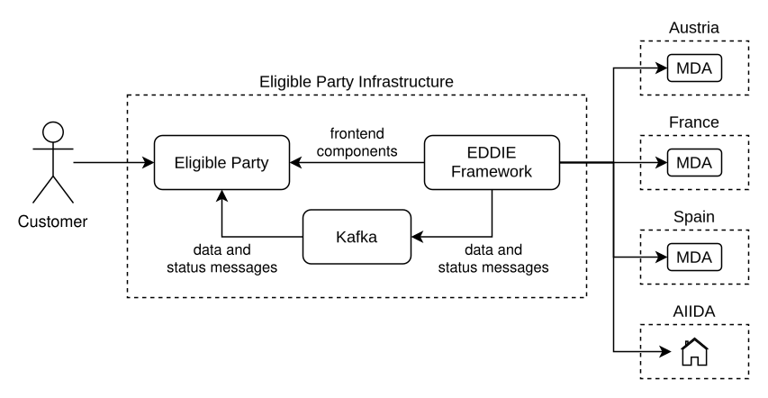

<!-- Regional Data-sharing Infrastructure is a common term used accross this document for Data Access Providers (DAPs) -->

The EDDIE Framework is one of the software systems of EDDIE, along with AIIDA and the Marketplace. It provides eligible third parties with unified access to energy data from various Regional Data-sharing Infrastructures throughout the European Union. For this reason, the EDDIE Framework implements a common interface that allows third parties to create permission requests and retrieve energy data. By doing so, it abstracts away the diverse processes and requirements of different data providers. Thus, the EDDIE Framework ensures that third parties can seamlessly access and use energy data across multiple regions without having to deal with provider-specific complexities.  

<!--  -->

To present the EDDIE Framework comprehensively, the main key decisions are discussed in the [Solution Strategy](./solution-strategy/solution-strategy.md), highlighting the role of the EDDIE framework in [Understanding EDDIE's Role](./understanding-eddie-role/understanding-eddie-role.md). Afterwards, the [Building Block View](./building-block-view/building-block-view.md) describes the main building blocks of the system using the [C4 Model](https://c4model.com/). Then, the [Runtime View](./runtime-view/runtime-view.md) of the system depicts the main behaviors. After that, the [Deployment View](./deployment-view/deployment-view.md) provides an overview of how the framework is deployed in the infrastructure of the eligible party. Finally, the [Architectural Decisions](./architectural-decisions/architectural-decisions.md) section presents the system decisions and their motivations.  