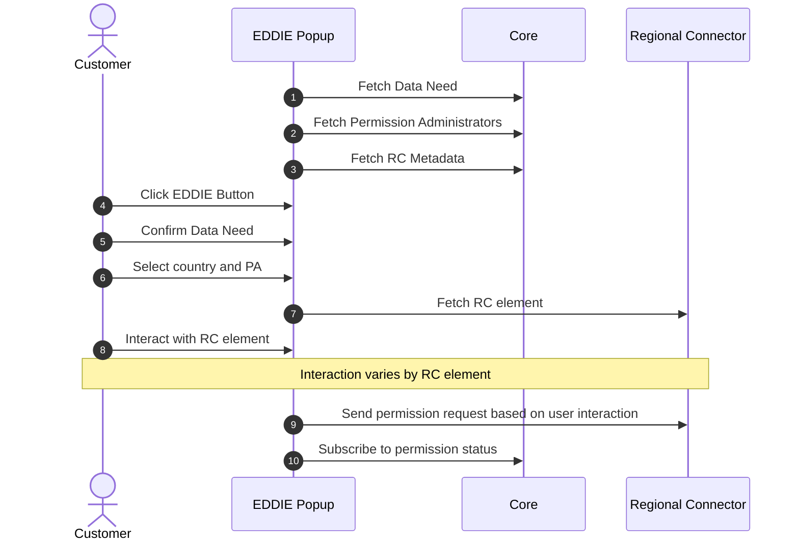

The runtime view describes the behavior of EDDIE Framework and the interaction between its building blocks for important workflows.

This section hides the behavior of individual region connectors and outbound connectors.
Specific documentation can found on the [respective building block pages](../building-block-view/regional-connectors/regional-connectors.md).

## EDDIE Popup

## Permission Process Model

::: info TODO
- Reference Aya's paper once published.
- Check if this should be on the domain concepts page.
- Provide prose description
:::

The [Operation Manual](https://eddie-web.projekte.fh-hagenberg.at/framework/2-integrating/integrating.html#permission-process-model) provides details on how to interpret and handle specific states.

## Use-Cases

::: info TODO
- Please check with @fweingartshofer if these notes are correct!
- Framework docs can be helpful reference: https://eddie-web.projekte.fh-hagenberg.at/framework
:::

### EP requests permission from the customer

- Create a data need via API or admin console
- Embed the EDDIE button and configure it for that data need
- Customer interacts with the button -> request created -> customer accepts
- EP can begin retrieving data
- Some headlines can be combined or split

### Customer grants their permission (maybe merge with "request permission")

Basically the EDDIE Popup flow

- Customer clicks the EDDIE button on the website of the eligible party (or Marketplace?)
- Follows instructions of the permission dialog
- Accepts the permission in the portal of their permission administrator
- Sees error or confirmation page

### Customer revokes their permission

- The customer logs in to the portal of their permission administrator and revoke their consent by whatever action necessary (RC as blackbox here).
- Depending on the RC, we receive information that the permission was revoked or we check ourselves when we stop receiving data for that permission.
- We update the permission status and stop retrieving data.

### EP collects customer data via message broker (Kafka, AMQP, MQTT)

https://eddie-web.projekte.fh-hagenberg.at/framework/1-running/outbound-connectors/outbound-connector-kafka.html

- EP needs at least on outbound connector to be enabled
- EP needs message broker to be available to the EDDIE framework
- Framework receives data and sends it through all outbound connectors
- CIM or non-standardized EDDIE format

### EP collects customer data via HTTP

https://eddie-web.projekte.fh-hagenberg.at/framework/1-running/outbound-connectors/outbound-connector-rest.html

- EP needs rest outbound connector enabled
- Framework receives data and temporarily stores it
- EP collects from HTTP endpoint

### EP terminates the customer's permission

- HTTP request to the API or button in the admin console

### EP tries to retransmit already published customer data (VHD)

- HTTP request to the API or button in the admin console
- Data is sent again through all enabled outbound connectors
