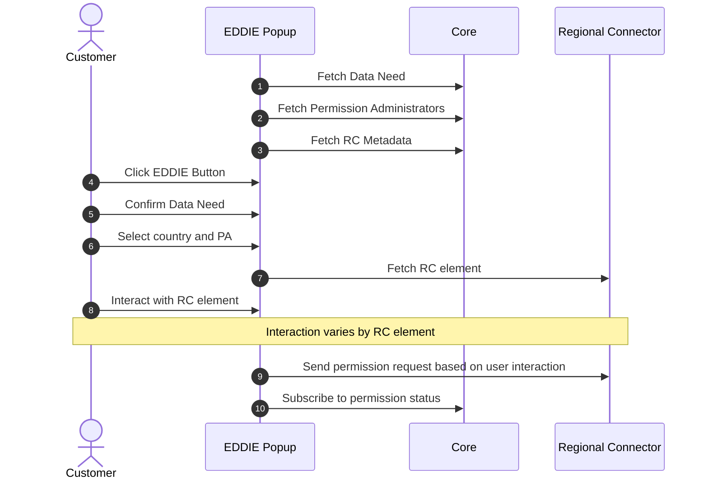

## Overview

The EDDIE Framework implements the following core workflows, which are discussed in the sections below.

- [The eligible party requests and the customer grants permission to access data](./runtime-view.md#the-eligible-party-requests-and-the-customer-grants-permission-to-access-data)
- [The customer revokes a previously granted permission](./runtime-view.md#the-customer-revokes-a-previously-granted-permission)
- [The eligible party collects customer data via message broker (Kafka, AMQP, MQTT)](./runtime-view.md#the-eligible-party-collects-customer-data-via-message-broker-kafka-amqp-mqtt)
- [The eligible party collects customer data via HTTP](./runtime-view.md#the-eligible-party-collects-customer-data-via-http)
- [The eligible party terminates a customer’s permission](./runtime-view.md#the-eligible-party-terminates-a-customers-permission)
- [The eligible party retransmits already published customer data (Validated Historical Data)](./runtime-view.md#the-eligible-party-retransmits-already-published-customer-data-validated-historical-data)

This section hides the behavior of individual region connectors and outbound connectors.
Specific documentation can found on the [respective building block pages](../building-block-view/regional-connectors/regional-connectors.md).

<!-- ### EP requests permission from the customer

- Create a data need via API or admin console
- Embed the EDDIE button and configure it for that data need
- Customer interacts with the button -> request created -> customer accepts
- EP can begin retrieving data
- Some headlines can be combined or split

### Customer grants their permission (maybe merge with "request permission")

Basically the EDDIE Popup flow

- Customer clicks the EDDIE button on the website of the eligible party (or Marketplace?)
- Follows instructions of the permission dialog
- Accepts the permission in the portal of their permission administrator
- Sees error or confirmation page -->

## The eligible party requests and the customer grants permission to access data

1. The Eligible Party (EP) defines a new Data Need using the API or the Admin Console.
1. The EP embeds the EDDIE Popup (button) on their website and configures it with the created Data Need.
1. The Customer visits the EP Website and clicks the EDDIE Popup to begin the permission process.
1. The EDDIE Popup requests the available Data Needs, Permission Administrators, and Regional Connector metadata from the EDDIE Core.
1. The Customer reviews the Data Need, selects their country and Permission Administrator (PA).
1. The EDDIE Popup retrieves the appropriate Regional Connector (RC) element for the selected PA.
1. The Customer interacts with the RC element (e.g., enters metering point ID, access token).
1. The EDDIE Popup sends the permission request to the Regional Connector based on the customer’s input.
1. The EDDIE Popup subscribes to updates on the permission status from the EDDIE Core.
1. The EDDIE Core forwards the permission request to the relevant Regional Connector.
1. The Regional Connector redirects the Customer to their Permission Administrator’s portal to approve the request.
1. The Customer reviews and accepts the permission request in the PA portal.
1. The Regional Connector notifies the EDDIE Core that the permission has been accepted.
1. The EDDIE Core informs the EDDIE Popup, which displays a confirmation or success page to the Customer.
1. The Eligible Party can now begin retrieving validated energy data via the EDDIE Core, which communicates with the Regional Connector to access the data.

## The customer revokes a previously granted permission

<!-- - The customer logs in to the portal of their permission administrator and revoke their consent by whatever action necessary (RC as blackbox here).
- Depending on the RC, we receive information that the permission was revoked or we check ourselves when we stop receiving data for that permission.
- We update the permission status and stop retrieving data. -->

1. The Customer logs in to the portal of their Permission Administrator (PA) through the Permission Facade.
1. The Customer revokes their previously granted permission.
1. The Permission Facade notifies the corresponding Regional Connector (RC) that the permission has been revoked.
1. Depending on the implementation, either the RC sends an explicit revocation notification to the EDDIE Core, or the EDDIE Core detects the revocation by observing that no further data updates are received from the RC.
1. The EDDIE Core updates the permission status in the Database to reflect the revocation.
1. The EDDIE Core instructs the Regional Connector to stop retrieving or transmitting data related to the revoked permission.

### EP collects customer data via message broker (Kafka, AMQP, MQTT)

https://eddie-web.projekte.fh-hagenberg.at/framework/1-running/outbound-connectors/outbound-connector-kafka.html

- EP needs at least on outbound connector to be enabled
- EP needs message broker to be available to the EDDIE framework
- Framework receives data and sends it through all outbound connectors
- CIM or non-standardized EDDIE format

### EP collects customer data via HTTP

https://eddie-web.projekte.fh-hagenberg.at/framework/1-running/outbound-connectors/outbound-connector-rest.html

- EP needs rest outbound connector enabled
- Framework receives data and temporarily stores it
- EP collects from HTTP endpoint

### EP terminates the customer's permission

- HTTP request to the API or button in the admin console

### EP tries to retransmit already published customer data (VHD)

- HTTP request to the API or button in the admin console
- Data is sent again through all enabled outbound connectors

## Use-Cases

::: info TODO
- Please check with @fweingartshofer if these notes are correct!
- Framework docs can be helpful reference: https://eddie-web.projekte.fh-hagenberg.at/framework
:::

## EDDIE Popup

## Permission Process Model

::: info TODO
- Reference Aya's paper once published.
- Check if this should be on the domain concepts page.
- Provide prose description
:::

The [Operation Manual](https://eddie-web.projekte.fh-hagenberg.at/framework/2-integrating/integrating.html#permission-process-model) provides details on how to interpret and handle specific states.
