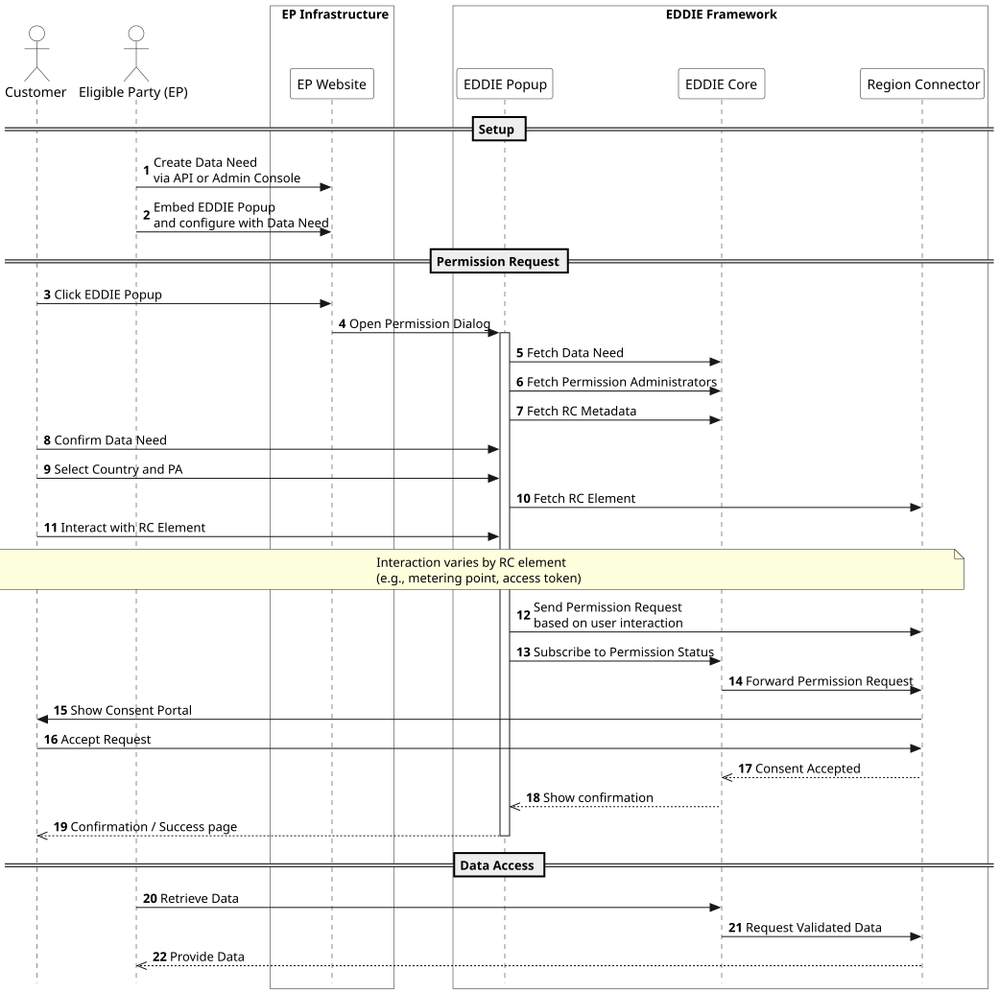
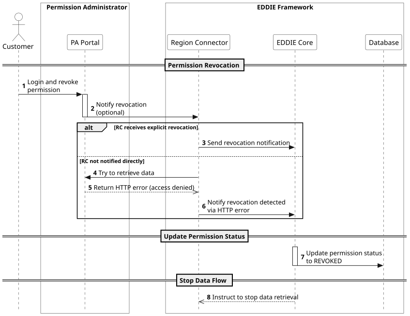
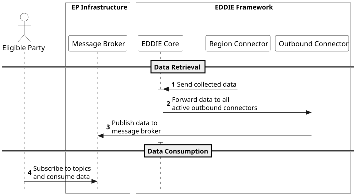
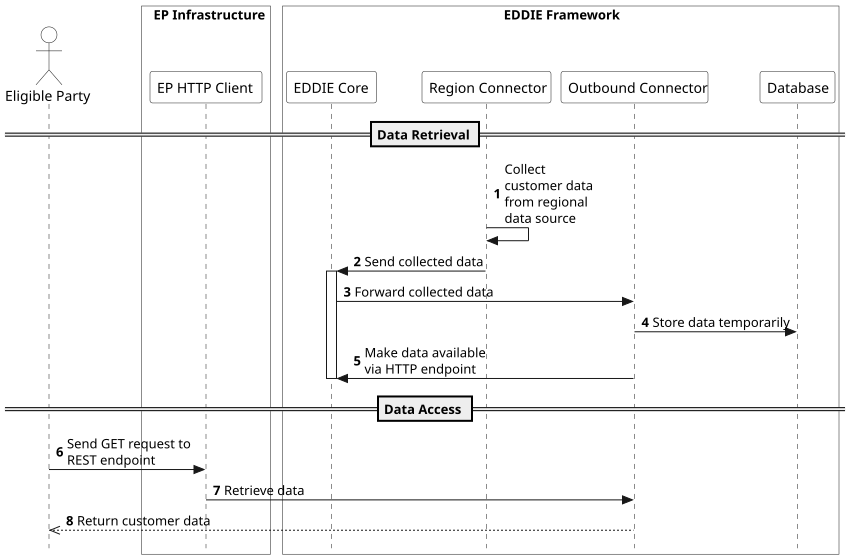
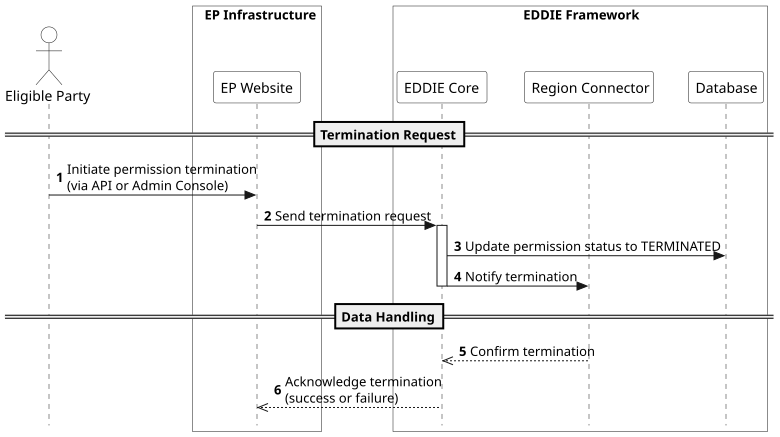
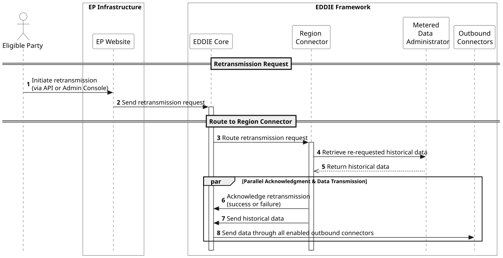

## Overview
The EDDIE Framework implements a set of core workflows that define how Eligible Parties and customers interact during the lifecycle of data access and sharing.
These workflows describe how permissions are created, managed, and terminated, as well as how customer data is transmitted and retransmitted through the system.
The following subsections describe these workflows in detail, each illustrated with sequence diagrams.

- [The Eligible Party requests and the customer grants permission to access data](./runtime-view.md#the-eligible-party-requests-and-the-customer-grants-permission-to-access-data)
- [The customer revokes a previously granted permission](./runtime-view.md#the-customer-revokes-a-previously-granted-permission)
- [The Eligible Party collects customer data via message broker (Kafka, AMQP, MQTT)](./runtime-view.md#the-eligible-party-collects-customer-data-via-message-broker-kafka-amqp-mqtt)
- [The Eligible Party collects customer data via HTTP](./runtime-view.md#the-eligible-party-collects-customer-data-via-http)
- [The Eligible Party terminates a customer’s permission](./runtime-view.md#the-eligible-party-terminates-a-customer-s-permission)
- [The Eligible Party retransmits already published customer data (historical data)](./runtime-view.md#the-eligible-party-retransmits-already-published-customer-data-historical-data)


This section hides the behavior of individual region connectors and outbound connectors.
Specific documentation can found on the [respective building block pages](../building-block-view/regional-connectors/regional-connectors.md).

<!-- ### EP requests permission from the customer

- Create a data need via API or admin console
- Embed the EDDIE button and configure it for that data need
- Customer interacts with the button -> request created -> customer accepts
- EP can begin retrieving data
- Some headlines can be combined or split

### Customer grants their permission (maybe merge with "request permission")

Basically the EDDIE Popup flow

- Customer clicks the EDDIE button on the website of the eligible party (or Marketplace?)
- Follows instructions of the permission dialog
- Accepts the permission in the portal of their permission administrator
- Sees error or confirmation page -->

## The Eligible Party requests and the customer grants permission to access data

This diagram illustrates the complete workflow of how an Eligible Party requests and obtains permission from a Customer to access their energy data through the EDDIE Framework. It covers both the setup phase, where a Data Need is created and the EDDIE Popup is embedded into the EP’s website, and the interactive permission flow between the Customer, the EDDIE Popup, and the corresponding Regional Connector. Once the customer grants consent, the framework establishes a secure data exchange channel that allows the EP to retrieve validated data through the EDDIE Core.



1. The Eligible Party defines a new Data Need using the API or the Admin Console.
1. The EP embeds the EDDIE Popup on their website and configures it with the created Data Need.
1. The Customer visits the EP Website and clicks the EDDIE Popup to begin the permission process.
1. The EDDIE Popup requests the available Data Needs, Permission Administrators, and Regional Connector metadata from the EDDIE Core.
1. The Customer reviews the Data Need, selects their country and Permission Administrator (PA).
1. The EDDIE Popup retrieves the appropriate Regional Connector (RC) element for the selected PA.
1. The Customer interacts with the RC element (e.g., enters metering point ID, access token).
1. The EDDIE Popup sends the permission request to the Regional Connector based on the customer’s input.
1. The EDDIE Popup subscribes to updates on the permission status from the EDDIE Core.
1. The EDDIE Core forwards the permission request to the relevant Regional Connector.
1. The Regional Connector redirects the Customer to their Permission Administrator’s portal to approve the request.
1. The Customer reviews and accepts the permission request in the PA portal.
1. The Regional Connector notifies the EDDIE Core that the permission has been accepted.
1. The EDDIE Core informs the EDDIE Popup, which displays a confirmation or success page to the Customer.
1. The Eligible Party can now begin retrieving validated energy data via the EDDIE Core, which communicates with the Regional Connector to access the data.

## The customer revokes a previously granted permission

<!-- - The customer logs in to the portal of their permission administrator and revoke their consent by whatever action necessary (RC as blackbox here).
- Depending on the RC, we receive information that the permission was revoked or we check ourselves when we stop receiving data for that permission.
- We update the permission status and stop retrieving data. -->



1. The Customer logs in to the portal of their Permission Administrator (PA) through the Permission Facade.
1. The Customer revokes their previously granted permission.
1. The Permission Facade notifies the corresponding Regional Connector (RC) that the permission has been revoked.
1. Depending on the implementation, either the RC sends an explicit revocation notification to the EDDIE Core, or the EDDIE Core detects the revocation by observing that no further data updates are received from the RC.
1. The EDDIE Core updates the permission status in the Database to reflect the revocation.
1. The EDDIE Core instructs the Regional Connector to stop retrieving or transmitting data related to the revoked permission.

## The Eligible Party collects customer data via message broker (Kafka, AMQP, MQTT)

<!-- https://eddie-web.projekte.fh-hagenberg.at/framework/1-running/outbound-connectors/outbound-connector-kafka.html

- EP needs at least on outbound connector to be enabled
- EP needs message broker to be available to the EDDIE framework
- Framework receives data and sends it through all outbound connectors
- CIM or non-standardized EDDIE format -->




1. The Eligible Party ensures that at least one Outbound Connector is enabled in the EDDIE Framework.
1. The EP provides a message broker (Kafka, AMQP, or MQTT) that is reachable by the EDDIE Framework.
1. The Regional Connector collects energy data from the respective regional data source and sends it to the EDDIE Core, formatted either in CIM or in a non-standardized EDDIE format.
1. The EDDIE Core forwards the received data to all active Outbound Connectors.
1. The Outbound Connector publishes the data to the configured message broker.
1. The Eligible Party subscribes to the relevant topics on the message broker and consumes the transmitted customer data.

## The Eligible Party collects customer data via HTTP

<!-- https://eddie-web.projekte.fh-hagenberg.at/framework/1-running/outbound-connectors/outbound-connector-rest.html

- EP needs rest outbound connector enabled
- Framework receives data and temporarily stores it
- EP collects from HTTP endpoint -->



1. The Eligible Party ensures that the REST Outbound Connector is enabled in the EDDIE Framework.
1. The Regional Connector collects customer data from the regional data-sharing infrastructure and sends it to the EDDIE Core.
1. The EDDIE Core temporarily stores the received data in the Database.
1. The EDDIE Core forwards the data to the REST Outbound Connector, which makes it available through an HTTP endpoint.
1. The Eligible Party uses its HTTP client to send a GET request to the REST endpoint.
1. The Outbound Connector retrieves the requested data and returns it to the EP in the response.

## The Eligible Party terminates a customer’s permission

<!-- - HTTP request to the API or button in the admin console -->


1. The Eligible Party initiates a termination of a customer’s permission, either by:
1. Sending an HTTP request to the EDDIE API, or
1. Clicking a button in the Admin Console.
1. The EP interface (HTTP client or Admin Console) sends the termination request to the EDDIE Core.
1. The EDDIE Core updates the Database, marking the permission status as TERMINATED.
1. The EDDIE Core notifies the Region Connector about the termination.
1. The Region Connector confirms the termination with the EDDIE Core.
1. The EDDIE Core acknowledges the result of the termination process to the EP interface (success or failure).

## The Eligible Party retransmits already published customer data (historical data)

<!-- - HTTP request to the API or button in the admin console
- Data is sent again through all enabled outbound connectors -->


1. The Eligible Party initiates retransmission of previously published data by either:
1. Sending an HTTP request to the API, or
1. Clicking a button in the Admin Console.
1. The EP interface sends the retransmission request to the EDDIE Core.
1. The EDDIE Core queries the Database to retrieve the stored historical data.
1. The Database returns the requested data to the EDDIE Core.
1. The EDDIE Core transmits the retrieved data through all enabled outbound connectors (e.g., Kafka, AMQP, MQTT, HTTP).
1. Each Outbound Connector acknowledges successful data transmission.
1. The EDDIE Core sends a final acknowledgment to the EP interface, confirming successful or failed retransmission.

<!-- ## Use-Cases

::: info TODO
- Please check with @fweingartshofer if these notes are correct!
- Framework docs can be helpful reference: https://eddie-web.projekte.fh-hagenberg.at/framework
:::

## EDDIE Popup

```mermaid
sequenceDiagram
    autonumber
    actor Customer
    participant Popup as EDDIE Popup
    participant Core
    participant RC as Regional Connector
    Popup ->> Core: Fetch Data Need
    Popup ->> Core: Fetch Permission Administrators
    Popup ->> Core: Fetch RC Metadata
    Customer ->> Popup: Click EDDIE Button
    Customer ->> Popup: Confirm Data Need
    Customer ->> Popup: Select country and PA
    Popup ->> RC: Fetch RC element
    Customer ->> Popup: Interact with RC element
    Note over Customer, RC: Interaction varies by RC element
    Popup ->> RC: Send permission request based on user interaction
    Popup ->> Core: Subscribe to permission status
``` -->
