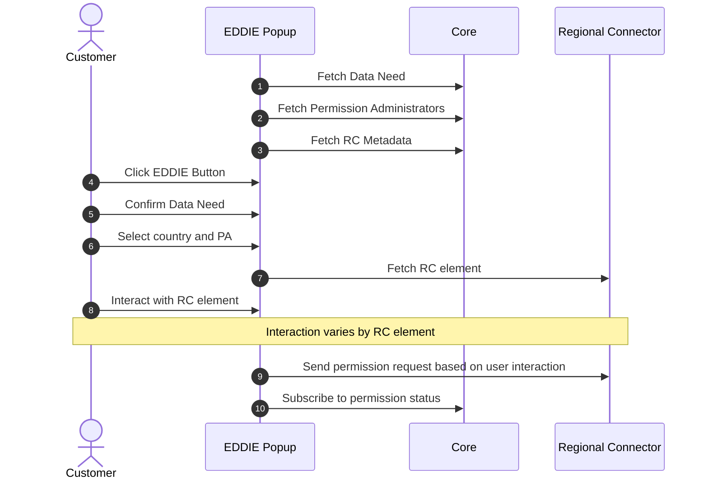
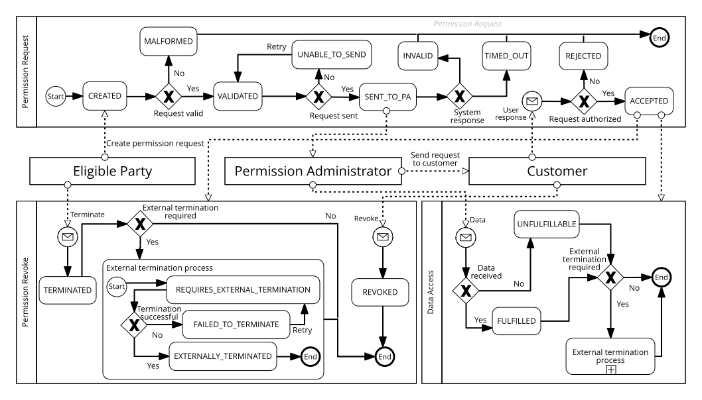

The runtime view describes the behavior of EDDIE Framework and the interaction between its building blocks for important workflows.

This section hides the behavior of individual region connectors and outbound connectors.
Specific documentation can found on the [respective building block pages](../building-block-view/regional-connectors/regional-connectors.md).

## EDDIE Popup

## Permission Process Model

::: info TODO
- Reference Aya's paper once published.
- Check if this should be on the domain concepts page.
:::

The [Operation Manual](https://eddie-web.projekte.fh-hagenberg.at/framework/2-integrating/integrating.html#permission-process-model) provides details on how to interpret and handle specific states.

## Use-Cases                          
### Collect the customer's information
### Request the customer's consent    
### Access the customer's data        
### Send the data to the services     
### Revoke the customer's consent     
