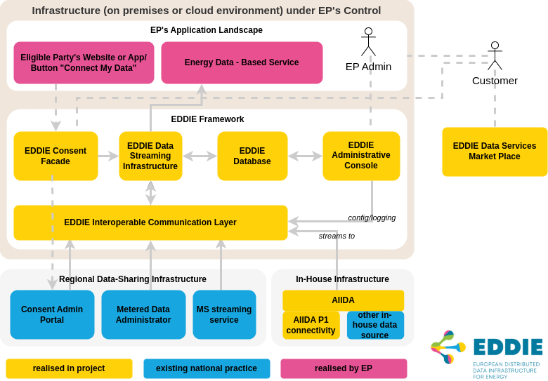
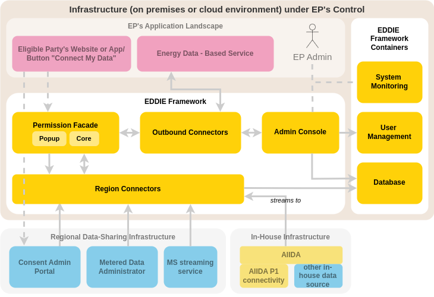
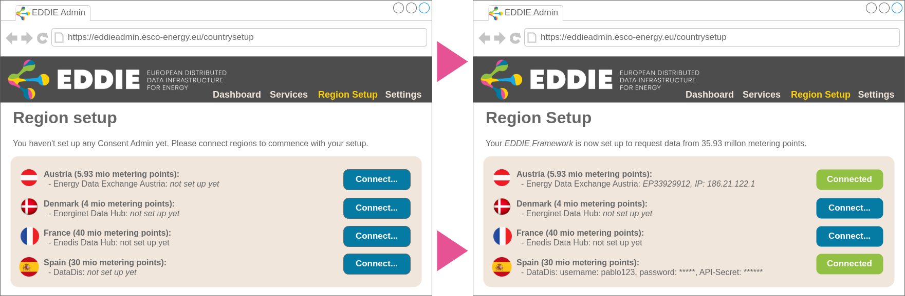
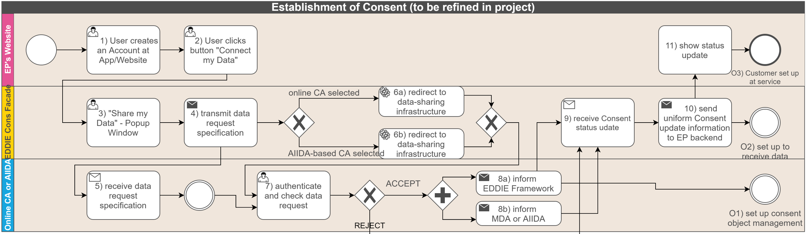

This page aims to describe the journey from the initial project specification towards the implemented architecture
by relating the methodology outlined in the Grant Agreement (Part B, Section 1.2, Pages 11–25)
to the documented architecture with references to related pages.

For those familiar with the Grant Agreement or early publications, it might serve as an improved point of entry towards the current state of the EDDIE Framework.
Others may find in it a more coherent view on architectural drivers and functional requirements.
Please note that the Grant Agreement is not a public document and therefore not shared with this documentation.

With its methodological structure, this page can be read as a historical companion to the [solution strategy](../solution-strategy/solution-strategy.md).

## EDDIE core components

- EDDIE Consent Facade -> [Permission Facade](../crosscutting-concepts/domain-concepts.md#permission-facade)
- EDDIE Interoperable Communication Layer -> [Region Connectors](../crosscutting-concepts/domain-concepts.md#region-connectors)
- EDDIE Data Streaming Infrastructure -> [Outbound Connectors](../crosscutting-concepts/domain-concepts.md#outbound-connectors)
- EDDIE Administrative Console -> [Admin Console](../building-block-view/building-block-view.md#eddie-application)

One notable change is the column on the right where the EDDIE Framework uses other software to tackle specific problems.

- System monitoring is done [separate from the admin console](../architectural-decisions/architectural-decisions.md#separate-system-monitoring-and-admin-console) and handled by an existing software solution.
- Authentication, authorization, and user management are delegated to a configured Keycloak instance.
- The shared database is configured to track process states and configuration for region connectors, as well as metrics for the admin console. It does not include authentication information.

TODO: Link architectural decisions and building blocks; elaborate, reason

> common database (EDDIE Database) to manage authentication information, process states, mapping/reference data

- Admin console authenticates eligible party accounts using Keycloak.
- The EDDIE Framework does authenticate users of the eligible party.
- TODO: Check with Florian what the database actually does

> EDDIE Data Streaming Infrastructure [...] provide[s] the Application Programming Interface (API) for Energy Data – Based Services.

> Scripted deployment configuration(s); single console command

- TODO: Florian -> Document why we only use Postgres and why we cannot use an embedded database for Option 1 deployment

## Functionality provided by the EDDIE Framework

### Installation and setup

_service_ provided by the eligible party
the specification of the data was termed a [data need](../crosscutting-concepts/domain-concepts.md#data-needs).

From the perspective of the eligible party, the acquisition of data begins with the definition of a [data need](../crosscutting-concepts/domain-concepts.md#data-needs) in the [admin console](../building-block-view/building-block-view.md#eddie-application).

### Establishment of a consent

Consent Facade -> [Permission Facade](../crosscutting-concepts/domain-concepts.md#permission-facade)

[Multistep Form](../crosscutting-concepts/user-experience.md#eddie-button-as-multistep-form)

### Manage active consents

[Admin Console](../building-block-view/building-block-view.md#eddie-application)

### Data transfer

### Termination and revocation

## Kafka

From the Grant Agreement:

> For the purpose of our project, it will account for the management of
> [1] in-house data streams (flowing in from AIIDA) as well as
> [2] online data streams (from MDAs and online near real-time data-sharing infrastructures) and the combination of the two, and also
> [3] the communication between different EDDIE Framework applications.

1. AIIDA communicates with EDDIE via [MQTT](../../aiida/architectural-decisions/architectural-decisions.md#mechanism-to-send-data-from-aiida-to-the-eddie-framework).
2. Region connectors communicate with MDAs using their preferred (usually only) option.
   TODO: Check with Flo
3. EDDIE Framework applications communicate using a suitable option.
   EDDIE ↔ Admin via HTTP/REST
   Outbound Connectors ↔ Core ↔ RCs via Flux (TODO: Link architectural decision)

Despite not being used in its originally intended contexts, Kafka is still available as an option for data streaming towards the eligible party.
Kafka Outbound Connector -> TODO: Link Framework Docs?

TODO: Link architectural decision