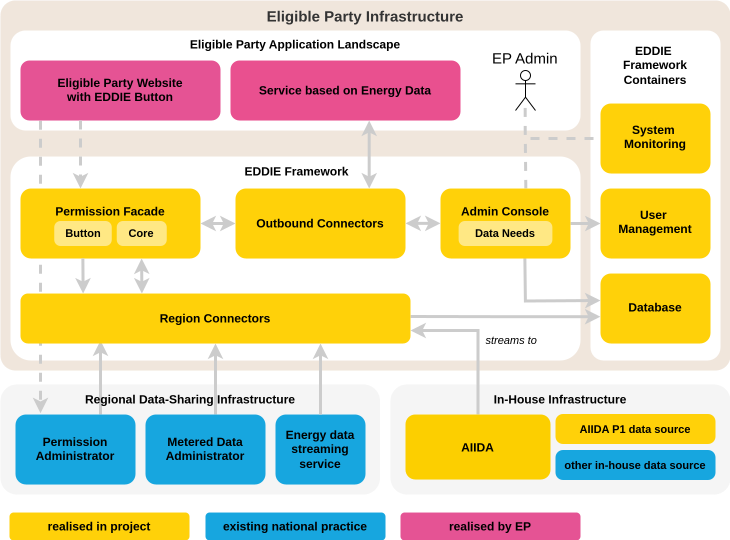

## Overview

The EDDIE Framework is a software system deployed by Eligible Parties to access customer energy data through standardized and consent-based processes.  
Its main functionality is to abstract away the complexity of diverse regional data infrastructures (e.g., different formats, interfaces, and permission procedures), and to provide Eligible Parties with a unified interface to request and consume data.

The EDDIE Framework builds upon several core concepts, which describe its main responsibilities and interactions. The table below provides an overview of these concepts. 

| Concept          | Description                                                                                                                                   |
|----------------------|---------------------------------------------------------------------------------------------------------------------------------------------------|
| Permission Facade    | Manages the customer-facing permission flow.                                                                                                     |
| Region Connectors  | Manage permissions and collect validated historical data and accounting point data from Metered Data Administrators and Permission Administrators. |
| Outbound Connectors  | Deliver the data to the Eligible Party in their preferred format and protocol.                                                               |
| Admin Console        | Provides the Eligible Party with tools to configure connectors, manage Data Needs, and oversee permissions.                                                  |
| Data Needs           | Represent the Eligible Party’s request for determining what data should be collected for a specific permission from an Metered Data Administrator.                                  |

## Why is the EDDIE Framework necessary in the context of EDDIE?

While Regional Data-sharing infrastructures exist for accessing historical or accounting-point energy data, their implementations differ across countries and providers.  
Without EDDIE, each eligible party would need to implement its own integrations for every regional system, facing significant complexity and cost.  

The EDDIE Framework solves this problem by:  

- Providing a single entry point for Eligible Parties to request data across multiple regions.  
- Managing the customer permission flow through the Permission Facade.  
- Acting as an integration layer between heterogeneous regional systems (via Region Connectors).  
- Enabling standardized data access through Data Needs, regardless of the original source.  
- Ensuring compliance with European regulations, including Directive (EU) 2019/944 and GDPR.  

## How do Eligible Parties and customers interact with the EDDIE Framework?

1. Setup by Eligible Party  
   - The Eligible Party installs the EDDIE Framework on their infrastructure.  
   - The Eligible Party configures Region Connectors for the Permission Administrators and Metered Data Administrators in the regions where they operate.  
   - The Eligible Party defines one or more Data Needs representing the data required for their services.  

2. Customer permission  
   - The Eligible Party embeds the EDDIE Popup in their service application.  
   - Customers interact with the Popup, which forwards the request to their Permission Administrator.  
   - The customer accepts or rejects the permission request via their Permission Administrator’s portal.  

3. Data provisioning  
   - Once permission is granted, the Region Connector retrieves the relevant data from the Metered Data Administrator.  
   - Outbound Connectors deliver this data to the Eligible Party’s services.  

4. Permission management  
   - Customers may revoke permissions via their Permission Administrator.  
   - Eligible Parties can monitor or terminate active permissions through the Admin Console.

## How does the EDDIE Framework integrate with other EDDIE components?

- With AIIDA: The framework uses AIIDA as a specialized Region Connector for in-house near real-time data streams.  
- With the Marketplace: The Marketplace helps customers discover Eligible Parties and their services, but no data flows through the Marketplace itself. Data exchange always happens through the EDDIE Framework once permissions are granted. 
  
## Deployability

The EDDIE Framework is deployable on commodity infrastructure (cloud or on-premise).  
It follows a container-based architecture, allowing Eligible Parties to enable only the connectors they need.  
<!-- This ensures scalability, resilience, and flexibility for integration with evolving regional infrastructures.   -->

<!-- ::: info DESIRED CONTENT

Similar to the methodology section of the grant agreement,
this page should document how key responsibilities of the EDDIE Framework have been implemented.
This is done by first showcasing the core components of the EDDIE Framework,
and then describing how these components provide specific functionality.
The latter is done by guiding the reader step-by-step through a complete setup and user flow.

The scenario includes the perspective of both the eligible party and the final customer.

1. The EP installs and sets up the EDDIE Framework
    - The EP configures _Region Connectors_ for regions it operates in
    - The EP creates a _Data Need_ to request data for their service
    - The EP embeds the _EDDIE Popup_ into their application
2. The customer grants their permission through the _EDDIE Popup_
    - The customer accepts the permission request in the portal of their PA
3. The EP manages data needs and permissions in the _Admin Console_
4. The EP receives data from the DAP (via _Outbound Connector_)
    - The EP configures an _Outbound Connector_ to consume data from
5. The customer revokes their permission
6. The EP discontinues their service, terminating permissions

---

**NOTES**
- It should be readable without prior knowledge about the EDDIE Framework.
- Avoid outdated terms and GA references. The [evolution page](evolution-from-the-grant-agreement.md) is for that.
- Defer any additional information to other pages, particularly [domain concepts](../crosscutting-concepts/domain-concepts.md) and [architectural decisions](../architectural-decisions/architectural-decisions.md).
- Describe in an FAQ format.

--

**TODO**
- Check if the concepts should be moved to a _Domain Concepts_ section.

::: -->

<!-- old:
## Overview

The main functionality of the EDDIE Framework is to abstract away the complex processes of permission requests and data access for different regional data infrastructures.
For this purpose, the EDDIE Framework builds upon four important concepts.
- _Permission Facade_ — handles permission requests and state.
- _Region Connectors_ — implement the data access for specific regional infrastructures.
- _Outbound Connectors_ — handle the data exchange with the eligible party.
- _Data Needs_ — define the data requirements of services provided by the eligible party.

This section first showcases the core components of the EDDIE Framework and describes how these components enable its functionality. 
It then elaborates on the key concepts mentioned, answers questions in a Q&A format, and references architectural decisions. -->

<!-- 
## Core Components

::: info Decide what to do

:::

The diagram below shows, at a glance, the most important parts and actors of the system.
At the top, the eligible party operates a website embedding the _EDDIE Popup_,
for the customer to create permissions, and a service based on energy data.
The eligible party also operates the framework application and containers supplementing additional functionality.

The framework application orchestrates _Region Connectors_ and _Outbound Connectors_
that can be enabled as plugins to support specific data providers or data exchange protocols.
An _Admin Console_ provides a UI for the eligible party to administer the EDDIE Framework,
including the definition of services as _Data Needs_, the onboarding of _Region Connectors_, and the management of permissions.
The user management and system monitoring are handled by specialized software deployed separate from the framework.

The [Building Block View](../building-block-view/building-block-view.md) will continue with a more accurate representation of system containers and components based on the [C4 Model](https://c4model.com/).

## Functionality

To describe how these concepts and components work together to address functional requirements,
we can look at the steps of the following scenario from the perspective of the eligible party.  -->

<!-- TODO: Add an installation step? -->

<!-- Move to Runtime View----Runtime View-------------Runtime View----------Runtime View-----Runtime View-----------:

- _Define services_ — The eligible party starts in the _Admin Console_ where they define the data requirements for their service as a _Data Need_.
- _Enable region connectors_ — They configure a _Region Connector_ to access data from the regions they operate in.
- _Establish permissions_ — On their website, they embed the _EDDIE Popup_ to guide their customers through the _Permission Facade_.
- _Transfer data_ — The eligible party configures an _Outbound Connector_ to pass the energy data in their preferred format using a data exchange protocol of their choice.
- _Manage active permissions_ — In the _Admin Console_, the eligible party can manage and view the status of active permissions.
- _Termination and revocation_ — Active permissions can be revoked by the customer through the portal of their permission administrator, or terminated by the eligible party through the _Admin Console_.

These important workflows are described in more detail in the [Runtime View](../runtime-view/runtime-view.md). 

Runtime View-------------Runtime View----------Runtime View-----Runtime View-------------Runtime View---------- -->

<!-- Move to Building Block View------Block View-------------Block View------------------Block View--------------Block View-----Block View-------------Block View-----:
## Permission Facade

::: info DESIRED CONTENT
In this section we are going to describe the reasoning and architectural implementation behind our permission facade.
Markus' master's thesis mainly contains these ideas and explanations.
We should focus on the decisions around the micro-frontend approach and why it is necessary for a modular system.
:::

- [Microfrontends](../architectural-decisions/architectural-decisions.md#implement-the-permission-facade-as-a-microfrontend)
- [Multistep Form](../crosscutting-concepts/user-experience.md#eddie-button-as-multistep-form)

## Region Connectors

Region connectors is an integral part of the EDDIE framework.
They collect validated historical data and accounting point data from a metered data administrator (MDA) and permission administrator (PA).
Furthermore, region connectors manage permissions given to collect the data.

## Data Needs (Services)

The data needs API provides a way to retrieve and create data needs.
A data need is used to determine what data should be collected for a specific permission from a MDA.

## Outbound Connectors

An outbound connector provides endpoints to access to permission market documents, accounting point data market documents, and validated historical data market documents.
Furthermore, they provide the means to terminate a permission request by the eligible party. 

### What are the responsibilities of a region connector?

A region connector has multiple responsibilities.
It creates and manages permission requests to access data from a final customer.
Furthermore, it collects validated historical data and accounting point data from an MDA.
Block View-------------Block View------------------Block View--------------Block View-----Block View-------------Block View Block View-------------Block View-->

<!-- Move to Architectural decisions----------------- Architectural decisions -------------------- Architectural decisions---------
### Why isn't there just one region connector?

There are multiple region connectors, since implementations of the permission process, that is how permission to data is given, differ per country or PA.
Furthermore, the format of the validated historical data and accounting point data differs per country or MDA.
This means to cover multiple MDAs and PAs, there need to be multiple implementations to cover the differences.
This is what a region connector does.
It implements the permission process for one PA or country and collects the data for one MDA or country.
So there are different region connectors for all countries, PAs, and MDAs, where these concepts are implemented differently.
Sometimes multiple PAs and MDAs implement the same permission process and provide the data in a common format, in this case there is only one region connector for multiple PAs and MDAs.
In othe cases there are multiple countries implementing the same permission process and data formats.
Here one region connector can cover multiple countries.

### How is permission to data given?

To access the data of a final customer, the final customer has to express the wish to share their data with the party hosting the EDDIE framework.
Then the region connector can create a permission request, which is sent to the PA.
The PA validates this permission request and shows it to the final customer.
The final customer can accept or decline the permission request.
Once it is accepted, the PA notifies the region connector, and at this point it is possible to retrieve the final customer's data.

### How does a region connector integrate into MDA and PA?

To create and manage permission requests a region connector has to integrate into the system of a PA.
If it wants to retrieve data it needs to integrate in to the system of an MDA.
MDAs and PAs have to offer an interface to interact with them.
These interfaces can range from REST APIs to using messaging via the AS4 protocol.
To access these interfaces a party hosting EDDIE has to register with the MDA and PA.

### How is the data that is retrieved determined?

The kind of data that is retrieved from an MDA is determined via a data need.
A data need specifies what kind of data can be accessed.
It differentiate between accounting point data and validated historical data.
Furthermore, data needs for validated historical data specifies a start and end date, as well as what kind of energy data should be collected.
For example gas or electricity.

### Why multiple outbound connectors?

There are multiple implementations of the outbound connectors to allow the eligible party to use a protocol of their choosing.

Architectural decisions----------------- Architectural decisions -------------------- Architectural decisions--------- -->