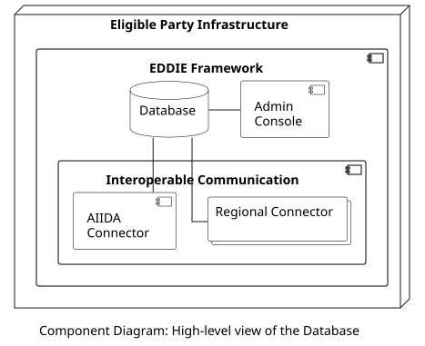

<!--::: warning TO ADD
more detailed explanation
::: -->

## Overview

The Database stores the state of the EDDIE Framework. This includes information related to the customers, the Regional Data-sharing Infrastructures, the connected AIIDA instances, the consents, the Services, and the eligible party. As shown in the figure below, the Regional Connectors access the Database (regarding the access to historical validated data), the AIIDA Connector accesses the Database (regarding real-time data), and the Admin Console can access the Database (for configurations from the eligible party).

## Data Models

> Information about the Database data model is presented on the following pages.
