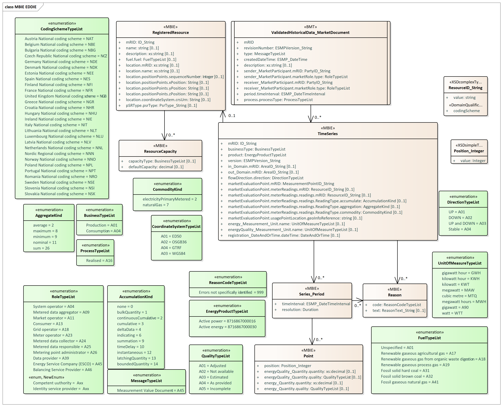

## Overview

The Regional Data-sharing Infrastructure of each country may be using a different data model to represent the energy data of a customer. For this reason, the EDDIE Framework converts the received data from a country-specific format to a unified format that is based on the Common Information Model (CIM) as derived from the standard IEC62325-351 Ed.3. Specifically, the data model that is used internally by the EDDIE Framework for representing historical validated data is shown in the class diagram below.

The metamodel of this model is shown in the class diagram below.

A detailed description of the attributes of this model is provided [here](../../Database/Database.md). 

To convert the data received from the Regional Data-sharing Infrastructure from the country-specific model to our CIM-compliant data model, we have created mappings which can be found in the link below.

> Mappings to country-specific models are presented on the following pages.

