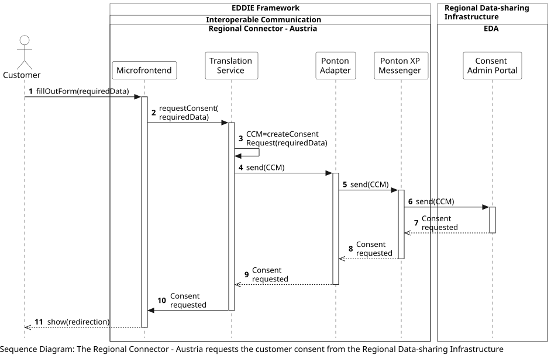

## Overview

The following workflow shows the process of the Regional Connector - Austria requesting consent for access to historical validated data of a customer from the Regional Data-sharing Infrastructure in Austria. This process starts when the Microfrontend has collected the consent form with the required data from the customer. 
<!-- The workflow of the customer filling out the consent form is presented [here](../collect-consent-historical-data/collect-consent-historical-data.md).  -->

This workflow includes the following steps:
1. The customer fills out the consent form that is provided by the Microfrontend and is shown on the EP Website through the Permission Facade.
2. The Microfrontend initiates the consent request from the Translation Service.
3. The Translation Service creates a CCM (Customer Consent Management) request according to the Regional Data-sharing Infrastructure of Austria.
4. The Translation Service sends the CCM request to the Ponton Adapter.
5. The Ponton Adapter sends the CCM request to the Ponton XP Messenger.
6. The Ponton XP Messenger sends the CCM request to the Consent Admin Portal of Austria (which is operated by EDA).
7. The Consent Admin Portal responds that the consent is requested.
8. The Ponton XP Messenger responds that the consent is requested.
9. The Ponton Adapter responds that the consent is requested.
10. The Translation Service sends the information that the consent is requested to the Microfrontend.
11. The Microfrontend shows the customer that the consent is requested, and further information about a redirection to the website of the metered data administrator (that is operated by the customer's DSO in Austria), where the customer needs to log in and approve the consent request.

<!-- After the consent form has been requested, another workflow takes place to access the historical validated data from the Regional Data-sharing Infrastructure. This workflow is presented [here](../access-historical-data-austria/access-historical-data-austria.md). -->