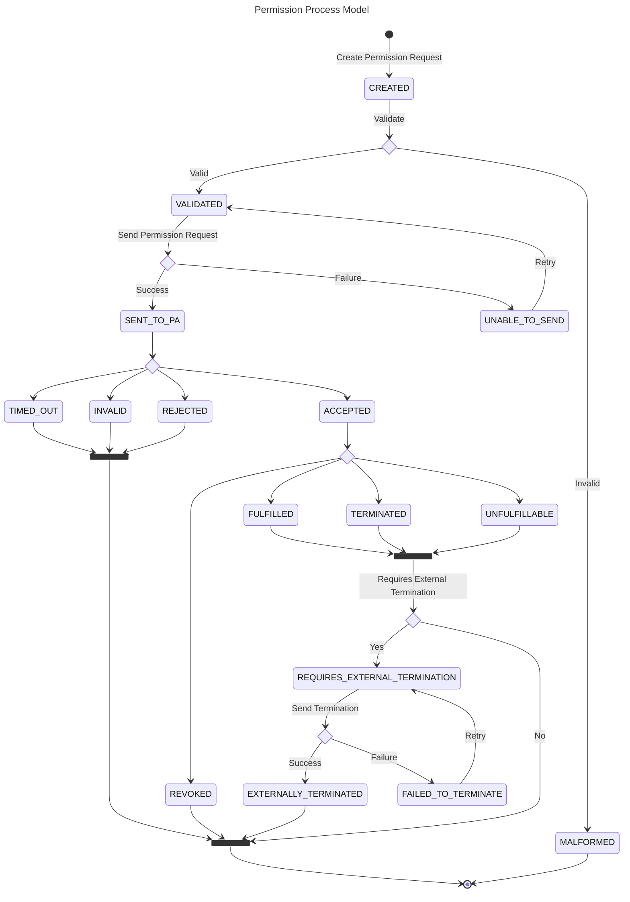

::: warning DESIRED CONTENT
Here we will not describe the runtime behavior per regional connector, as this well result in a matrix explosion problem (MxN).
Most of the region connector specifics will be moved to the framework developer documentation (please refer to the git history, to restore this information), as it is not architecture per se, but implementation information for users working on specific region connectors.

This section should mainly describe the Permission Process Model and how the different parts of EDDIE Framework interact with each other. This includes
- how EDDIE Core enables region connectors via plugins
- how the Permission Facade comes together by combining EDDIE Core and the region connector specific micro-frontends
- ...

Regarding the specific workflows listed at the end of the page. They will still provide a lot of value, as those are the main use-cases of using EDDIE Framework, but we should explain them based on the Permission Process Model (top-down) and not based on the individual region connectors (bottom-up).
:::

## Permission Process Model

The permission process model describes the lifecycle of a permission request in a region connector.
It is an abstraction of the permission process implemented by the different PAs.
A permission request is in one state at a time.
At certain points it will transition from one state to the next.

- _Created_: The permission request was created on the EDDIE framework.
- _Malformed_: The permission request is not valid and cannot be sent to the permission administrator. 
A new permission request has to be created.
- _Validated_: The permission request is valid and can be sent to the PA.
- _Unable To Send_: The EDDIE framework was not able to send the permission request to the PA. Can be retried.
- _Sent To PA_: The permission request was sent to the permission administrator.
- _Invalid_: The PA could not validate the permission request. A new permission request has to be created.
- _Timed Out_: The final customer took too long to accept or reject the permission request.
- _Rejected_: The final customer rejected the permission request.
- _Accepted_: The final customer accepted the permission request. The EDDIE framework is now able to collect data from the final customer.
- _Revoked_: The final customer revoked the permission request after it was accepted. The EDDIE framework is not able to collect any data anymore.
- _Fulfilled_: The EDDIE framework collect all necessary data and does not need any data anymore.
- _Terminated_: The eligible party decided they do not need this permission request anymore and terminated it.
- _Unfulfillable_: After accepting the permission request, the EDDIE framework found that the final customer does not own the right kind of data.
- _Requires External Termination_: Extra state, that is only needed in cases were PAs allow the termination of permission requests by the EDDIE framework.
In that case a termination request is sent to the PA.
- _Failed To Terminate_: There was a problem when sending the termination request. Can be retried.
- _Externally Terminated_: The permission request was successfully externally terminated.

<!--
::: warning TO ADD
For each chapter, review the content and check if the following criterias are fullfilled:

According to arc42 the runtime view describes concrete behavior and interactions of the system’s building blocks in form of scenarios. The scenario should answer the following questions:

- how do building blocks execute important use cases or features?
- how do building blocks cooperate with users and neighbouring systems?
- what happens in case of a launch, start-up, stop of operation and administration
- how could error and exception scenarios look like
  goal:
  You should understand how (instances of) building blocks of your system perform their job and communicate at runtime. You will mainly capture scenarios in your documentation to communicate your architecture to stakeholders that are less willing or able to read and understand the static models (building block view, deployment view).

:::
-->

## Overview

The runtime view focuses on interactions among the system's components. The goal of this section is to describe representative and important workflows that occur during the runtime of the system. These workflows are categorized into sections, as shown below.

## Use-Cases                          
### Collect the customer's information
### Request the customer's consent    
### Access the customer's data        
### Send the data to the services     
### Revoke the customer's consent     
