> [!CAUTION]
> The Permission Facade is not a component like in the project proposal. It's region-specific functions are included in the according region connector and there is also a part for functions that are the common across all regions.

The Permission Facade (or Consent Facade) component is implemented within the EDDIE framework which is under the operation of the eligible party. Upon request from the customer, this component is responsible for triggering the process that gives the eligible party access to the customer's energy data (either from the customer's permission administrator or from AIIDA). The figures below describe various aspects of the Permission Facade.

The Permission Facade is linked with various operations of the EDDIE Framework. For this reason, in order to describe the Permission Facade comprehensively, this section provides various details and graphical representations. In general, the acquisition of data from the EDDIE Framework is initiated by the creation of a *Service*. Thus, the eligible party initially has to create a Service and specify certain Service-related attributes such as the data family (e.g., historical validated data, or real-time data) of the required data. The figure below shows an example of a form that has to be filled out by the eligible party in order to create a new Service.

When a Service is created, customers can be linked to this Service, so that the Service can process their data. The figure below shows the high-level process of a customer that gives their consent to an eligible party for data access and processing by a Service. This process includes the following steps:

1. The customer creates an account on the Eligible Party (EP) Website.
2. The customer clicks a button to share their data.
3. The customer then has to fill out a form with details of the data to be shared and also select their permission administrator (e.g., based on their country).
4. Using the collected information, a request for data access is created and sent to the permission administrator (if the request is for historical data) or to AIIDA (if the request is for real-time data).
5. The request for data access is received by the permission administrator.
6. The customer is redirected to the permissions administrator's website.
7. The customer accepts (or declines) the request for data access.
8. The EDDIE Framework is informed about the acceptance of the request.
9. The acceptance is forwarded to the Permission Facade.
10. The acceptance is forwarded to the EP Website.
11. A status update of the request is shown.

To show all the consents given to a particular eligible party, the EDDIE Framework will provide an overview of the consents along with respective details and available actions. An example of this overview is shown in the figure below.

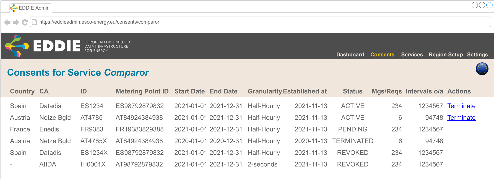

The necessary components to achieve the basic functionality of the Permission Facade are shown in the figure below. On the left-hand side, there is an onboarding process that shows the button *connect my data* that has to be clicked by the customer. After clicking, there is a popup window with a form that gathers additional information from the customer. This information includes the country and the permission administrator of the customer. The filled-out form is sent back to the Permission Facade. The Permission Facade creates the request for data access and shares this request with the EDDIE Interoperable Communication component via a Kafka topic. The Interoperable Communication maintains a state of all the requests so that if a state changes, all related components are notified (e.g., the popup window of the customer on the EP Website). The state can change by EDDIE Components such as the Connectors which implement functionality to interact with Permission Administrators (PA) of the Regional Data-sharing Infrastructures, e.g., PA Connector EDA or PA Connector Enedis in the figure. These connectors communicate with the respective permission administrators, i.e., PA Connector EDA communicates with the Austrian permission administrator EDA, while Enedis is the French permission administrator.

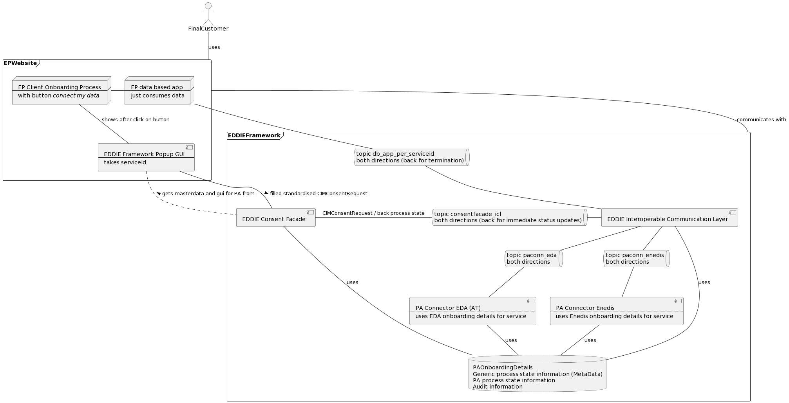

The process discussed so far is also shown below in a detailed sequence diagram. This diagram includes the following steps.

1. This step is to be implemented by the eligible party. It needs to be able to identify the customer and create an onboarding flow for its user.
2. For each data set required, a 'connect my data' button must be placed in the onboarding journey of the user.
3. The popup should either redirect to a dedicated page or to open a popup (discussed later on).
4. Request list of countries and - after a country is selected - a list of the permission administrators in each country from the EDDIE Framework.
5. Return countries and data families.
6. Here the popup will need to download glue HTML code to fill _shortcomings of user flows of data-sharing environments_.
7. Return shortcomings.
8. If _cancel_ is clicked on the popup, the user should be redirected back to the onboarding workflow.
9. Send a standardized [CIMConsentRequest] message to the PA Portal to preset consent information.
10. Forward the message in MS format and within MS data exchange environment.
11. Redirect the customer to the PA Portal.
12. User logs in to PA Portal.
13. User closes portal or is redirected to _EP App Onboarding Workflow_.
14. Ideally - but depending on the support by the data-sharing infrastructure - the customer should then be redirected on login to the respective consent request, so that he must only say _accept_ or _reject_.
15. Send negative Status update in MS format to the Interoperable Communication.
16. Translate MS format to CIM Format and forward to Service.
17. Close portal or redirect user.
18. PA informs MDA about established consent (within MS environment).
19. Set up the transfer of data. If data is directly available and we are in PUSH environments, it is directly transferred to _EP Service_ or when it gets available. In PULL environments, the data becomes _pullable_.
20. MS MarketMessage to Interoperable Communication that the consent request has been accepted.
21. Forward MarketMessage about consent acceptance in CIM format to EP Service.
22. EP Service can update its customer account information.
23. Close portal or redirect user.
24. If other data families are needed, the EP Application in its onboarding process can request it.
25. Data is sent to the EP Service as an MS format MarketMessage to the Interoperable Communication. Note that in PULL scenarios this _sending_ needs to be emulated by polling smartly.
26. Data is translated to common CIM MarketMessage and forwarded to EP Service through EDDIE Data Streaming infrastructure.

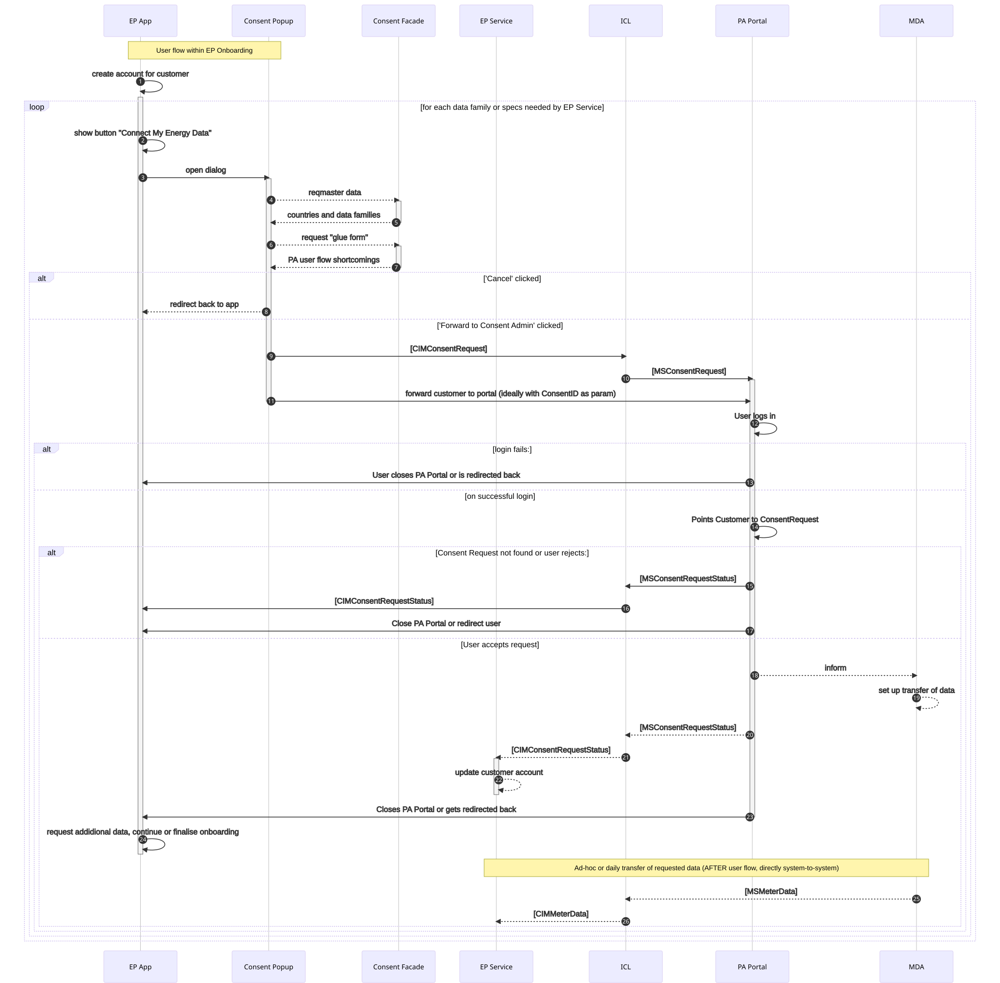

The consent for data access may be revoked at any time. If the revocation is triggered by the Metered Data Administrator, then the Permission Administrator is notified, and in turn, the EDDIE Framework (through the Interoperable Communication). This process is shown in the figure below.

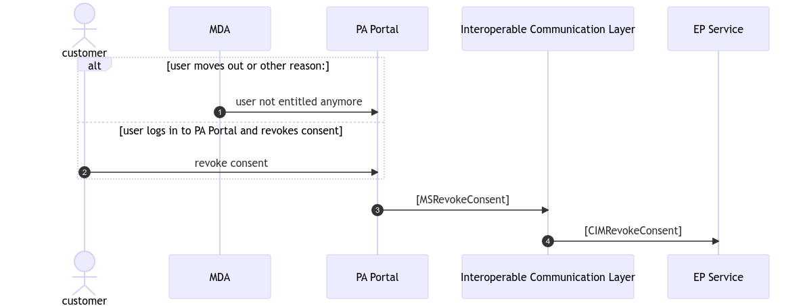

If the Service is terminated by the eligible party, then a termination request is sent from the EDDIE Framework to the permission administrator and then to the metered data administrator. This process is shown in the figure below.

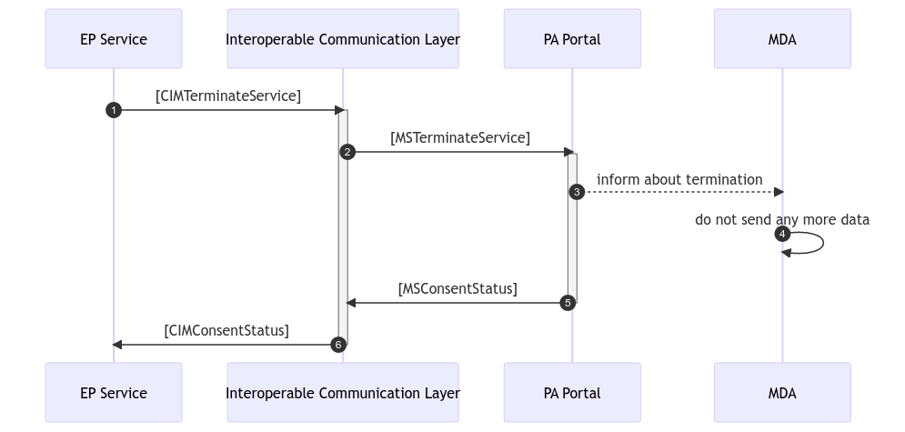

The popup window that is shown to the customer upon clicking the *connect my data* button, needs to collect the necessary information for acquiring the customer's data. An example of such a window is shown in the figure below, including two cases: Spain on the left-hand side and Austria on the right-hand side. Both cases need information about the selected country and permission administrator as well as the data family, granularity and period. In addition, the popup window may require specific information based on the selected permission administrator. For example, for Datadis in Spain, the shared metering point number is needed, while for Netze Burgenland, the Generated ConsentID is needed. After filling out this window, the customer clicks *Proceed* and is redirected to the permission administrator website.

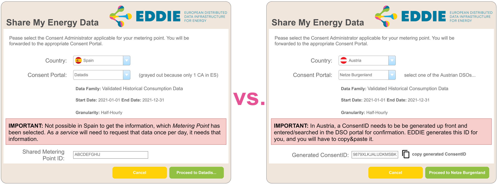

The overall consent management process is shown in the figure below. This process starts with a new consent request (shown on the right-hand side of the figure). For this request, a process state object is created including a process ID, creation date, corresponding Service, region, etc, and is given the state *CREATED*. Then, this object is examined by the corresponding Region Connector to make sure that all the mandatory fields are filled in. If something is missing, the state is changed to *INVALID*, and the process ends. Otherwise, the state is changed to *VALIDATED*. If the state is *VALIDATED*, then the object is transformed into a PA message that is structured based on what is needed by the corresponding permission administrator. If something goes wrong during the transformation process, the state changes to *INVALID* and the process ends. Otherwise, the state is changed to *VALID_PA*. At this point, is where the customer is redirected to the Permission Administrator Website to accept the request. When the customer accepts, the EDDIE Framework is notified, and the state is changed to *CONSENT_ESTABLISHED*. In this state, the EDDIE Framework has acquired the customer's consent, and is able to request the energy data. If the Service is terminated by the eligible party, the process ends and the state is changed to *CONSENT_TERMINATED*. If the consent is revoked, e.g., by the permission administrator, the process also ends, and the state is changed to *CONSENT_TERMINATED*.

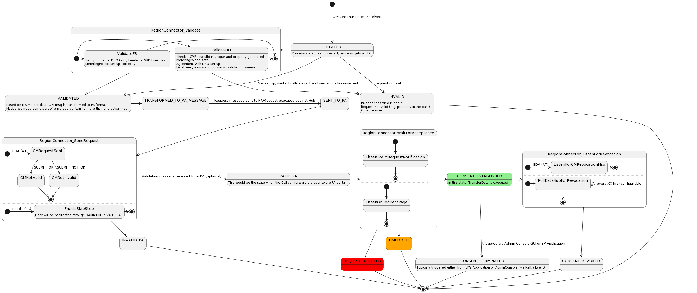

After establishing the consent, the data is sent to the EDDIE Framework through the Interoperable Communication. This process is shown in the figure below and includes the following steps:

1. The requested data is collected and sent to the Interoperable Communication.
2. Future data is also collected and sent.
3. The data is received by the Interoperable Communication.
4. The data is transformed into a common format. This is important because data from different countries may be received in different formats.
5. The data is sent to a Service for processing.
6. The data is received by the Service.
7. The data is transformed to be used by the internal algorithms of the Service, and is further processed.

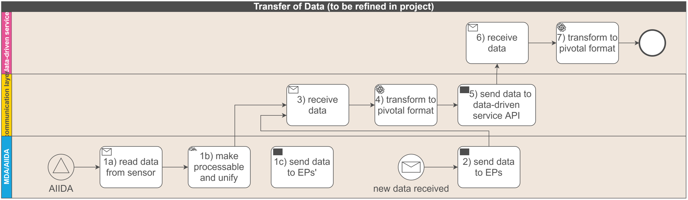

When the data is received by the Interoperable Communication, this data is transformed into a [CIM](../../../crosscutting-concepts/domain-models/cim/cim.md) representation. Then, the data is enriched with additional information that is used internally in the EDDIE Framework (e.g., Service ID, ConsentID, etc.). Finally, the enriched CIM representation of the data is sent to the Service via a Kafka topic. This process is also shown in the figure below.

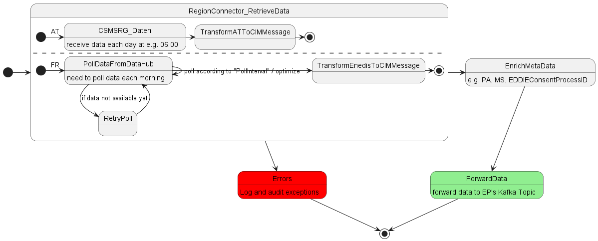

The figure below shows the process from the perspective of the customer. Specifically, this figure includes examples of graphical interfaces that collect the response of the customer, e.g., to provide consent, accept a request for data access, etc.

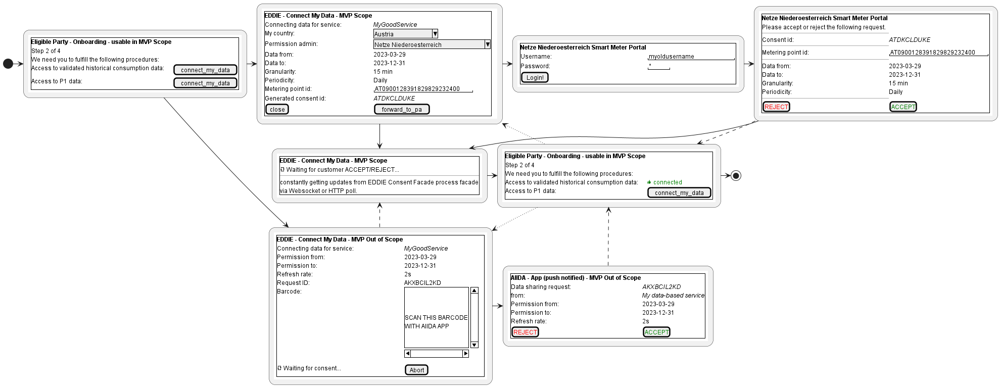

Finally, the following figure shows a domain model which includes the necessary variables and methods that need to be implemented in the EDDIE Framework for efficient integration and interactions with the permissions administrators.

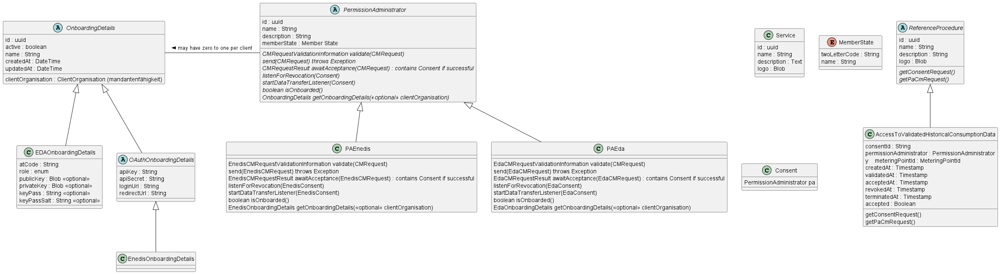

