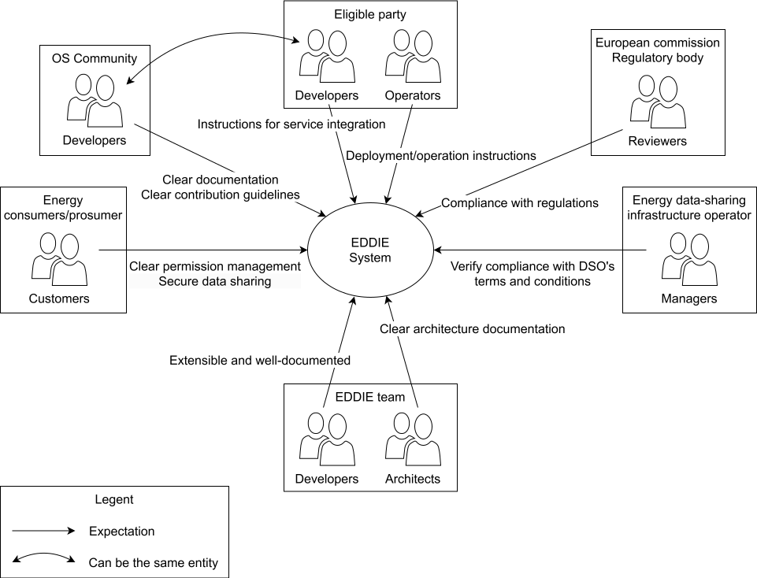

This document provides a comprehensive view on the architecture of the EDDIE software system (or EDDIE system hereinafter), following the guidelines of the [arc42](https://arc42.org/) template. The EDDIE software system is part of the [EDDIE project](https://eddie.energy/) which aims at addressing the lack of large-scale, uniform, and streamlined access to energy data across European member states, facilitating the establishment of a common European energy data space. The EDDIE system aims at providing an open-source framework for secure and efficient energy data sharing, supporting energy service providers and energy service companies (also referred to as eligible parties hereinafter) as well as final customers and other stakeholders.

The EDDIE software system is defined as a system of systems, consisting of three internal systems: 

1. EDDIE Framework: Focuses on providing historical and (near) real-time energy data to energy services. 
1. AIIDA: This is the Administrative Interface for In-house Data Access (AIIDA) which focuses on accessing real-time energy data from energy metering devices.
1. Marketplace: Focuses on facilitating the communication between customers and eligible parties.

The main goals of the EDDIE system are the following:

| Goal | Description |
|-|-|
| Enable secure energy data access | Implement a system to securely access historical and near real-time energy data from diverse sources across European member states. |
| Facilitate in-house energy data sharing | Develop AIIDA to allow customers to share real-time energy data from their metering devices (e.g., smart meters). |
| Ensure interoperability across systems | Support standardized data exchange and integration with various national and regional energy data-sharing infrastructures to create a unified European energy data interface. |
| Empower customers and eligible parties | Provide an interface that enables customers and eligible parties to use the EDDIE system for sharing energy data and for running energy services, e.g., to improve energy efficiency, predictability, and demand response, among others. |
| Enhance customer control and permission management | Implement customer-controlled permission management, allowing users to grant and revoke access to their energy data in compliance with GDPR. |
| Build a marketplace for energy data services | Develop the Marketplace to connect customers with eligible parties, allowing customers to discover and utilize energy services running over the EDDIE Framework. |
| Promote open-source and scalability | Ensure that the EDDIE system remains open-source, modular, and scalable, enabling broad adoption and community improvements. |

## Requirements Overview

This section aims at providing an overview with the main functional and non-functional requirements of the EDDIE system.

### Functional Requirements

| ID  | Requirement | Description |
|-|-|-|
| FR1 | Decentralized | The system shall operate in a decentralized manner, allowing independent deployment by eligible parties, and allowing the customers to select who can access their data. No central entity shall have access to all the customer data without the explicit permission of customers. |
| FR2 | In-house data access | The system shall enable customers to share energy data from their metering devices at home, such as smart meters, and IoT home automation devices. |
| FR3 | Security, privacy, and compliance | The system shall ensure secure data access, respect for personal information, and compliance with GDPR and other relevant regulations, such as the Directive (EU) 2019/944. |
| FR4 | Interoperability | The system shall support integration with different national and regional energy data-sharing infrastructures, ensuring seamless access to energy data across European member states. |
| FR5 | Consent and permission management | The system shall allow customers to grant, manage, and revoke access permissions for their energy data. |
| FR6 | Easy deployment and use by eligible parties | The system shall provide simple deployment mechanisms that allow eligible parties to easily integrate energy data into their services. |
| FR7 | Enables energy service discovery | The system shall provide a marketplace where customers can connect with eligible parties offering energy services. |

### Non-Functional Requirements

| ID  | Requirement | Description |
|----|-------------|-------------|
| NFR1 | Usability | The system shall provide user-friendly interfaces for both customers and eligible parties, ensuring ease of use and intuitive navigation. |
| NFR2 | Scalability | The system shall support multiple customers without significant performance degradation. |
| NFR3 | Open-source | The system shall be maintained open-source, aiming to encourage contributions from the energy community. |
| NFR4 | Modularity and extensibility | The system shall be modular, allowing extensions and adaptation without disrupting existing functionality. |

## Quality Goals

The quality goals of the architecture aim at expressing the system's priorities regarding effectiveness and efficiency.

#### Primary Quality Goals  

| ID | Quality Goal | Description |
|-|-|-|
| QG1 | Interoperability | Ensure seamless integration with multiple regional data-sharing infrastructures across European member states. |
| QG2 | Security and Privacy | Protect sensitive customer data by adhering to GDPR and ensuring secure data transfer, storage, and processing. |
| QG3 | Maintainability | Ensure the system is made open-source, and is easy to modify, extend, and maintain, encouraging community involvement. |

#### Secondary Quality Goals  

| ID | Quality Goal | Description |
|-|-|-|
| QG4 | Scalability | Support the handling of multiple customers and large volumes of data, including real-time data streams from European metering points. |
| QG5 | Usability | Deliver intuitive, user-friendly interfaces for the customers and eligible parties, ensuring smooth navigation and interaction. |  
| QG6 | Reliability | Provide a highly reliable system with minimal downtime to ensure uninterrupted access to energy data. |
| QG7 | Performance | Ensure low latency data access for the energy services of the eligible party. |
| QG8 | Portability | Ensure that the system can be deployed on various platforms, including cloud computing, on-premise computing infrastructure, and edge devices. |

## Stakeholders

The stakeholders of the EDDIE system include all roles and organizations that influence/depend on the architecture documentation, i.e., those who need to understand the architecture, interact with the system, or work with the source code. 
An overview of the key stakeholders is provided below.

---

| Role | Stakeholder | Expectations |
|-|-|-|
| Software developers | EDDIE framework developers, AIIDA developers, Marketplace developers, Technical writers | Clear and maintainable documentation that facilitates easy and continuous contributions. |
| Eligible parties | Energy service providers, flexibility service providers, balance responsible parties | Well-documented architecture that explains the access to energy data, and the integration with energy services. |
| Customers | End users, energy consumers, prosumers | Clear customer permission management processes and transparent data-sharing mechanisms. |
| Energy data-sharing infrastructure operators | Distribution System Operators (DSOs), Transmission System Operators (TSOs), Meter Data Administrators (MDAs), Consent Administrators (CAs) | Well-documented data access processes, compliance with regulatory requirements. |
| Open-source community | Software developers, energy community | Well-documented architecture, clear contribution guidelines, open access to source code. |
| IT System operators | Hosting providers, IT administrators, DevOps teams | Clear deployment documentation. |
| Architecture decision-makers | System architects, technical leads, product owners | Well-defined architecture documentation, clear rationale for architectural decisions. |
| Regulatory and compliance bodies | Policy makers, regulators, standardization organizations | Clear processes ensuring compliance with data protection regulations and energy data access policies. |

