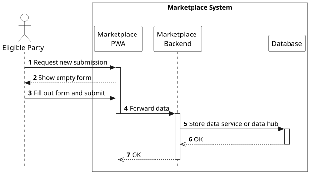
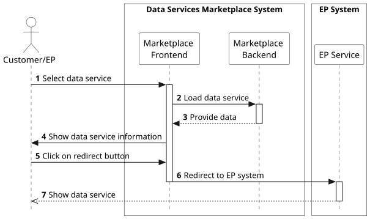
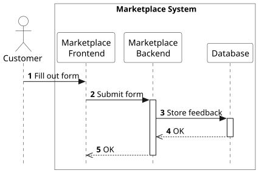

## Overview

The Marketplace system supports several main workflows, which are outlined below and described in detail in the following sections. Other basic workflows are not covered here.

- [The customer/eligible party creates a user account](./runtime-view.md#the-customer-eligible-party-creates-a-user-account)
- [The eligible party user registers as eligible party](./runtime-view.md#the-eligible-party-user-registers-as-eligible-party)
- [The eligible party submits a data service or data hub](./runtime-view.md#the-eligible-party-submits-a-data-service-or-data-hub)
- [The customer browses data services](./runtime-view.md#the-customer-browses-data-services)
- [The customer accesses a data service](./runtime-view.md#the-customer-accesses-a-data-service)
- [The customer submits feedback on a data service](./runtime-view.md#the-customer-submits-feedback-on-a-data-service)

## The customer/eligible party creates a user account

The process for creating a new user account and obtaining access to the Data Service Marketplace follows a standard OpenID Connect (OIDC) flow built on top of OAuth 2.0.
In this process, the Identity and Access Management (IAM) system handles user registration, authentication, and the issuance of tokens that enable secure access to the Marketplace Backend.
The typical workflow is as follows:

1. A customer or eligible party initiates a request to create a new account via the Marketplace Frontend (PWA). 
2. The PWA redirects the user to the IAM system’s web interface (authorization endpoint) in the browser. 
3. The IAM presents a registration or login form, allowing the user to either create a new account or sign in if an account already exists. 
4. The user enters the required credentials and submits the form. 
5. The IAM validates the input, creates the new account (if applicable), and securely stores the user information in its internal database.
6. The database confirms successful storage. 
7. After successful authentication or registration, the IAM issues an authorization code and redirects the user back to the Marketplace Frontend via the predefined redirect URI.

The PWA is now able to exchange this authorization code for a set of tokens (including Access Token, ID Token, and optionally a Refresh Token) by calling the IAM’s token endpoint and can now securely communicate with protected Marketplace Backend APIs using these tokens. 
As this is a standard OAuth flow, it is not shown into more detail here.

## The eligible party user registers as eligible party 

The prerequisite for this workflow is that the eligible party (EP) has already created a user account in the Data Services Marketplace, as described in the previous section.

1. The eligible party (EP) contacts the Marketplace Operator (e.g. via email), providing the necessary user account details and information required for the EP role. 
2. The Marketplace Operator creates the EP role in the Identity and Access Management (IAM) system, entering all relevant information.
3. The Marketplace Operator associates (links) the newly created EP role with the corresponding user account in the IAM. 
4. The Marketplace Operator sends a confirmation notification to the eligible party once the process is completed. 
5. Upon the next login to the Data Services Marketplace via the Progressive Web App (PWA), the IAM includes the updated role information in the user’s token, and the PWA updates the user’s privileges accordingly. 
6. The eligible party can now access extended Marketplace functionalities, such as browsing data hubs and submitting new data services or data hubs.

The essential aspect of this process is that the Marketplace Operator is responsible for assigning and linking the eligible party role to the corresponding user account in the IAM.
All subsequent steps, such as authorization and token-based access control, follow the standard OpenID Connect (OIDC) mechanisms and are therefore not covered in detail here.

## The eligible party submits a data service or data hub

1. The eligible party requests a new submission via the PWA.
2. The PWA shows an empty for and requests the data to be entered. 
3. The eligible party fills out the form in the Marketplace Frontend with all required information, including a link to the data service or data hub.
4. Once the eligible party submits the data, the Marketplace Frontend sends the form data to the Marketplace Backend.
5. The Marketplace Backend stores the submitted information in the database.
6. The Marketplace Backend notifies the Frontend that the data service or data hub has been successfully stored.

## The customer browses data services

1. The customer requests to view data services offered by eligible parties via the PWA (optional filtering available).
2. The PWA forwards the request to the Marketplace Backend.
3. The Marketplace Backend queries the database for the corresponding data services.
4. The database returns the requested data.
5. The Marketplace Backend responds to the PWA with the filtered list of data services.

*Note:* This process can be performed without user registration. Registration is only required when the user wants to view details or access a specific data service.

Once the user is registered as eligible party, this process looks the same for eligible parties browsing data hubs.

## The customer accesses a data service

1. The customer selects a data service in the Marketplace Frontend to view more details. 
2. The Marketplace Frontend sends a request to the Marketplace Backend to retrieve the corresponding data service information. 
3. The Marketplace Backend returns the detailed information about the selected data service. 
4. The Marketplace Frontend displays the data service details to the customer in a dedicated detail view. 
5. The customer clicks a button in the detail view which links directly to the data service hosted on the eligible party’s system. 
6. The Marketplace Frontend redirects to the customer’s browser with the corresponding URL provided by the eligible party. 
7. The data service is then opened and displayed in the customer’s browser, loaded from the eligible party’s environment.

This process looks the same for eligible parties accessing data hubs.

## The customer submits feedback on a data service

1. The customer fills out a feedback form (containing a comment and/or rating) in the Marketplace Frontend.  
2. Once the customer submits the feedback, the Marketplace Frontend sends the form data to the Marketplace Backend.  
3. The Marketplace Backend stores the feedback along with a reference to the corresponding data service in the database.  
4. The Marketplace Backend notifies the Frontend that the feedback has been successfully stored.