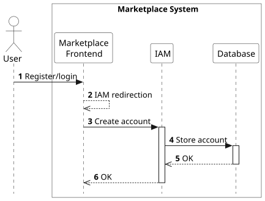
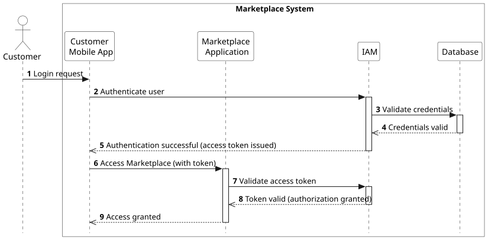
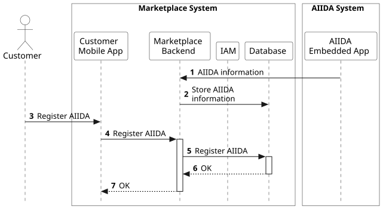
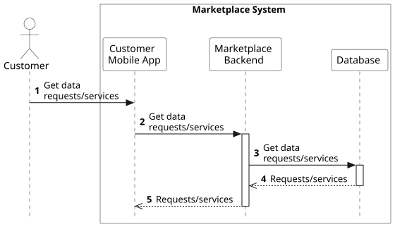
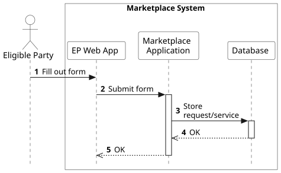
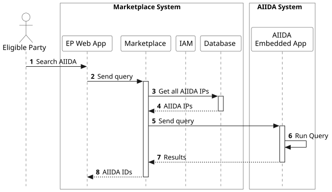
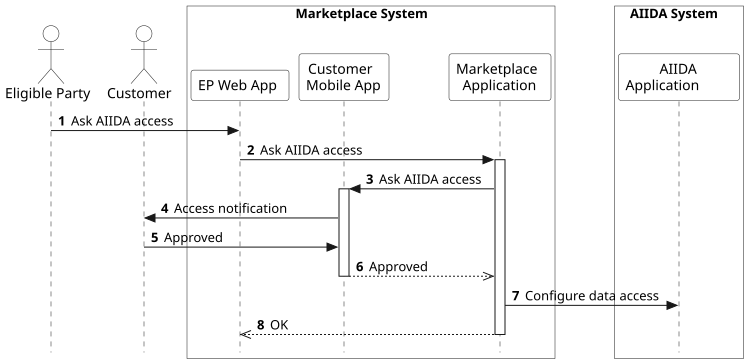

## Overview

The Marketplace system implements the following workflows which are further discussed in the sections below.

- [The customer/eligible party creates a user account](./runtime-view.md#the-customer-eligible-party-creates-a-user-account)
- [The customer registers their AIIDA instance](./runtime-view.md#the-customer-registers-their-aiida-instance)
- [The customer browses data requests and services](./runtime-view.md#the-customer-browses-data-requests-and-services)
- [The eligible party creates a data request/service](./runtime-view.md#the-eligible-party-creates-a-data-request-service)
- [The eligible party searches AIIDA instances for energy data](./runtime-view.md#the-eligible-party-searches-aiida-instances-for-energy-data)
- [The eligible party asks for access to data from AIIDA instances](./runtime-view.md#the-eligible-party-asks-for-access-to-data-from-aiida-instances)

## The customer/eligible party creates a user account

1. A customer or an eligible party uses the Customer Mobile App or the EP Web App, respectively, to request a new account. 
1. The Customer Mobile App/EP Web App sends the request for a new account to the Marketplace Application.
1. The Marketplace Application redirects the customer/eligible party to the IAM.
1. The customer/eligible party creates a new account at the IAM.
1. The IAM stores the new account in the Database.
1. The new account is stored in the Database.
1. The Customer Mobile App/EP Web App is notified.

After creating an account, requests from Customer Mobile Apps/EP Web Apps are authenticated based on OAuth2 using the account credentials and tokens from the IAM.

<!-- 

1. The customer/eligible party submits their account credentials to login via the Customer Mobile App/EP Web App.
1. The App sends the credentials to the IAM to authenticate the user account.
1. The IAM queries the database to check if the provided credentials match an existing user account.
1. The database returns a confirmation that the credentials match a stored user account.
1. The IAM responds to the App with an authorization code for this particular user.
1. The App can now use the authorization code to request tokens from the IAM (e.g., access, ID, and refresh tokens).
1. IAM responds with (at least) a JWT access token.
1. The customer/eligible party is now logged in, and the tokens can be used for any action at the Customer Mobile App/EP Web App.
1. The customer/eligible party executes an action at the Customer Mobile App/EP Web App.
1. The App includes the access token in the request to the Marketplace Application.
1. The Marketplace Application validates the access token (to validate access tokens, the Marketplace Application needs to occasionally get a public key from the IAM).
1. The Marketplace Application processes the request.
1. The Marketplace Application sends the appropriate response. -->

## The customer registers their AIIDA instance

The prerequisite for this workflow is that the customer uses the AIIDA Smartphone App to register their AIIDA instance at the Marketplace, which leads to sending the AIIDA IP and ID to the Marketplace, and storing them as an AIIDA instance in the Database.

1. The customer requests to register their AIIDA instance at the Customer Mobile App using the AIIDA ID.
1. The Customer Mobile App forwards the registration request to the Marketplace Application, including the AIIDA ID.
1. The Marketplace Application uses the AIIDA ID to find the AIIDA instance in the Database, and stores the customer's account as the owner of this AIIDA instance in the Database.
1. The AIIDA instance is registered.
1. The Customer Mobile App is notified that the AIIDA instance is registered.

## The customer browses data requests and services

1. The customer requests to see data requests/services of eligible parties at the Customer Mobile App (filtering possible). 
1. The Customer Mobile App forwards the request to the Marketplace Application. 
1. The Marketplace Application requests the selected data requests/services from the Database.
1. The Database responds with the matching data requests/services.
1. The Marketplace Application sends to the Customer Mobile App the requested data requests/services.

## The eligible party creates a data request/service

1. The eligible party fills out a form (with all the required information) in the EP Web App to create a data request/service. When creating a data request, a suitable query is also added by the eligible party. This query is later executed by AIIDA in the workflow to search for AIIDA instances having data that match this data request.
1. The EP Web App sends this form to the Marketplace Application.
1. The Marketplace Application stores the data request/service information in the Database.
1. The data request/service is stored in the Database.
1. The Marketplace Application notifies the EP Web App that the data request/service is stored.

## The eligible party searches AIIDA instances for energy data

1. After a data request has been created, the eligible party uses the EP Web App to search for AIIDA instances matching this data request. 
1. The EP Web App requests the Marketplace Application to run the data request.  
1. The Marketplace Application requests all the AIIDA IPs from the database.
1. The Database responds with the AIIDA IPs.
1. The Marketplace Application sends the query of the data request to all the AIIDA instances that are registered in the Database.
1. The AIIDA instances run the query, and examine if they have data matching the query.
1. The AIIDA instances respond to the Marketplace Application with the results of the query.
1. The Marketplace Application responds to the EP Web App with the matching AIIDA instances. 

## The eligible party asks for access to data from AIIDA instances

Prerequisite of this workflow is that the eligible party has created and run a data request, and received information about the AIIDA instances matching this data request.

1. To request access to the data of these AIIDA instances, the eligible party asks for data access at the EP Web App.
1. The EP Web App asks the Marketplace Application for data access.  
1. The Marketplace Application sends an access request to the Customer Mobile Apps of the customers whose AIIDA instances have the energy data.
1. The Customer Mobile Apps of these customers show an access request notification.
1. The customers approve/reject the access requests.
1. The Customer Mobile Apps of the customers who approved notify the Marketplace Application.
1. The Marketplace Application configures the data access on the AIIDA instances of the customers who approved the access requests. The AIIDA instances then start sending data to the EDDIE Framework of the eligible party.
1. The Marketplace Application notifies the EP Web App that access has been requested.

