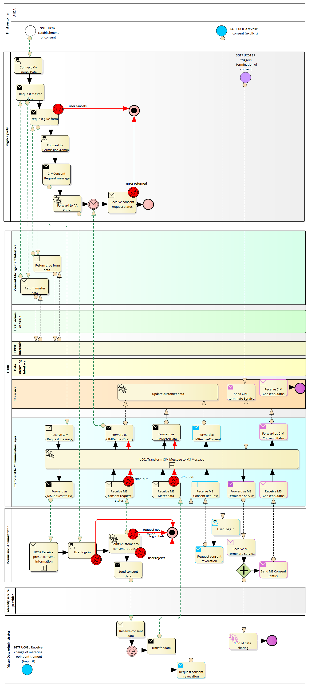

## Context

The behavior of the EDDIE Framework regarding handling historical validated energy consumption data of customers, needs to comply with the Implementing Act of the Smart Grids TaskForce (SGTF). To this end, the process diagrams below shows the place of the EDDIE Framework in the context of the following SGTF uses cases. 

- SGTF Use Case 2: Access to Historical Validated Consumption Data by the Eligible Party
- SGTF Use Case 3: The Eligible Party Terminates a Service
- SGTF Use Case 4: Revocation of an Active Consent

 

### SGTF Use Case 2: Access to Historical Validated Consumption Data by the Eligible Party

To further aid in the interpretation of the diagrams, the following diagram is enhanced with a color scheme indicating what is directly within the scope of the EDDIE Framework, what is indirectly within scope (e.g. the communication between eligible party and metered data administrator) and what is out of scope (e.g. the customer identifying the eligible party).

 

### SGTF Use Case 3: The Eligible Party Terminates a Service

TBD

### SGTF Use Case 4: Revocation of an Active Consent

TBD

## Stimulus

There is a different stimulus for every use case, as shown below.
- Use case 2: The customer fills out the consent form of the EDDIE Framework, and the EDDIE Framework initiates the process of accessing the historical validated data from the Regional Data-sharing Infrastructure.
- Use case 3: TBD
- Use case 4: TBD

## Response

There is a different response for every use case, as shown below.
- Use case 2: The EDDIE Framework follows the process indicated by the SGTF use case 2 (show in the diagram above) to access the historical validated data of the customer.
- Use case 3: TBD
- Use case 4: TBD
