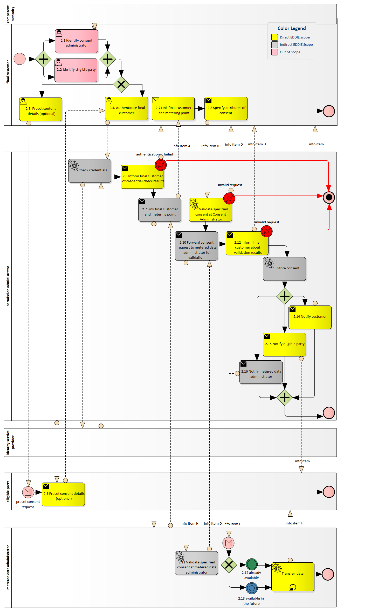
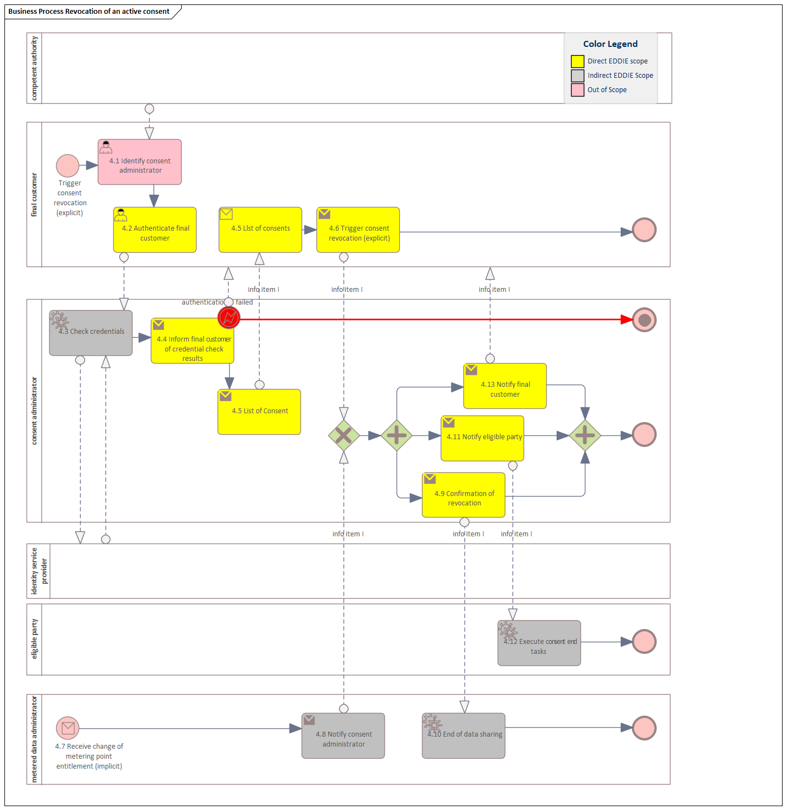
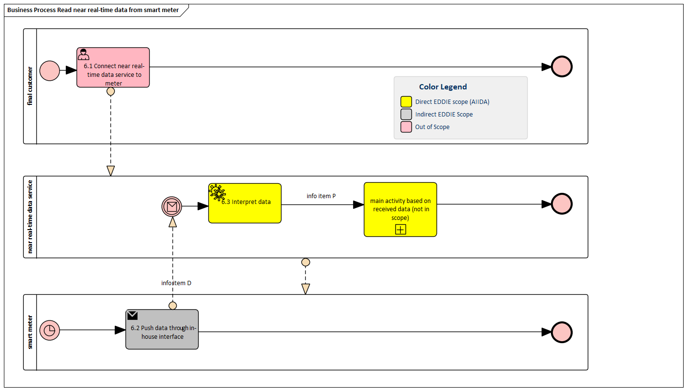

## Context

The behavior of the EDDIE Framework regarding handling historical validated energy consumption data of customers, needs to comply with the Implementing Act of the Smart Grids TaskForce (SGTF). To this end, the process diagrams below shows the place of the EDDIE Framework in the context of the following SGTF procedures. 

- SGTF Procedure 1: <s> Access validated historical consumption data by the customer </s> [not covered by EDDIE]
- SGTF Procedure 2: Access to Historical Validated Consumption Data by the Eligible Party
- SGTF Procedure 3: <s> The Eligible Party Terminates a Service </s> [not covered by EDDIE]
- SGTF Procedure 4: Revocation of an Active Consent
- SGTF Procedure 5: <s> Activate near real-time flow from smart meter  </s> [not covered by EDDIE]
- SGTF Procedure 6: Read near real-time flow from smart meter 

### Overview 

Below you will find an overview of how the three supported SGTF procedures interact with the EDDIE environment. The trigger that starts the support for procedure 2 is in white, procedure 3 in blue  and procedure 4 in purple. Note that procedure 4 concerning revocation has two possible triggers: the final customer (3a in the diagram) and the Metered Data Administrator (3b in the diagram).

  

### SGTF Procedure 2: Access to Historical Validated Consumption Data by the Eligible Party

To further aid in the interpretation of the diagrams, the following diagrams are enhanced with a color scheme indicating what is directly within the scope of the EDDIE Framework, what is indirectly within scope (e.g. the communication between eligible party and metered data administrator) and what is out of scope (e.g. the customer identifying the eligible party).

### SGTF Procedure 3: The Eligible Party Terminates a Service

Not applicable

### SGTFProcedure 4: Revocation of an Active Consent

### SGTF Procedure 5: Activate near real-time flow from smart meter 

Not applicable

### SGTF Procedure 6: Read near real-time flow from smart meter 

## Stimulus

There is a different stimulus for every use case, as shown below.
- Procedure 2: The customer fills out the consent form of the EDDIE Framework, and the EDDIE Framework initiates the process of accessing the historical validated data from the Regional Data-sharing Infrastructure.
- Procedure 4: TBD
- Procedure 6: TBD

## Response

There is a different response for every use case, as shown below.
- Procedure 2: The EDDIE Framework follows the process indicated by the SGTF use case 2 (show in the diagram above) to access the historical validated data of the customer.
- Procedure 4: TBD
- Procedure 6: TBD
