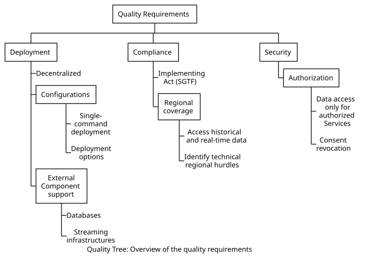

<!-- This section contains all quality requirements as quality tree with
scenarios. The most important ones have already been described in
section 1.2. (quality goals)
Here you can also capture quality requirements with lesser priority,
which will not create high risks when they are not fully achieved.
The quality tree (as defined in ATAM -- Architecture Tradeoff Analysis
Method) with quality/evaluation scenarios as leafs.

The quality tree is a high-level overview of the quality goals and
requirements:
-   tree-like refinement of the term \"quality\". Use \"quality\" or
    \"usefulness\" as a root
-   a mind map with quality categories as main branches 
quality tree example https://arnon.me/2010/05/utility-trees-hatching-quality-attributes/
-->

The quality requirements of the system are outlined in the quality tree below. This tree has 3 main types of quality requirements, i.e., Deployment, Compliance, and Security, each one having various requirements.

The following table provides links to more detailed information for every quality requirements type.

## Deployment Requirements

| Quality Requirement Type| Section |
|-|-|
| Deployment Requirements | [Link](./deployment-requirements/deployment-requirements.md) |
| Compliance Requirements | [Link](./compliance-requirements/compliance-requirements.md) |
| Security Requirements | [Link](./security-requirements/security-requirements.md) |

<!-- Concretization of (sometimes vague or implicit) quality requirements
using (quality) scenarios.
These scenarios describe what should happen when a stimulus arrives at
the system.
For architects, two kinds of scenarios are important:
-   Usage scenarios (also called application scenarios or use case
    scenarios) describe the system's runtime reaction to a certain
    stimulus. This also includes scenarios that describe the system's
    efficiency or performance. Example: The system reacts to a user's
    request within one second.
-   Change scenarios describe a modification of the system or of its
    immediate environment. Example: Additional functionality is
    implemented or requirements for a quality attribute change. 

 A scenario should have:
- Context – under what circumstances
- Stimulus – trigger in Use case lingo
- Response – what the system does. 

 ### Unauthorized Access

#### Context

#### Stimulus

#### Response  -->

