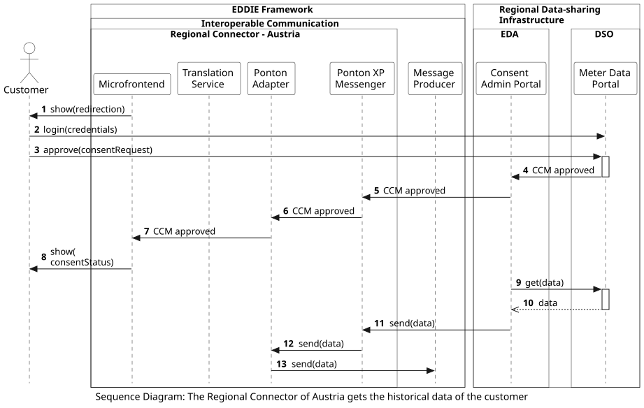

## Overview

The following workflow shows the process of the eligible party accessing the historical validated data of a customer in Austria. This process starts when the customer approves the consent request at the Regional Data-sharing Infrastructure. 
<!-- The workflow of requesting the customer consent is presented [here](../request-consent-austria/request-consent-austria.md).  -->

This workflow includes the following steps:
1. The Microfrontend shows the customer a redirection to the website of the metered data administrator (that is the customer's DSO, in Austria).
2. The customer logs in to the Meter Data Portal.
3. The customer approves the consent request at the Meter Data Portal.
4. The Meter Data Portal informs the Consent Admin Portal (that is EDA, in Austria) that the CCM (Customer Consent Management) request is approved.
5. The Consent Admin Portal informs the Ponton XP Messenger that the CCM request is approved.
6. The Ponton XP Messenger informs the Ponton Adapter that the consent request is approved.
7. The Ponton Adapter informs the Microfrontend that the consent request is approved.
8. The Microfrontend shows to the customer that the consent request is approved. 
9. Since the consent request is now approved by the customer, the Consent Admin Portal gets the requested data from the Meter Data Portal.
10. The requested data is sent to the Consent Admin Portal.
11. The Consent Admin Portal sends the data to the Ponton XP Messenger. Notably, the EDDIE Framework has no control over the specific point in time that this step takes place. 
12. The Ponton XP Messenger sends the data to the Ponton Adapter.
13. The Ponton Adapter sends the data to the Message Producer.

<!-- After the data has been received by the Message Producer, another workflow takes place to send the data to a Service. This workflow is presented [here](../send-data-to-service-regional-connector/send-data-to-service-regional-connector.md). -->