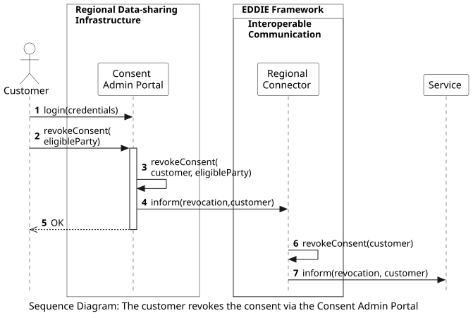

## Overview

The following workflow shows the process of the customer revoking their consent for historical validated data access via the Regional Data-sharing Infrastructure. This process starts with the customer logging in to the appropriate website, i.e., either the Consent Admin Portal or the Meter Data Portal (based on country).

This workflow includes the following steps:
1. The customer logs in to the Consent Admin Portal.
2. The customer clicks to revoke the consent of the eligible party.
3. The permission administrator revokes the consent. This step may include additional actions that are out of scope, e.g., informing the Meter Data Portal. However, EDDIE depends on the timely execution of these actions. Notably, additional mechanisms to verify that this step is completed may be necessary (if the permission administrator allows it, e.g., through an API).
4. The Consent Admin Portal informs the Regional Connector about the consent revocation of the customer.
5. The consent revocation is confirmed to the customer.
6. The Regional Connector applies the revocation, e.g., by updating the relevant fields in the Database.
7. The Regional Connector informs the service of the customer that the customer has revoked their consent. 
