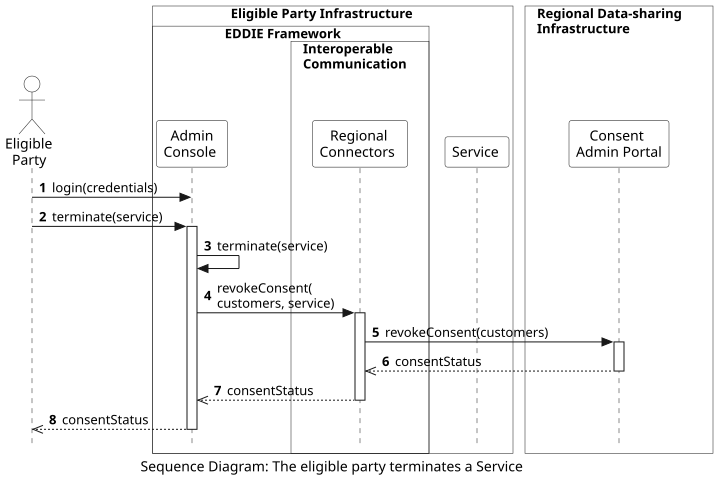

## Overview

The following workflow shows the process of the eligible party terminating a Service, and consequently, also revoking the consent of the customers who use this Service. This process starts with the eligible party accessing the Admin Console.

This workflow includes the following steps:
1. The eligible party logs in to the Admin Console.
2. The eligible party clicks to terminate the Service.
3. The Admin console applies the Service termination, e.g., by updating the relevant fields in the Database.
4. The Admin Console instructs the Regional Connectors to revoke the consent of the customers who use the terminated service.
5. The Regional Connectors revoke the consent of the customers from the box "EDDIE Framework" #transparent
Regional Data-sharing Infrastructures of their countries, e.g., via the Consent Admin Portal, or the Meter Data Portal.
6. The responses of the consent status are sent back to the Regional Connectors.
7. The consent status of each customer is sent to the Admin Console.
8. The Admin Console shows the eligible party that the consents have been revoked.