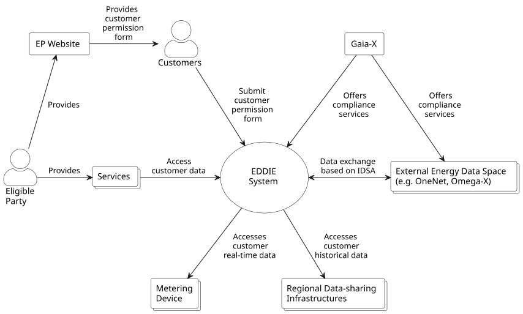
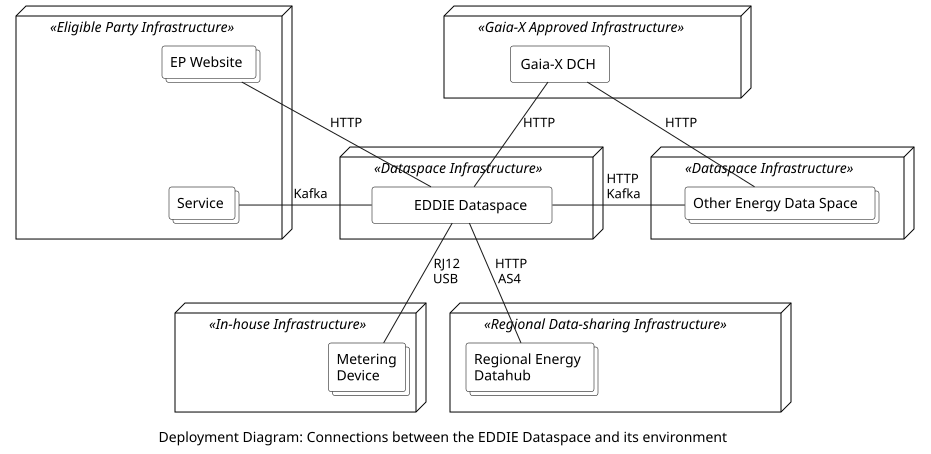

This section describes the context of the system. To this end, we show the EDDIE dataspace within its environment and we define all the neighboring entities, i.e., systems and users. In the following, we differentiate between business context where we describe the interactions within the environment, and technical context where we describe the technical nodes and connections.

## Business Context

The figure below shows the context diagram of the environment. The system within scope, i.e., the EDDIE dataspace, is in a circle at the center, while the neighboring entities are shown as squares and users around it.

The table below shows a description of all the entities of the context diagram.

| Entity | Description |
|-|-|
| EDDIE Dataspace | This is the software system within scope. The EDDIE Dataspace aims at offering energy-related data to Services that are provided by eligible parties. Furthermore, the EDDIE Dataspace needs to be Gaia-X compliant in order to allow for interoperability with other energy dataspaces, i.e., other similar software systems for sharing energy data. |
| Service | A Service is a software application that is provided by the eligible party. Services access energy data from the EDDIE Dataspace and use it to generate value, e.g., using data analysis techniques based on statistics and artificial intelligence. |
| Eligible Party | The eligible party is a person (or organization) that wants to enter the energy data services market. The eligible party provides Services and uses the EDDIE Dataspace so that these Services have access to energy data from customers. |
| Customer | Customers are persons (or organizations) that consume/produce energy, and are willing to share their energy consumption/production data. This data is used as input to the Services. Customers can be motivated to allow their data to be used as the input of the Services in order to access the output. For example, a Service may be processing residential energy consumption values in order to provide consumption recommendations that reduce the energy bill.|
| EP Website | The EP Website (Eligible Party Website) is a website provided by an eligible party. The goal of this website is to gather the necessary information from customers to be able to access their energy data either from in-house Metering Devices, or from the Regional Energy Datahubs. |
| Metering Device | This is an in-house device that can provide access to energy-related values, e.g., a smart meter that provides access to near real-time energy consumption values. |
| Regional Energy Datahub | This is the energy data sharing system of a Member State that provides access to historical data (e.g., historical validated consumption metering data) about the energy consumption of a customer. 
| Other Energy Dataspace| This is a software system similar to the EDDIE Dataspace that facilitates energy data sharing. The EDDIE Dataspace needs to be compatible with other energy dataspaces so that energy data can also be shared between dataspaces. |
| Gaia-X DCH | The Gaia-X DCH (Digital Clearing House) offers compliance services and defines rules for achieving interoperability and trust among dataspaces. Thus, as long as two dataspaces follow the same compliance services and rules, a certain degree of interoperability can be achieved. |

## Technical Context 

The figure below shows a deployment diagram of the environment, specifying the participating nodes and technical connections between the entities. 

The table below shows a description of the nodes.

| Node | Description |
|-|-|
| Eligible Party Infrastructure | Either on-premise or cloud-based computing infrastructure for running software applications. This infrastructure is operated by the eligible party. |
| In-house Infrastructure | This includes all the in-house devices with energy metering information such as smart meters, home automation systems, electric vehicle chargers, photovoltaic systems, etc. |
| Regional Data-sharing Infrastructure | This is the computing infrastructure of a country for sharing historical validated energy consumption data. This infrastructure may be operated by a different entity in every country, e.g., by a country-specific permission administrator, and/or a metered data administrator. |
| Dataspace Infrastructure | The infrastructure that hosts a dataspace. This infrastructure can be a distributed and may be operated by different entities that can vary based on the goals and use cases of the dataspace. The EDDIE Dataspace infrastructure is described in detail in the [Building Block View](../building-block-view/building-block-view.md). |
| Gaia-X Approved Infrastructure | This infrastructure is operated by an organization that is approved by Gaia-X to operate a Gaia-X compliant Digital Clearing House for offering dataspace compliance services. |

The following table shows a description of the connection interfaces.

| Provided by | Consumed by | Protocol | Transferred Data|
|-|-|-|-|
| EDDIE Dataspace | EP Website | HTTP | Transfers the customer information necessary for accessing the customer energy data, e.g., country, metering point ID, etc. |
| EDDIE Dataspace | Service | Kafka | Transfers the customer energy data to the Services, e.g., near real-time metering data, historical validated consumption metering data, etc. |
| Metering Device | EDDIE Dataspace | DSMR, DLMS| Transfers the energy metering data, e.g, near real-time smart meter measurements, etc. |
| Regional Datahub | EDDIE Dataspace | HTTP, AS4 | Transfers the historical validated energy consumption metering data. |
| EDDIE Dataspace | Other energy dataspace | HTTP, Kafka | Transfers energy data between dataspaces, e.g., near real-time energy data, historical validated metering data, etc. |
| Other energy dataspace | EDDIE Dataspace | HTTP, Kafka | Transfers energy data between dataspaces, e.g., near real-time energy data, historical validated metering data, etc. |
| Gaia-X DCH | EDDIE Dataspace | HTTP | Transfers dataspace compliance data, e.g., Gaia-X verifiable credentials about participants and data offerings. |
| Gaia-X DCH | Other energy dataspace | HTTP | Transfers dataspace compliance data, e.g., Gaia-X verifiable credentials about participants and data offerings. |

